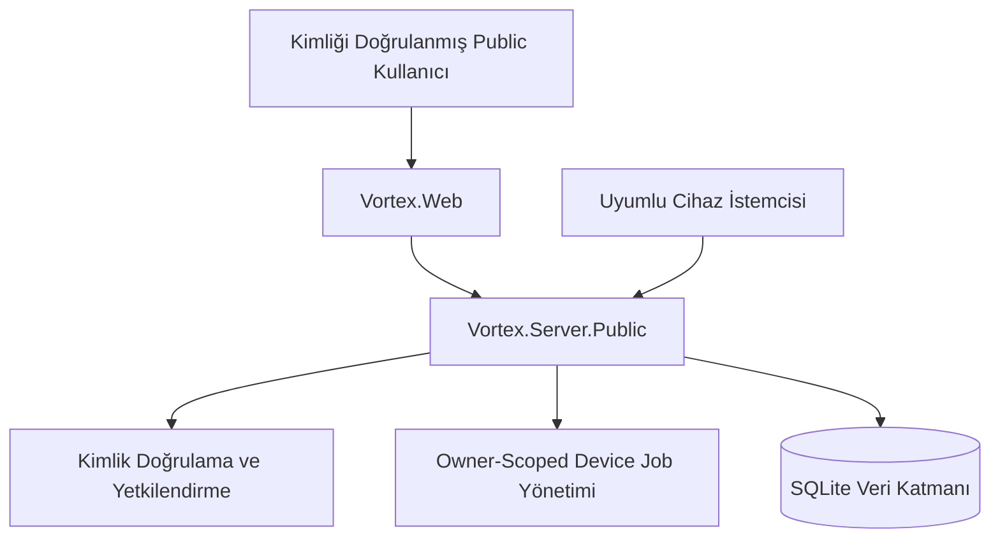
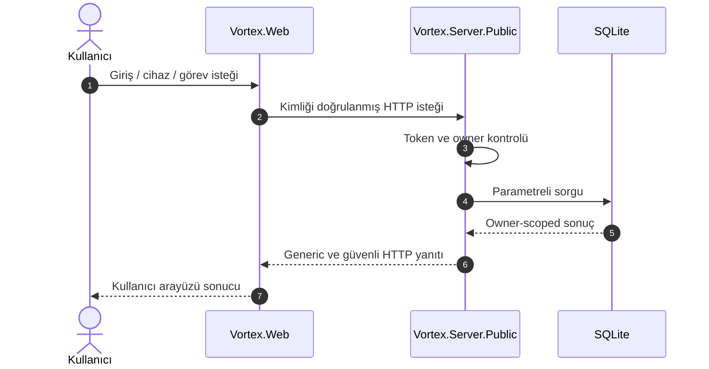
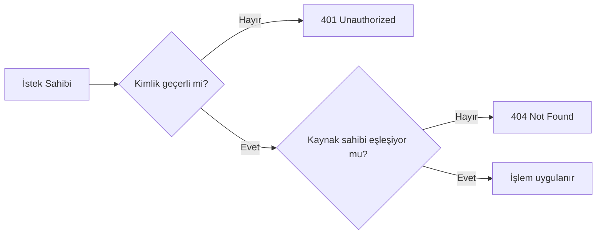
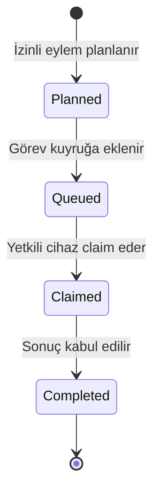

<div align="center">

# VORTEX Public Sistem Mimarisi

**Kimlik doğrulama, owner isolation, cihaz yönetimi ve sunucu tarafından korunan görev yaşam döngüsü.**

[← Ana README](../README.md) · [Dokümantasyon Merkezi](README.md) · [Kurulum](SETUP.md)

</div>

---

> [!IMPORTANT]
> Bu belge yalnız **public VORTEX mimarisini** açıklar. Desktop çalışma zamanı, LocalAgent, Hermes, HermesWorker, private deployment ve üretim erişim bilgileri bu kapsamın dışındadır.

## İçindekiler

- [Mimari özeti](#mimari-özeti)
- [Sistem sınırı](#sistem-sınırı)
- [Ana bileşenler](#ana-bileşenler)
- [İstek akışı](#istek-akışı)
- [Kimlik doğrulama](#kimlik-doğrulama)
- [Yetkilendirme ve owner isolation](#yetkilendirme-ve-owner-isolation)
- [Cihaz güvenliği](#cihaz-güvenliği)
- [Device-job yaşam döngüsü](#device-job-yaşam-döngüsü)
- [Görev tamamlama sözleşmesi](#görev-tamamlama-sözleşmesi)
- [HTTP durumları](#http-durumları)
- [DryRun politikası](#dryrun-politikası)
- [Yerel işlem sınırları](#yerel-işlem-sınırları)
- [Veri katmanı](#veri-katmanı)
- [Public repository sınırı](#public-repository-sınırı)
- [Public sürümde bulunmayan bileşenler](#public-sürümde-bulunmayan-bileşenler)
- [Mimari ilkeler](#mimari-ilkeler)
- [Güvenlik kontrol listesi](#güvenlik-kontrol-listesi)
- [İlgili belgeler](#ilgili-belgeler)

## Mimari özeti

Public sürümde kullanıcı ve cihaz istekleri `Vortex.Server.Public` üzerinden yönetilir. Sunucu; kimlik doğrulama, yetkilendirme, owner-scoped kaynak erişimi, güvenli görev planlama ve kalıcı SQLite veri katmanından sorumludur.



Metinsel görünüm:

```text
Kimliği Doğrulanmış Public Kullanıcı                 Uyumlu Cihaz İstemcisi
                  |                                             |
                  |                                             |
                  +------------------------+--------------------+
                                           |
                                           v
                              Vortex.Server.Public
                    Kimlik Doğrulama • Yetkilendirme
                    SQLite Veri Katmanı
                    Sahip (Owner) Bazlı Görev Yönetimi
```

## Sistem sınırı

### Public tarafta bulunanlar

- kullanıcı kaydı,
- kullanıcı girişi,
- JWT Bearer Token doğrulaması,
- profil sorgulama,
- cihaz kaydı,
- cihaz listeleme,
- izinli eylem planlama,
- görev kuyruğu,
- görev claim işlemi,
- görev tamamlama,
- görev durumu sorgulama,
- SQLite veri katmanı,
- public web istemcisi,
- public testler ve dokümantasyon.

### Public tarafta bulunmayanlar

- Desktop çalışma zamanı,
- LocalAgent,
- Hermes ve HermesWorker,
- Worker servisleri,
- uzak çalıştırma altyapısı,
- private network veya Tailscale yapılandırması,
- Docker runtime/deployment durumu,
- Admin Paneli,
- private Web kaynak kodu,
- üretim servisleri ve erişim bilgileri,
- gerçek kullanıcı verileri,
- build veya kurulum çıktıları.

> [!CAUTION]
> Public server'ın görev kuyruğu sağlaması, public repository'nin serbest komut veya private Worker çalıştırdığı anlamına gelmez.

## Ana bileşenler

| Bileşen | Temel sorumluluk | Güvenlik sınırı |
| --- | --- | --- |
| `Vortex.Contracts` | API istek/yanıtları, roller ve device-job sözleşmeleri | Uygulama katmanları arasında açık veri sözleşmesi sağlar |
| `Vortex.Server.Public` | Kimlik doğrulama, cihaz erişimi, görev yaşam döngüsü ve SQLite erişimi | Sahiplik kontrolü, token doğrulama ve sunucu tarafından yönetilen alanlar |
| `Vortex.Web` | Kullanıcı girişini ve public server etkileşimini sunan web arayüzü | Tarayıcıdan API key istemez; oturum çerezini HTTP-only tutar |
| `Vortex.Public.Tests` | Public iş akışı ve güvenlik davranışlarını doğrular | Dokümantasyon iddiasını revision-specific test kanıtıyla ayırır |

## İstek akışı



İstekler için temel güvenlik sırası:

1. İstek biçimi doğrulanır.
2. Kimlik doğrulama bilgisi doğrulanır.
3. Kullanıcı veya cihazın iptal durumu kontrol edilir.
4. Kaynağın sahibinin istek sahibiyle eşleştiği doğrulanır.
5. Yaşam döngüsü kuralları uygulanır.
6. Veri katmanı yalnız parametreli sorgularla kullanılır.
7. Yanıt gereksiz teknik ayrıntı paylaşmadan döndürülür.

## Kimlik doğrulama

Kimlik doğrulama Bearer Token modeliyle gerçekleştirilir. Token doğrulaması `TokenService` sorumluluğundadır.

Kimliği doğrulanmış kullanıcı istekleri aşağıdaki genel başlık biçimini kullanır:

```http
Authorization: Bearer <ACCESS_TOKEN>
```

> [!WARNING]
> Gerçek token değerleri README, log, issue, ekran görüntüsü veya commit içinde paylaşılmamalıdır.

Token doğrulaması tek başına yeterli değildir. Başarılı kimlik doğrulamasından sonra kaynak sahipliği ayrıca kontrol edilir.

## Yetkilendirme ve owner isolation

Owner isolation, bir kullanıcının yalnız kendisine ait kaynakları görebilmesini ve değiştirebilmesini sağlar.

Temel davranışlar:

- Kullanıcı başka bir kullanıcının cihazını listeleyemez.
- Cihaz başka bir cihaza ait görevi claim edemez.
- Cihaz başka bir cihaza ait görevi tamamlayamaz.
- Sahibi olmayan bir kaynağa erişim denemesi kaynak varlığını sızdırmamak için `404 Not Found` döndürebilir.
- Anonymous istek korunan kaynaklarda `401 Unauthorized` ile reddedilir.



## Cihaz güvenliği

Her cihaz yalnızca aşağıdaki koşulları sağlayan device token ile kimlik doğrulayabilir:

- token cihaza aittir,
- token geçerlidir,
- cihaz iptal edilmemiştir,
- istek owner-scoped kaynak sınırını ihlal etmez.

Cihaz kimliği ile kullanıcı kimliği birbirinin yerine kullanılmaz. Kullanıcı hesabı cihazı yönetebilir; cihaz token'ı ise cihazın izin verilen görev yaşam döngüsüne katılımını sağlar.

## Device-job yaşam döngüsü

Public server görev yaşam döngüsünü sunucu tarafında yönetir.



Bu diyagram kaynak metindeki public kapsamı özetler. Gerçek enum veya ek ara durumlar için kaynak kod sözleşmeleri esas alınmalıdır.

Yaşam döngüsünün temel korumaları:

- Kuyruklanmamış görev claim edilemez.
- Bekleyen veya sahibi farklı görev tamamlanamaz.
- Tamamlanmış görevin sunucu tarafından korunan alanları tekrar yazılamaz.
- Aynı tamamlama isteği idempotent davranarak mevcut kaydı koruyabilir.
- Geçersiz geçiş `409 Conflict` ile reddedilebilir.

## Görev tamamlama sözleşmesi

Görev tamamlama isteğinde istemciden yalnız aşağıdaki alanlar kabul edilir:

| Alan | Amaç |
| --- | --- |
| `DeviceId` | Sonucu gönderen cihaz kimliği |
| `DeviceToken` | Cihaz kimlik doğrulama bilgisi |
| `Success` | İşlem başarı durumu |
| `Code` | Sonuç kodu |
| `Message` | Kullanıcıya veya sisteme dönük sonuç özeti |
| `Timeline` | İzin verilen yaşam döngüsü/zaman çizelgesi bilgisi |

İstemciden kabul edilmeyen veya sunucu tarafından yönetilen alanlar:

- `DryRun`,
- serbest komutlar,
- terminal çıktıları,
- sınırsız teknik ayrıntılar,
- server-owned yaşam döngüsü alanları.

> [!IMPORTANT]
> İstemci tarafından gönderilmeyen bir alanın sunucu tarafında korunması, mass-assignment ve yaşam döngüsü manipülasyonu riskini azaltır.

## HTTP durumları

| Durum | HTTP yanıtı | Anlam |
| --- | --- | --- |
| Geçersiz veya iptal edilmiş cihaz | `401 Unauthorized` | Kimlik doğrulama başarısız |
| Görev bulunamadı | `404 Not Found` | Kaynak bulunmuyor veya görünür değil |
| Başka cihaza ait görev | `404 Not Found` | Owner/device bilgisi sızdırılmaz |
| Bekleyen görev | `404 Not Found` | İzin verilen aşamada değil |
| Başarıyla tamamlandı | `200 OK` | Sonuç kabul edildi |
| Aynı görevin tekrar tamamlanması | `200 OK` | Mevcut kayıt korunarak idempotent yanıt |
| Yaşam döngüsü koruma hatası | `409 Conflict` | Geçersiz durum geçişi veya çakışma |

> [!NOTE]
> `404` yanıtı her zaman kaynağın fiziksel olarak bulunmadığını kanıtlamaz; owner isolation amacıyla görünürlüğün kapatıldığını da gösterebilir.

## DryRun politikası

`DryRun` değeri yalnız sunucu tarafından yönetilir.

İstemci bu değeri:

- değiştiremez,
- silemez,
- üzerine yazamaz,
- tamamlama sonucuyla yeniden belirleyemez.

Görev tamamlandıktan sonra sunucuda saklanan özgün `DryRun` değeri korunur.

Bu politika aşağıdaki riskleri azaltır:

- riskli görevin istemci tarafından normal görev gibi gösterilmesi,
- onay sınırlarının sonradan değiştirilmesi,
- görev geçmişinin manipüle edilmesi,
- audit bilgilerinin istemci girdisiyle bozulması.

## Yerel işlem sınırları

Public sürüm serbest komut çalıştırılmasına izin vermez.

Yalnızca:

- önceden tanımlanmış,
- açıkça izin verilmiş,
- parametreleri sınırlandırılmış,
- risk seviyesi değerlendirilmiş

eylemler görev kuyruğuna eklenebilir.

Ek korumalar:

- parametre uzunluğu sınırları,
- riskli işlem sınıflandırması,
- kullanıcı onayı gerektiren işlemler,
- onay olmadan kuyruklamayı reddetme,
- generic hata yanıtları,
- owner-scoped görev erişimi.

## Veri katmanı

Public veriler SQLite üzerinde saklanır. Kaynak metin, sorguların parametreli biçimde yürütüldüğünü belirtir.

Veri katmanı için güvenlik beklentileri:

- sorgu girdileri string birleştirmeyle SQL'e eklenmez,
- owner/device filtreleri veri erişiminde uygulanır,
- veri dizini yazılabilir fakat public repository dışında tutulur,
- SQLite dosyası GitHub'a eklenmez,
- loglar ve veri yedekleri public export'a dahil edilmez.

Örnek secret-free yapılandırma:

```json
{
  "Vortex": {
    "DataDirectory": "<LOCAL_WRITABLE_DATA_DIRECTORY>"
  }
}
```

## Public repository sınırı

`Vortex.Desktop/` klasörü public sürümde yalnız statik örnek servis dosyaları veya görsel varlıklar barındırabilir.

Bu dosyalar:

- Public Solution tarafından derlenmez,
- Desktop çalışma zamanı oluşturmaz,
- LocalAgent görevi görmez,
- uzak cihaz çalıştırma yeteneği sağlamaz.

Public repository'nin bir klasör adı içermesi, private çalışma zamanının public olduğu anlamına gelmez. Gerçek kapsam solution, manifest, test ve dokümantasyon tarafından birlikte belirlenmelidir.

## Public sürümde bulunmayan bileşenler

Aşağıdaki sistemler public mimarinin parçası değildir:

- Desktop çalışma zamanı,
- LocalAgent,
- Hermes,
- HermesWorker,
- Worker servisleri,
- uzak çalıştırma altyapısı,
- Tailscale,
- Docker deployment durumu,
- deployment sistemleri,
- Admin Paneli,
- private Web kaynak kodu,
- üretim ortamı servisleri,
- harici servis sağlayıcı entegrasyonları,
- build çıktıları,
- kurulum paketleri.

## Mimari ilkeler

Public sürüm aşağıdaki temel prensiplere dayanır:

1. **Güvenli kimlik doğrulama**
2. **Yetkilendirilmiş cihaz erişimi**
3. **Sahip bazlı görev yönetimi**
4. **Sunucu tarafından yönetilen işlem yaşam döngüsü**
5. **İzinli eylem ve sınırlandırılmış girdi modeli**
6. **Parametreli veri erişimi**
7. **Private bileşenlerden ayrıştırılmış public yapı**
8. **Secret-free repository ve dokümantasyon**
9. **Revision-specific build/test doğrulaması**
10. **Kaynak varlığını sızdırmayan hata davranışı**

## Güvenlik kontrol listesi

### Kimlik doğrulama

- [ ] Korunan endpoint anonymous isteği reddediyor.
- [ ] Geçersiz bearer token `401` ile reddediliyor.
- [ ] İptal edilmiş cihaz token'ı kullanılamıyor.
- [ ] Token değeri log veya dokümana yazılmıyor.

### Owner isolation

- [ ] Kullanıcı başka kullanıcının cihazını göremiyor.
- [ ] Cihaz başka cihaza ait görevi claim edemiyor.
- [ ] Sahibi farklı görev `404` ile gizleniyor.
- [ ] Tamamlama sonucu yanlış owner kaydını değiştirmiyor.

### Yaşam döngüsü

- [ ] Bekleyen görev geçersiz aşamada tamamlanamıyor.
- [ ] `DryRun` istemci tarafından değiştirilemiyor.
- [ ] Tekrarlanan tamamlama mevcut kaydı koruyor.
- [ ] Geçersiz durum geçişi `409` ile reddediliyor.

### Repository

- [ ] Gerçek `appsettings.json` bulunmuyor.
- [ ] `.env`, token, private key veya sertifika bulunmuyor.
- [ ] SQLite veritabanı ve loglar commit edilmemiş.
- [ ] Private Worker/Desktop runtime public solution'a dahil değil.

## İlgili belgeler

| Belge | Açıklama |
| --- | --- |
| [Ana README](../README.md) | Proje tanıtımı ve hızlı başlangıç |
| [Dokümantasyon Merkezi](README.md) | Tüm belgeler ve okuma sırası |
| [Kurulum Rehberi](SETUP.md) | Yerel yapılandırma, çalıştırma ve doğrulama |
| [Takım ve TEKNOFEST](TEAM.md) | Proje hikâyesi, takım ve hedefler |
| [Destekçiler](SUPPORTERS.md) | Kurumsal destek ve teşekkürler |

---

[← Ana sayfaya dön](../README.md)
