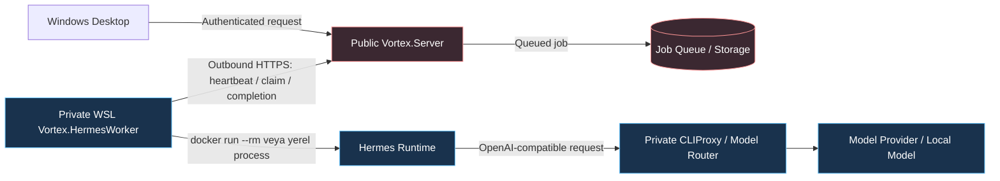
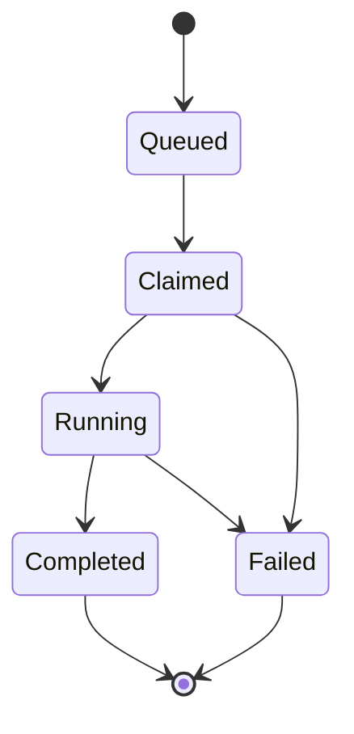

# Vortex.HermesWorker — Private WSL Operasyon Rehberi

> **Rol:** Private WSL / Hermes Worker  
> **Kapsam:** Windows 10/11 + WSL2 + Linux systemd user service + Docker veya yerel .NET 8  
> **Dil:** Türkçe  
> **Ana rehber:** Bu `README.md`, GitHub üzerinde tek başına kullanılabilecek ayrıntılı operasyon rehberidir. Görsel HTML sürümü için [`README.html`](README.html) dosyasını açın.

---

## İçindekiler

- [1. Amaç ve kapsam](#1-amaç-ve-kapsam)
- [2. Mimari](#2-mimari)
- [3. Değiştirilemez güvenlik sınırları](#3-değiştirilemez-güvenlik-sınırları)
- [4. Komut etiketleri ve doğru kabuk seçimi](#4-komut-etiketleri-ve-doğru-kabuk-seçimi)
- [5. Gereksinimler](#5-gereksinimler)
- [6. Önerilen dizin yapısı](#6-önerilen-dizin-yapısı)
- [7. Hızlı başlangıç](#7-hızlı-başlangıç)
- [8. Temiz Windows laptop kurulumu](#8-temiz-windows-laptop-kurulumu)
- [9. WSL2 ve systemd hazırlığı](#9-wsl2-ve-systemd-hazırlığı)
- [10. Docker Desktop ve WSL entegrasyonu](#10-docker-desktop-ve-wsl-entegrasyonu)
- [11. .NET 8 kurulumu](#11-net-8-kurulumu)
- [12. Portable kit kullanımı](#12-portable-kit-kullanımı)
- [13. Worker release kurulumu](#13-worker-release-kurulumu)
- [14. Private environment sözleşmesi](#14-private-environment-sözleşmesi)
- [15. Worker–Server eşleştirmesi](#15-workerserver-eşleştirmesi)
- [16. Hermes seed dosyaları](#16-hermes-seed-dosyaları)
- [17. CLIProxy / model router yapılandırması](#17-cliproxy--model-router-yapılandırması)
- [18. Docker çalışma modu](#18-docker-çalışma-modu)
- [19. Yerel process çalışma modu](#19-yerel-process-çalışma-modu)
- [20. systemd user service kurulumu](#20-systemd-user-service-kurulumu)
- [21. Worker yaşam döngüsü komutları](#21-worker-yaşam-döngüsü-komutları)
- [22. Versioned publish ve current symlink](#22-versioned-publish-ve-current-symlink)
- [23. Docker image hazırlama ve doğrulama](#23-docker-image-hazırlama-ve-doğrulama)
- [24. Sağlık kontrolleri](#24-sağlık-kontrolleri)
- [25. Kontrollü E2E doğrulama](#25-kontrollü-e2e-doğrulama)
- [26. Günlükler ve salt-okunur tanılama](#26-günlükler-ve-salt-okunur-tanılama)
- [27. Hata sınıflandırma matrisi](#27-hata-sınıflandırma-matrisi)
- [28. Ağ ve IPv4/IPv6 tanısı](#28-ağ-ve-ipv4ipv6-tanısı)
- [29. Worker rollback](#29-worker-rollback)
- [30. Portable backup sınırı](#30-portable-backup-sınırı)
- [31. Restore akışı](#31-restore-akışı)
- [32. Server entegrasyon sınırı](#32-server-entegrasyon-sınırı)
- [33. Desktop başlangıç sorunu ile Worker sorununu ayırma](#33-desktop-başlangıç-sorunu-ile-worker-sorununu-ayırma)
- [34. Public export politikası](#34-public-export-politikası)
- [35. Bakım ve güncelleme kontrol listesi](#35-bakım-ve-güncelleme-kontrol-listesi)
- [36. Sık sorulan sorular](#36-sık-sorulan-sorular)
- [37. Referans dosyalar](#37-referans-dosyalar)
- [38. Kabul kriterleri](#38-kabul-kriterleri)

---

# 1. Amaç ve kapsam

Bu runbook, **private WSL/Linux ortamında çalışan `Vortex.HermesWorker`** bileşeninin kurulumu, başlatılması, güncellenmesi, tanılanması, geri alınması ve taşınabilir yedekten geri kurulması için hazırlanmıştır.

Vortex sistemindeki sorumluluk ayrımı şöyledir:

- `Vortex.Server` işleri kuyruğa alır, sahiplik kontrolü yapar ve sonuçları saklar.
- `Vortex.HermesWorker` Server'a **outbound HTTPS** bağlantısı kurar.
- Hermes yalnız private Worker ortamında çalıştırılır.
- Public Server, Hermes'i veya Worker Docker container'ını başlatmaz.
- Worker için laptop/WSL üzerinde inbound public port açılmaz.

> [!IMPORTANT]
> Bu rehber private Worker operasyonları içindir. Public Server yayını, Nginx ve Server rollback işlemleri için `Vortex.Server/README.html` kullanılmalıdır.

> [!NOTE]
> HTML rehber görsel ve etkileşimli sürümdür. Bu Markdown dosyası ise GitHub üzerinde tek başına uygulanabilir komut kataloğu olarak tutulur. İki dokümandaki operasyon mantığı birbiriyle çelişmemelidir.

---

# 2. Mimari

## 2.1 Yüksek seviye akış



## 2.2 Güven sınırları

```text
Private Windows Laptop / WSL
  Vortex.HermesWorker
    ├─ private worker.env
    ├─ private Hermes seed files
    ├─ per-owner durable data
    ├─ Docker image veya yerel .NET runtime
    └─ outbound HTTPS
             │
             ▼
Public Vortex.Server
    ├─ queue
    ├─ Worker authentication
    ├─ owner isolation
    └─ result storage

Public Server üzerinde Hermes çalışmaz.
Worker için inbound laptop portu açılmaz.
```

## 2.3 İş durumu akışı



Bir Docker image smoke testi veya `/health/worker` yanıtı tek başına tam E2E kanıtı değildir. Tam doğrulama kontrollü bir işin aşağıdaki geçişi tamamlamasını gerektirir:

```text
Queued → Claimed → Running → Completed
```

---

# 3. Değiştirilemez güvenlik sınırları

Aşağıdaki kurallar operasyon kolaylığı için gevşetilmez.

> [!CAUTION]
> Gerçek environment dosyalarını, Worker tokenını, Hermes seed dosyalarını, provider/model anahtarlarını, kullanıcı çalışma alanlarını, logları, veritabanlarını, Docker volume/container durumunu veya credential dosyalarını source repository'ye ya da portable arşive koymayın.

## 3.1 Repository dışında tutulacak öğeler

- Gerçek `.env`
- Gerçek `worker.env`
- `VORTEX_WORKER_TOKEN`
- Provider API key'leri
- CLIProxy authentication bilgileri
- `hermes-config.yaml` gerçek içeriği
- `hermes.env` gerçek içeriği
- Sertifika ve private key dosyaları
- SQLite ve diğer veritabanları
- `App_Data` benzeri durable runtime dizinleri
- Kullanıcı workspace'leri
- Log dosyaları
- Docker volume'leri
- Çalışan/durmuş container state'i
- Docker credential dosyaları
- Docker cache
- Kullanıcı oturum/cookie/session exportları

## 3.2 Public HTTPS Server guard kuralı

Worker bilinçli olarak public HTTPS Server origin kullanıyorsa:

```text
VORTEX_REQUIRE_PRIVATE_SERVER_ENDPOINT=false
```

olarak kalmalıdır.

Bu değer yalnız **doğrulanmış private transport** kullanılmaya başladıktan sonra değiştirilmelidir.

> [!WARNING]
> Private endpoint doğrulanmadan guard değerini `true` yapmak normal public hostname/IP bağlantısını fail-closed reddedebilir.

## 3.3 Docker fallback kuralı

Docker modu seçildiyse Docker hatasında process mode'a otomatik fallback yapılmaz.

```text
VORTEX_HERMES_EXECUTION_MODE=docker
```

seçimi şu anlama gelir:

- Docker daemon hazır olmalıdır.
- Doğru image mevcut olmalıdır.
- Güvenli mount ve resource limitleri uygulanmalıdır.
- Hata oluşursa gerçek Docker/Hermes hatası raporlanmalıdır.
- Sahte başarı yanıtı üretilmemelidir.

## 3.4 CLIProxy endpoint kuralı

Eski örneklerden port kopyalanmaz.

Önce canlı private kurulumda aşağıdakiler doğrulanır:

1. CLIProxy Windows host'ta mı, WSL içinde mi çalışıyor?
2. Hangi adreste dinliyor?
3. OpenAI-compatible base path `/v1` mi?
4. Docker container `host.docker.internal` üzerinden erişebiliyor mu?
5. Authentication gerekiyor mu?
6. Aktif Worker'ın private environment dosyasında hangi endpoint yapılandırılmış?

---

# 4. Komut etiketleri ve doğru kabuk seçimi

Bu rehberde komutlar dört operasyon sınıfına ayrılır.

| Etiket | Anlamı |
|---|---|
| **[SALT-OKUNUR]** | Sistem durumunu okur; servis, release, image veya yapılandırma değiştirmemelidir. |
| **[GEÇİCİ DOĞRULAMA]** | `--rm` smoke container gibi geçici runtime işlemi oluşturabilir; kalıcı veri bırakmaması beklenir. |
| **[RUNTIME DEĞİŞTİRİR]** | Servis başlatır/durdurur, image oluşturur/yükler, symlink değiştirir veya release aktive eder. |
| **[DEĞİŞTİRİR / ONAY GEREKİR]** | Rollback, live restore, protected dosya değişikliği gibi açık operasyon kararı gerektirir. |
| **[ÖZEL DOSYA GEREKİR]** | Repository dışında tutulan private environment/seed dosyasına ihtiyaç duyar. |

## 4.1 Kabuk göstergeleri

### Windows PowerShell

```powershell
PS C:\> wsl --status
```

### WSL / Linux shell

```bash
$ systemctl --user status vortex-hermes-worker
```

> [!CAUTION]
> `wsl --status`, `wsl -l -v` ve `wsl --shutdown` Windows PowerShell'de çalıştırılır. `systemctl`, Linux `dotnet`, `docker`, `journalctl`, `chmod`, `tar` ve `sha256sum` hedef WSL dağıtımında çalıştırılır.

## 4.2 Kopyala-yapıştır disiplini

- Çok satırlı komut bloklarını yanlış kabuğa yapıştırmayın.
- Placeholder değerlerini değiştirmeden komut çalıştırmayın.
- Private dosya içeriğini `cat`, `Get-Content`, `echo` veya log ile yazdırmayın.
- Canlı sistemde önce salt-okunur preflight çalıştırın.
- Bir adım başarısızsa sonraki state-changing adıma geçmeyin.
- Rollback hedefi doğrulanmadan `current` symlink'i değiştirmeyin.

---

# 5. Gereksinimler

## 5.1 Windows tarafı

| Bileşen | Gereksinim |
|---|---|
| İşletim sistemi | WSL2 destekleyen Windows 10/11 |
| WSL | Güncel WSL2 |
| Dağıtım | Ubuntu veya desteklenen Linux dağıtımı |
| Docker modu | Docker Desktop + hedef dağıtım için WSL Integration |
| Dosya sistemi | Worker runtime için WSL Linux dosya sistemi önerilir |

## 5.2 WSL/Linux tarafı

| Bileşen | Gereksinim |
|---|---|
| systemd | User service çalıştırabilen systemd |
| .NET | .NET 8 runtime veya SDK |
| Docker modu | `docker` CLI ve erişilebilir daemon |
| Araçlar | `curl`, `tar`, `sha256sum`, `ca-certificates` |
| Disk | Release, image ve durable data için yeterli boş alan |
| Ağ | Public Server'a outbound HTTPS |

## 5.3 Private girdiler

- `VORTEX_SERVER_URL`
- `VORTEX_WORKER_ID`
- `VORTEX_WORKER_TOKEN`
- `VORTEX_WORKER_DATA`
- Worker execution mode
- Hermes Docker image etiketi veya yerel executable bilgisi
- Hermes config seed path
- Opsiyonel Hermes env seed path
- Doğrulanmış CLIProxy/model-router endpointi
- Gerekliyse provider/model anahtarları

---

# 6. Önerilen dizin yapısı

## 6.1 Worker kurulum dizini

```text
~/vortex-worker/
├── releases/
│   ├── worker-release-<UTC>/
│   └── worker-release-<UTC>/
├── current -> releases/worker-release-<ACTIVE_UTC>/
├── data/
│   ├── users/
│   └── logs/
├── secrets/
│   ├── worker.env
│   ├── hermes-config.yaml
│   └── hermes.env
└── source/                  # yalnız source publish kullanılacaksa
```

## 6.2 Per-owner durable data

```text
<VORTEX_WORKER_DATA>/
└── users/
    └── <SERVER_WORKSPACE_ID>/
        ├── workspace/
        ├── hermes-home/
        ├── memory/
        ├── automations/
        ├── artifacts/
        └── temp/
```

## 6.3 Owner isolation kuralları

- Her Server workspace ID ayrı dizin kullanır.
- `workspace` kullanıcılar arasında paylaşılmaz.
- `hermes-home` kullanıcılar arasında paylaşılmaz.
- Memory, automations ve artifacts owner sınırını aşmaz.
- Path traversal girişimleri reddedilmelidir.
- Worker job-specific Hermes home oluşturur.
- Seed dosyaları yalnız güvenli hedef dizine kopyalanır.

---

# 7. Hızlı başlangıç

Bu bölüm yalnız ana akışı gösterir. Ayrıntılar sonraki bölümlerdedir.

## 7.1 Windows PowerShell — WSL kontrolü

**[SALT-OKUNUR]**

```powershell
wsl --status
wsl -l -v
```

## 7.2 WSL — runtime kontrolü

**[SALT-OKUNUR]**

```bash
systemctl --version
systemctl --user is-system-running || true
docker version
docker info
dotnet --info
df -h
```

## 7.3 Private dizinleri oluştur

**[RUNTIME DEĞİŞTİRİR]**

```bash
mkdir -p "$HOME/vortex-worker/releases"
mkdir -p "$HOME/vortex-worker/data"
mkdir -p "$HOME/vortex-worker/secrets"
chmod 700 "$HOME/vortex-worker/secrets"
```

## 7.4 Release'i çıkar

**[RUNTIME DEĞİŞTİRİR]**

```bash
mkdir -p "$HOME/vortex-worker/releases/<RELEASE_DIRECTORY>"
tar -xzf <WORKER_RELEASE_TAR_GZ> \
  -C "$HOME/vortex-worker/releases/<RELEASE_DIRECTORY>"
```

## 7.5 `current` bağlantısını oluştur

**[RUNTIME DEĞİŞTİRİR]**

```bash
ln -sfn \
  "$HOME/vortex-worker/releases/<RELEASE_DIRECTORY>" \
  "$HOME/vortex-worker/current"

readlink -f "$HOME/vortex-worker/current"
```

## 7.6 Private environment dosyasını hazırla

**[ÖZEL DOSYA GEREKİR]**

Şablon:

```text
deploy/wsl/vortex-hermes-worker.env.example
```

Hedef:

```text
~/vortex-worker/secrets/worker.env
```

İzin:

```bash
chmod 600 "$HOME/vortex-worker/secrets/worker.env"
```

## 7.7 systemd servisini kur ve başlat

**[RUNTIME DEĞİŞTİRİR]**

```bash
mkdir -p "$HOME/.config/systemd/user"
cp <SERVICE_TEMPLATE> \
  "$HOME/.config/systemd/user/vortex-hermes-worker.service"

systemctl --user daemon-reload
systemctl --user enable --now vortex-hermes-worker
systemctl --user status vortex-hermes-worker --no-pager -l
```

## 7.8 Son doğrulama

**[SALT-OKUNUR]**

```bash
docker image inspect <IMAGE_TAG>
systemctl --user status vortex-hermes-worker --no-pager -l
journalctl --user -u vortex-hermes-worker -n 100 --no-pager
curl -fsS <PUBLIC_SERVER_ORIGIN>/health/worker
```

Ardından owner-authenticated kontrollü job gönderilir.

---

# 8. Temiz Windows laptop kurulumu

## 8.1 WSL2 kurulumu

**Kabuk:** Yönetici Windows PowerShell  
**Etiket:** [RUNTIME DEĞİŞTİRİR]

```powershell
wsl --install -d Ubuntu
wsl --update
wsl --status
```

Windows yeniden başlatma isterse yeniden başlatın. Ubuntu ilk açılışında Linux kullanıcı adı ve parolası oluşturun.

## 8.2 Dağıtımın WSL2 olduğunu doğrulama

**Kabuk:** Windows PowerShell  
**Etiket:** [SALT-OKUNUR]

```powershell
wsl -l -v
```

Beklenen:

```text
NAME      STATE      VERSION
Ubuntu    Running    2
```

Dağıtım WSL1 ise uygun dağıtım adıyla WSL2'ye dönüştürülmelidir.

## 8.3 İlk Ubuntu hazırlığı

**Kabuk:** Ubuntu / WSL  
**Etiket:** [RUNTIME DEĞİŞTİRİR]

```bash
sudo apt update
sudo apt install -y \
  ca-certificates \
  curl \
  git \
  tar \
  unzip \
  zip
```

## 8.4 Windows ve WSL dosya sistemi ayrımı

Portable kit Windows'ta kalabilir ve WSL üzerinden `/mnt/c/...` ile okunabilir. Ancak aktif release, private secrets ve yoğun runtime data için Linux dosya sistemi önerilir:

```text
/home/<USER>/vortex-worker/
```

> [!TIP]
> Portable arşivi Windows diskinden okuyup release'i WSL Linux dosya sistemine çıkarın. Worker'ı doğrudan `/mnt/c` altındaki release üzerinden çalıştırmak izin, performans ve symlink davranışı açısından daha sorunlu olabilir.

---

# 9. WSL2 ve systemd hazırlığı

## 9.1 systemd yapılandırması

**Kabuk:** Ubuntu / WSL  
**Etiket:** [DEĞİŞTİRİR / ONAY GEREKİR]

```bash
sudo nano /etc/wsl.conf
```

Dosya içeriği:

```ini
[boot]
systemd=true
```

## 9.2 WSL'i kapatıp yeniden açma

**Kabuk:** Windows PowerShell  
**Etiket:** [RUNTIME DEĞİŞTİRİR]

```powershell
wsl --shutdown
```

Ubuntu'yu yeniden açın.

## 9.3 systemd kontrolü

**Kabuk:** Ubuntu / WSL  
**Etiket:** [SALT-OKUNUR]

```bash
systemctl --version
systemctl --user is-system-running || true
```

## 9.4 User service oturum sürekliliği

WSL user service'in kullanıcı terminali kapandıktan sonra çalışması gerekiyorsa:

**Etiket:** [RUNTIME DEĞİŞTİRİR]

```bash
loginctl enable-linger "$USER"
```

Kontrol:

```bash
loginctl show-user "$USER" -p Linger
```

> [!NOTE]
> `enable-linger`, WSL veya Docker Desktop'ın Windows açılışında her durumda otomatik olarak hazır olacağını garanti etmez. WSL ve Docker Desktop başlangıç davranışı ayrıca doğrulanmalıdır.

## 9.5 Sık systemd engelleri

### `Failed to start the systemd user session`

Kontrol sırası:

```bash
systemctl --version
ps -p 1 -o comm=
loginctl show-user "$USER"
systemctl --user status
```

Bu hata Worker restart ile gizlenmemelidir. Önce systemd user-session blocker çözülmelidir.

---

# 10. Docker Desktop ve WSL entegrasyonu

## 10.1 Docker Desktop tarafı

Windows'ta Docker Desktop kurulduktan sonra:

```text
Settings
  → Resources
    → WSL Integration
      → Ubuntu: Enabled
```

## 10.2 WSL doğrulaması

**Kabuk:** Ubuntu / WSL  
**Etiket:** [SALT-OKUNUR]

```bash
docker version
docker info
```

## 10.3 Hello World smoke testi

**Etiket:** [GEÇİCİ DOĞRULAMA]

```bash
docker run --rm hello-world
```

Bu test şunları doğrular:

- Docker CLI erişilebilir.
- Docker daemon erişilebilir.
- Container başlatılabiliyor.

Bu test şunları doğrulamaz:

- Hermes image hazır.
- Worker private config doğru.
- CLIProxy erişilebilir.
- Server authentication doğru.
- E2E job tamamlanıyor.

## 10.4 `docker: command not found`

Olası nedenler:

- Docker Desktop kurulu değil.
- WSL Integration kapalı.
- Yanlış dağıtım açıldı.
- Docker CLI dağıtımda erişilebilir değil.

Kontrol:

```powershell
wsl -l -v
```

Ardından hedef dağıtım içinde:

```bash
command -v docker || true
docker version
```

## 10.5 Daemon erişim hatası

Örnek hata:

```text
Cannot connect to the Docker daemon
```

Kontrol sırası:

1. Docker Desktop çalışıyor mu?
2. Hedef WSL dağıtımı integration listesinde açık mı?
3. `docker context ls` doğru context'i gösteriyor mu?
4. WSL yeniden başlatıldı mı?

```bash
docker context ls
docker version
docker info
```

---

# 11. .NET 8 kurulumu

## 11.1 SDK kurulumu

**Kabuk:** Ubuntu / WSL  
**Etiket:** [RUNTIME DEĞİŞTİRİR]

```bash
sudo apt update
sudo apt install -y dotnet-sdk-8.0
```

## 11.2 Doğrulama

**Etiket:** [SALT-OKUNUR]

```bash
dotnet --info
dotnet --list-runtimes
dotnet --list-sdks
```

## 11.3 Runtime-only senaryosu

Worker self-contained publish değilse en az uygun `.NET 8` runtime gerekir. SDK, source'tan publish yapılacaksa gereklidir.

## 11.4 Yanlış runtime belirtisi

Örnek belirtiler:

- `A fatal error was encountered. The library 'libhostpolicy.so' was not found.`
- `You must install or update .NET to run this application.`
- `.runtimeconfig.json` hedef runtime ile uyumsuz.

Kontrol:

```bash
ls -lah "$HOME/vortex-worker/current"
dotnet --info
cat "$HOME/vortex-worker/current/Vortex.HermesWorker.runtimeconfig.json"
```

> [!WARNING]
> Private config veya token içerebilecek dosyaları tanı sırasında yazdırmayın. `.runtimeconfig.json` ve `.deps.json` secret içermemesi beklenen build çıktılarıdır; yine de paylaşmadan önce kontrol edin.

---

# 12. Portable kit kullanımı

Portable kit aşağıdaki bileşenleri içerebilir:

```text
VORTEX_PORTABLE_BACKUP_<UTC>/
├── source/
│   ├── Vortex.HermesWorker/
│   └── Vortex.Shared/
├── docker/
│   └── hermes/
├── templates/
│   ├── deploy/wsl/vortex-hermes-worker.env.example
│   └── vortex-hermes-worker.service.example
├── release/
│   ├── worker-release-<UTC>.tar.gz
│   └── worker-release-<UTC>.tar.gz.sha256
├── image/
│   ├── vortex-hermes-<VERSION>.tar
│   └── vortex-hermes-<VERSION>.tar.sha256
├── docs/
│   └── RESTORE.md
└── integrity/
    └── manifest...
```

## 12.1 Kitin bilinçli olarak içermediği öğeler

- Gerçek Worker tokenı
- Gerçek Worker ID provision bilgisi
- Gerçek Server pairing secretı
- Gerçek Hermes seed içeriği
- CLIProxy key'i
- Provider key'i
- Kullanıcı verileri
- Loglar
- Database
- Docker volume/container state

## 12.2 Arşiv checksum doğrulaması

**Kabuk:** Ubuntu / WSL  
**Etiket:** [SALT-OKUNUR]

```bash
sha256sum -c <ARCHIVE_CHECKSUM_FILE>
```

Windows PowerShell alternatifi:

```powershell
Get-FileHash -Algorithm SHA256 <ARCHIVE_PATH>
```

Checksum başarısızsa arşivi çıkarmayın veya image'i yüklemeyin.

## 12.3 Kit envanteri

**Etiket:** [SALT-OKUNUR]

```bash
find <PORTABLE_KIT_ROOT> -maxdepth 3 -type f -printf '%P\n' | sort
```

Arşiv içeriğini çıkarmadan inceleme:

```bash
tar -tzf <WORKER_RELEASE_TAR_GZ> | sed -n '1,200p'
```

> [!CAUTION]
> Arşiv içinde `.env`, `worker.env`, database, log, credential veya gerçek seed görülürse portable kit güvenli kabul edilmemelidir.

---

# 13. Worker release kurulumu

## 13.1 Dizinleri oluştur

**Etiket:** [RUNTIME DEĞİŞTİRİR]

```bash
mkdir -p "$HOME/vortex-worker/releases"
mkdir -p "$HOME/vortex-worker/data"
mkdir -p "$HOME/vortex-worker/secrets"
chmod 700 "$HOME/vortex-worker/secrets"
```

## 13.2 Release checksum doğrulaması

**Etiket:** [SALT-OKUNUR]

```bash
cd <PORTABLE_KIT_ROOT>
sha256sum -c release/<WORKER_RELEASE>.tar.gz.sha256
```

## 13.3 Release'i timestamped dizine çıkar

**Etiket:** [RUNTIME DEĞİŞTİRİR]

```bash
RELEASE_NAME="worker-release-<UTC>"
RELEASE_DIR="$HOME/vortex-worker/releases/$RELEASE_NAME"

mkdir -p "$RELEASE_DIR"
tar -xzf <PORTABLE_KIT_ROOT>/release/<WORKER_RELEASE>.tar.gz \
  -C "$RELEASE_DIR"
```

## 13.4 DLL konumunu doğrula

**Etiket:** [SALT-OKUNUR]

```bash
find "$RELEASE_DIR" -maxdepth 3 \
  -name 'Vortex.HermesWorker.dll' \
  -print
```

Arşiv tek üst dizin içeriyorsa gerçek release root'u bu çıktıya göre seçin.

## 13.5 `current` symlink oluştur

**Etiket:** [RUNTIME DEĞİŞTİRİR]

```bash
ACTIVE_RELEASE="<DIRECTORY_CONTAINING_WORKER_DLL>"

test -f "$ACTIVE_RELEASE/Vortex.HermesWorker.dll"
ln -sfn "$ACTIVE_RELEASE" "$HOME/vortex-worker/current"
readlink -f "$HOME/vortex-worker/current"
```

## 13.6 Release bütünlük kontrolü

```bash
ls -lah "$HOME/vortex-worker/current"
test -f "$HOME/vortex-worker/current/Vortex.HermesWorker.dll"
test -f "$HOME/vortex-worker/current/Vortex.HermesWorker.runtimeconfig.json"
```

---

# 14. Private environment sözleşmesi

Secret-free örnek dosya:

```text
deploy/wsl/vortex-hermes-worker.env.example
```

Gerçek dosya için önerilen hedef:

```text
~/vortex-worker/secrets/worker.env
```

## 14.1 İzinler

**Etiket:** [RUNTIME DEĞİŞTİRİR]

```bash
chmod 700 "$HOME/vortex-worker/secrets"
chmod 600 "$HOME/vortex-worker/secrets/worker.env"
```

**[SALT-OKUNUR]** izin kontrolü:

```bash
stat -c '%a %U:%G %n' \
  "$HOME/vortex-worker/secrets" \
  "$HOME/vortex-worker/secrets/worker.env"
```

## 14.2 Temel değişkenler

| Değişken | Zorunluluk | Açıklama |
|---|---:|---|
| `VORTEX_SERVER_URL` | Evet | Public Server HTTPS origin. |
| `VORTEX_WORKER_ID` | Evet | Server'ın kabul ettiği Worker kimliği. |
| `VORTEX_WORKER_TOKEN` | Evet | HMAC/authentication secret. CLI argümanı değildir. |
| `VORTEX_WORKER_DATA` | Evet | Private durable per-owner data root. |
| `VORTEX_HERMES_EXECUTION_MODE` | Evet | `docker` veya `process`. Geçersiz değer fail-closed olmalıdır. |
| `VORTEX_DOCKER_CLI_PATH` | Docker | Docker CLI yolu gerekliyse. |
| `VORTEX_DOCKER_HERMES_IMAGE` | Docker | Aktif Hermes image etiketi. |
| `HERMES_CONFIG_SEED_PATH` | Runtime'a bağlı | Private Hermes config seed dosyası. |
| `HERMES_ENV_SEED_PATH` | Opsiyonel/runtime'a bağlı | Private Hermes env seed dosyası. |
| `VORTEX_REQUIRE_PRIVATE_SERVER_ENDPOINT` | Evet | Public HTTPS origin kullanılırken `false`. |
| `OPENAI_BASE_URL` | Model route'a bağlı | Doğrulanmış OpenAI-compatible CLIProxy endpointi. |

## 14.3 Secret göstermeden environment yükleme

**Etiket:** [ÖZEL DOSYA GEREKİR]

```bash
set -a
. "$HOME/vortex-worker/secrets/worker.env"
set +a
```

> [!CAUTION]
> Ardından `env`, `printenv`, `set`, `cat worker.env` veya benzer komutlarla tüm değerleri ekrana dökmeyin.

## 14.4 Environment dosyasında yapılmaması gerekenler

- Gerçek değerleri README içine kopyalamak
- Dosyayı repository'ye commit etmek
- Tokenı systemd unit içine literal yazmak
- Tokenı process command-line argümanı yapmak
- Worker tokenını child process/container environmentına geçirmek
- CLIProxy portunu eski örnekten tahmin etmek
- Server URL'yi HTTP'ye düşürmek

---

# 15. Worker–Server eşleştirmesi

Server tarafında protected environment içinde eşleşen değerler bulunur:

| Server tarafı | Worker tarafı |
|---|---|
| `Worker__AllowedWorkerId` | `VORTEX_WORKER_ID` |
| `Worker__ServiceToken` | `VORTEX_WORKER_TOKEN` |

## 15.1 Eşleşme başarısızsa

Olası sonuçlar:

- Heartbeat 401
- Claim 401
- Worker offline görünmesi
- `/health/worker` readiness alanlarının başarısız olması
- Job'ların `Queued` durumunda kalması

## 15.2 Güvenli doğrulama yaklaşımı

Gerçek tokenı yazdırmadan:

1. Worker logundaki HTTP durum kodunu inceleyin.
2. Server logunda Worker authentication reddini inceleyin.
3. Worker ID'nin iki tarafta aynı provision sürecinden geldiğini doğrulayın.
4. Tokenı karşılaştırmak yerine iki tarafta yeniden güvenli provision etmeyi tercih edin.

> [!WARNING]
> Token hash'i, token prefix'i veya tokenın bir bölümünü dahi public issue/log çıktısına eklemeyin.

## 15.3 401 ve 404 ayrımı

- `401`: Authentication eksik veya geçersiz olabilir.
- `404`: Owner isolation nedeniyle farklı owner kaynağı bilinçli olarak gizleniyor olabilir.
- Anonymous request: kabul kriterine göre 401 beklenir.
- Farklı owner: kabul kriterine göre 404 beklenir.

---

# 16. Hermes seed dosyaları

## 16.1 Hedef yerleşim

```text
~/vortex-worker/secrets/hermes-config.yaml
~/vortex-worker/secrets/hermes.env
```

## 16.2 İzinler

```bash
chmod 600 "$HOME/vortex-worker/secrets/hermes-config.yaml"
chmod 600 "$HOME/vortex-worker/secrets/hermes.env"
```

## 16.3 Varlık ve izin kontrolü

**[SALT-OKUNUR]**

```bash
test -f "$HOME/vortex-worker/secrets/hermes-config.yaml"
test -f "$HOME/vortex-worker/secrets/hermes.env"

stat -c '%a %U:%G %n' \
  "$HOME/vortex-worker/secrets/hermes-config.yaml" \
  "$HOME/vortex-worker/secrets/hermes.env"
```

## 16.4 Fail-closed davranış

- Yapılandırılmış seed dosyası yoksa job başarısız olmalıdır.
- Seed dosyası güvenli değilse job başarısız olmalıdır.
- Yanlış adlandırılmış seed sessizce yok sayılmamalıdır.
- Seed path hiç yapılandırılmamışsa Worker kopyalama adımını atlayabilir.
- Gerçek Hermes runtime seed gerektiriyorsa operator path'i açıkça yapılandırmalıdır.

## 16.5 Seed içeriğini paylaşmama

Tanı için yalnız şunları paylaşın:

- Dosya var mı?
- Owner/group doğru mu?
- Permission değeri nedir?
- Worker dosyaya erişebiliyor mu?
- Hata kodu nedir?

Seed içeriğini paylaşmayın.

---

# 17. CLIProxy / model router yapılandırması

CLIProxy veya OpenAI-compatible model router private runtime bağımlılığıdır.

## 17.1 Genel endpoint biçimi

CLIProxy Windows host'ta çalışıyor ve Docker container'dan erişilecekse genel biçim:

```text
OPENAI_BASE_URL=http://host.docker.internal:<CONFIRMED_PORT>/v1
```

Bu yalnız biçim örneğidir. `<CONFIRMED_PORT>` canlı private kurulumdan alınmalıdır.

## 17.2 Neden eski port kullanılmaz?

Geçmiş örneklerde farklı endpoint/port değerleri bulunabilir. Bu nedenle:

- Bir dokümandaki eski port aktif Worker için doğru kabul edilmez.
- `/v1` ve `/api/v1` birbirinin yerine körlemesine kullanılmaz.
- Aktif private environment ve çalışan listener birlikte doğrulanır.

## 17.3 Listener doğrulaması

CLIProxy Windows'ta çalışıyorsa Windows tarafında ilgili uygulamanın listener ayarı doğrulanır. WSL içinde çalışıyorsa:

**[SALT-OKUNUR]**

```bash
ss -ltnp
```

Belirli bir doğrulanmış port için:

```bash
ss -ltnp | grep ':<CONFIRMED_PORT> '
```

## 17.4 WSL'den erişim testi

**[SALT-OKUNUR]**

```bash
curl -fsS --connect-timeout 10 \
  <CONFIRMED_LOCAL_MODEL_ENDPOINT>/models
```

Endpoint authentication gerektiriyorsa secret'ı shell history'ye yazmayın.

## 17.5 Docker container'dan host endpoint testi

**[GEÇİCİ DOĞRULAMA]**

```bash
docker run --rm \
  --network bridge \
  --add-host host.docker.internal:host-gateway \
  --entrypoint python \
  <IMAGE_TAG> \
  -c "import urllib.request; print(urllib.request.urlopen('<CONFIRMED_LOCAL_MODEL_ENDPOINT>/models', timeout=10).status)"
```

Bu test:

- Container DNS/host gateway yolunu kontrol eder.
- Endpoint'in HTTP seviyesinde erişilebilirliğini kontrol eder.

Bu test:

- Worker authentication'ı doğrulamaz.
- Model inference başarısını tam doğrulamaz.
- Provider key'in doğru olduğunu kanıtlamaz.

## 17.6 CLIProxy hata belirtileri

| Belirti | Olası neden |
|---|---|
| Connection refused | Listener çalışmıyor veya yanlış port. |
| Timeout | Firewall, yanlış host, IPv4/IPv6 veya route sorunu. |
| 404 | Yanlış base path. |
| 401/403 | CLIProxy auth eksik/geçersiz. |
| `/models` çalışıyor, inference fail | Model/provider yapılandırması veya request uyumsuzluğu. |

---

# 18. Docker çalışma modu

## 18.1 Mode seçimi

Private environment:

```text
VORTEX_HERMES_EXECUTION_MODE=docker
```

## 18.2 Docker mode garantileri

- One-shot container
- İş tamamlandıktan sonra `--rm`
- Dar bind mount sınırı
- Ayrı owner workspace
- Worker token child/container'a geçmez
- Allowlisted model-router environment değerleri geçebilir
- Docker failure process mode'a düşmez

## 18.3 Image varlık kontrolü

**[SALT-OKUNUR]**

```bash
docker image inspect <IMAGE_TAG>
```

Özet liste:

```bash
docker image ls --digests
```

## 18.4 Image kimliğini doğrulama

```bash
docker image inspect <IMAGE_TAG> \
  --format 'ID={{.Id}} RepoDigests={{json .RepoDigests}} Created={{.Created}}'
```

> [!IMPORTANT]
> Birden fazla benzer Hermes image varsa doğru tag/digest operator tarafından seçilmeden `docker save`, release activation veya Worker start yapılmamalıdır.

## 18.5 Image smoke testi

**[GEÇİCİ DOĞRULAMA]**

```bash
docker run --rm <IMAGE_TAG> --help
```

Bu test image/entrypoint readiness kontrolüdür; E2E kabulü değildir.

## 18.6 Resource sınırları

Aktif Worker uygulamasının uyguladığı limitler source/config üzerinden doğrulanmalıdır. Docker mode production kullanımı için en az şu sınırlar değerlendirilmelidir:

- CPU limiti
- Memory limiti
- PID limiti
- Timeout
- Read-only veya dar filesystem mountları
- Network ihtiyacı
- Non-root runtime

## 18.7 Source mount hatası

`docker/hermes/Dockerfile` bulunamıyorsa guessed path ile build denemeyin.

Kontrol:

```bash
pwd
find . -maxdepth 4 -path '*/docker/hermes/Dockerfile' -print
```

Doğrulanmış source root'a geçin.

---

# 19. Yerel process çalışma modu

## 19.1 Mode seçimi

```text
VORTEX_HERMES_EXECUTION_MODE=process
```

## 19.2 Kullanım amacı

Process mode yalnız yerel Hermes executable/runtime gerçekten kurulu ve doğrulanmışsa kullanılmalıdır.

## 19.3 Worker'ı doğrudan çalıştırma

**[ÖZEL DOSYA GEREKİR]**  
**[RUNTIME DEĞİŞTİRİR]**

```bash
set -a
. "$HOME/vortex-worker/secrets/worker.env"
set +a

dotnet "$HOME/vortex-worker/current/Vortex.HermesWorker.dll"
```

## 19.4 Source'tan geliştirme çalıştırması

```bash
cd <VORTEX_SOURCE_ROOT>
dotnet run --project Vortex.HermesWorker/Vortex.HermesWorker.csproj
```

Bu geliştirme yoludur; production systemd release aktivasyonunun yerine geçmez.

## 19.5 Docker ve process mode karşılaştırması

| Konu | Docker | Process |
|---|---|---|
| Runtime izolasyonu | Daha yüksek | Host runtime'a bağlı |
| Image gereksinimi | Evet | Hayır |
| Yerel Hermes kurulumu | Image içinde | Host üzerinde |
| Fallback | Otomatik yok | Ayrı mode seçimi |
| Portable restore | Image TAR ile kolay | Runtime bağımlılıkları ayrıca kurulmalı |

---

# 20. systemd user service kurulumu

Service şablonu:

```text
Vortex.HermesWorker/vortex-hermes-worker.service.example
```

Hedef:

```text
~/.config/systemd/user/vortex-hermes-worker.service
```

## 20.1 Şablonu kopyalama

**[RUNTIME DEĞİŞTİRİR]**

```bash
mkdir -p "$HOME/.config/systemd/user"
cp <SERVICE_TEMPLATE> \
  "$HOME/.config/systemd/user/vortex-hermes-worker.service"
```

## 20.2 Unit içeriğinde doğrulanacak alanlar

- `ExecStart`
- `WorkingDirectory`
- `EnvironmentFile`
- Restart policy
- Timeout değerleri
- Log yönlendirmesi

## 20.3 Unit'i secret göstermeden inceleme

**[SALT-OKUNUR]**

```bash
systemctl --user cat vortex-hermes-worker
```

> [!CAUTION]
> Environment değerlerini unit içine literal yazmayın. `EnvironmentFile=` protected private dosyaya işaret etmelidir.

## 20.4 Reload ve enable

**[RUNTIME DEĞİŞTİRİR]**

```bash
systemctl --user daemon-reload
systemctl --user enable vortex-hermes-worker
```

## 20.5 Başlatma

```bash
systemctl --user start vortex-hermes-worker
```

## 20.6 Durum

**[SALT-OKUNUR]**

```bash
systemctl --user status vortex-hermes-worker --no-pager -l
```

## 20.7 Unit property preflight

```bash
systemctl --user show vortex-hermes-worker \
  -p LoadState \
  -p ActiveState \
  -p SubState \
  -p FragmentPath \
  -p ExecStart \
  -p WorkingDirectory
```

---

# 21. Worker yaşam döngüsü komutları

## 21.1 Başlat

**[RUNTIME DEĞİŞTİRİR]**

```bash
systemctl --user start vortex-hermes-worker
```

## 21.2 Durdur

```bash
systemctl --user stop vortex-hermes-worker
```

## 21.3 Yeniden başlat

```bash
systemctl --user restart vortex-hermes-worker
```

## 21.4 Enable + start

```bash
systemctl --user enable --now vortex-hermes-worker
```

## 21.5 Disable + stop

```bash
systemctl --user disable --now vortex-hermes-worker
```

## 21.6 Durum

**[SALT-OKUNUR]**

```bash
systemctl --user status vortex-hermes-worker --no-pager -l
```

## 21.7 Son journal

```bash
journalctl --user -u vortex-hermes-worker -n 200 --no-pager
```

## 21.8 Belirli zaman aralığı

```bash
journalctl --user -u vortex-hermes-worker \
  --since '30 minutes ago' \
  --no-pager
```

## 21.9 Canlı takip

```bash
journalctl --user -u vortex-hermes-worker -f
```

> [!WARNING]
> Journal çıktısını paylaşmadan önce token, authorization header, provider key, prompt/user data ve internal endpoint redaksiyonu yapın.

---

# 22. Versioned publish ve current symlink

## 22.1 Model

```text
~/vortex-worker/releases/<TIMESTAMPED_RELEASE>/
~/vortex-worker/current -> releases/<ACTIVE_RELEASE>/
```

Bu model:

- Eski release'i korur.
- Atomik aktivasyon sağlar.
- Hızlı rollback sağlar.
- Çalışan dosyaların yerinde ezilmesini önler.

## 22.2 Aktif release kontrolü

**[SALT-OKUNUR]**

```bash
readlink -f "$HOME/vortex-worker/current"
ls -ld "$HOME/vortex-worker/releases"/*
```

## 22.3 Publish helper

Referans helper:

```text
Vortex.HermesWorker/publish-wsl-worker.sh
```

Örnek:

**[RUNTIME DEĞİŞTİRİR]**

```bash
cd "$HOME/vortex-worker/source"
./Vortex.HermesWorker/publish-wsl-worker.sh "$PWD"
```

Helper'ın beklenen görevleri source ile doğrulanmalıdır:

- Private environment varlık/izin kontrolü
- Timestamped publish dizini oluşturma
- `dotnet publish`
- Release doğrulama
- `current` symlink aktivasyonu
- Worker user service restart

> [!CAUTION]
> Publish helper rutin health komutu değildir. Release ve servis durumunu değiştirir.

## 22.4 Manuel publish

**Kabuk:** WSL  
**Etiket:** [RUNTIME DEĞİŞTİRİR]

```bash
cd <VORTEX_SOURCE_ROOT>

RELEASE_NAME="worker-release-$(date -u +%Y%m%dT%H%M%SZ)"
RELEASE_DIR="$HOME/vortex-worker/releases/$RELEASE_NAME"

mkdir -p "$RELEASE_DIR"

dotnet publish \
  Vortex.HermesWorker/Vortex.HermesWorker.csproj \
  -c Release \
  -o "$RELEASE_DIR"
```

## 22.5 Aktivasyondan önce kontrol

```bash
test -f "$RELEASE_DIR/Vortex.HermesWorker.dll"
test -f "$RELEASE_DIR/Vortex.HermesWorker.runtimeconfig.json"
dotnet "$RELEASE_DIR/Vortex.HermesWorker.dll" --help 2>/dev/null || true
```

## 22.6 Atomik symlink aktivasyonu

```bash
ln -s "$RELEASE_DIR" "$HOME/vortex-worker/current.next"
mv -Tf "$HOME/vortex-worker/current.next" "$HOME/vortex-worker/current"
```

Ardından:

```bash
systemctl --user restart vortex-hermes-worker
systemctl --user status vortex-hermes-worker --no-pager -l
```

---

# 23. Docker image hazırlama ve doğrulama

## 23.1 Portable TAR'dan image yükleme

Önce checksum:

**[SALT-OKUNUR]**

```bash
sha256sum -c image/<IMAGE_TAR>.sha256
```

Image yükleme:

**[RUNTIME DEĞİŞTİRİR]**

```bash
docker load -i image/<IMAGE_TAR>
```

Doğrulama:

```bash
docker image inspect <IMAGE_TAG>
docker run --rm <IMAGE_TAG> --help
```

## 23.2 Source'tan build

**[RUNTIME DEĞİŞTİRİR]**

```bash
cd <VORTEX_SOURCE_ROOT>
test -f docker/hermes/Dockerfile

docker build \
  -t <IMAGE_TAG> \
  -f docker/hermes/Dockerfile \
  .
```

## 23.3 Image'i portable TAR'a aktarma

Bu işlem yalnız doğru tek image seçildikten sonra yapılır.

```bash
docker image inspect <IMAGE_TAG>
docker save -o <OUTPUT_IMAGE_TAR> <IMAGE_TAG>
sha256sum <OUTPUT_IMAGE_TAR> > <OUTPUT_IMAGE_TAR>.sha256
sha256sum -c <OUTPUT_IMAGE_TAR>.sha256
```

## 23.4 Dahil edilmeyen Docker state

`docker save` yalnız seçilen image'i dışa aktarır. Aşağıdakiler yedeklenmez:

- Container'lar
- Volume'ler
- Docker Desktop state
- Credential store
- Build cache
- Runtime network state

---

# 24. Sağlık kontrolleri

Sağlık kontrolleri katmanlı yapılmalıdır.

## 24.1 Katman 1 — WSL

```bash
uname -a
ps -p 1 -o comm=
df -h
```

## 24.2 Katman 2 — systemd

```bash
systemctl --user is-active vortex-hermes-worker
systemctl --user status vortex-hermes-worker --no-pager -l
```

## 24.3 Katman 3 — Docker ve image

```bash
docker version
docker info
docker image inspect <IMAGE_TAG>
```

## 24.4 Katman 4 — private dosyalar

İçeriği göstermeden:

```bash
test -r "$HOME/vortex-worker/secrets/worker.env"
test -r <HERMES_CONFIG_SEED_PATH>
test -r <HERMES_ENV_SEED_PATH>
```

## 24.5 Katman 5 — Worker heartbeat

Public Server endpointi:

```bash
curl -fsS <PUBLIC_SERVER_ORIGIN>/health/worker
```

Beklenen alanlar implementation'a göre aşağıdaki readiness bileşenlerini gösterebilir:

```text
workerConnected: true
hermesReady: true
modelReady: true
storageHealthy: true
```

## 24.6 Katman 6 — kontrollü job

Yalnız owner-authenticated kontrollü job ile:

```text
Queued → Claimed → Running → Completed
```

## 24.7 Health tek başına neden yeterli değildir?

- Worker heartbeat atıyor olabilir ancak claim başarısız olabilir.
- Hermes image hazır olabilir ancak seed hatalı olabilir.
- Model router erişilebilir olabilir ancak inference başarısız olabilir.
- Job completed olabilir ancak beklenen Desktop görsel eylemi gerçekleşmemiş olabilir.

---

# 25. Kontrollü E2E doğrulama

## 25.1 Ön koşullar

- Public Server health başarılı
- Worker service active
- Worker heartbeat başarılı
- Docker/image veya process runtime hazır
- Private seed dosyaları okunabilir
- CLIProxy endpoint doğrulanmış
- Owner-authenticated test hesabı hazır

## 25.2 Güvenli test işi

Test:

- Hassas veri içermemelidir.
- Gerçek kullanıcı workspace'ini bozacak eylem yapmamalıdır.
- Sonuç durumu gözlenebilir olmalıdır.
- Owner isolation doğrulamasına izin vermelidir.

## 25.3 Beklenen durumlar

```text
Queued
  ↓
Claimed
  ↓
Running
  ↓
Completed
```

## 25.4 Owner isolation kabulü

- Aynı owner authenticated request: beklenen sonuca erişebilir.
- Farklı owner: `404`.
- Anonymous request: `401`.

## 25.5 E2E başarısızlık sınırını belirleme

| Son görülen durum | Muhtemel sınır |
|---|---|
| Queued | Worker offline, auth/claim veya Server queue sorunu. |
| Claimed | Worker job startup, storage veya Hermes hazırlığı. |
| Running | Hermes/model/timeout/completion yolu. |
| Completed | Worker hattı tamamlandı; Desktop/UI sonucu ayrıca doğrulanmalı. |
| Failed | Gerçek `ErrorCode` ve bounded log incelenmeli. |

---

# 26. Günlükler ve salt-okunur tanılama

## 26.1 systemd journal

```bash
journalctl --user -u vortex-hermes-worker -n 200 --no-pager
```

## 26.2 Son 30 dakika

```bash
journalctl --user -u vortex-hermes-worker \
  --since '30 minutes ago' \
  --no-pager
```

## 26.3 Worker file log

Dosya mevcutsa:

```bash
tail -n 200 "$HOME/vortex-worker/data/logs/worker.log" 2>/dev/null || true
```

## 26.4 Aktif release kimliği

```bash
readlink -f "$HOME/vortex-worker/current"
sha256sum "$HOME/vortex-worker/current/Vortex.HermesWorker.dll"
```

## 26.5 Service unit tanısı

```bash
systemctl --user show vortex-hermes-worker \
  -p ActiveState \
  -p SubState \
  -p Result \
  -p ExecMainStatus \
  -p ExecMainCode
```

## 26.6 İlk hata sınırını bulma

Tanı sırası:

1. `.NET / DLL / ExecStart`
2. `EnvironmentFile` varlık ve izin
3. Worker data yazma izni
4. Docker daemon
5. Docker image/tag
6. Hermes seed
7. CLIProxy/model endpoint
8. Server URL
9. Worker ID/token authentication
10. Job claim/completion API

## 26.7 Secret redaksiyonu

Paylaşılmadan önce silinmesi gerekenler:

- Authorization header
- Bearer/HMAC token
- Provider API key
- Cookie/session
- Prompt ve kullanıcı verisi
- Private hostname/IP gerekiyorsa
- Internal endpoint query parametreleri

---

# 27. Hata sınıflandırma matrisi

| Belirti | Olası sınır | Salt-okunur kontrol | Doğru yaklaşım |
|---|---|---|---|
| `docker: command not found` | Docker CLI / WSL integration | `command -v docker`, `wsl -l -v` | Docker Desktop ve integration düzelt. |
| Docker daemon unavailable | Docker Desktop/runtime | `docker version`, `docker info` | Worker restart ile gizleme. Daemonu düzelt. |
| Image not found | Yanlış tag veya load/build eksik | `docker image ls`, `inspect` | Aktif config ile image tag'i karşılaştır. |
| Service immediately exits | ExecStart/runtime/config | `status`, `journalctl`, `dotnet --info` | İlk kesin hatayı düzelt. |
| `203/EXEC` | Yanlış executable/izin | `systemctl cat`, `ls -lah` | ExecStart yolunu düzelt. |
| Environment file error | Dosya yok/izin yanlış | `stat`, `test -r` | Private dosyayı doğru path/permission ile provision et. |
| Seed unavailable | Yanlış path/izin | `test -f`, `stat` | Fail-closed; seed'i güvenli düzelt. |
| Heartbeat 401 | Worker ID/token | Worker + Server bounded logs | Pairing değerlerini private yeniden provision et. |
| Job `Queued` kalıyor | Worker offline/claim | `/health/worker`, journal | Worker connectivity/auth kontrol et. |
| Job `Claimed` kalıyor | Startup/storage/Hermes | journal + data permission | İlk Worker job hatasını bul. |
| Job `Running` kalıyor | Model/timeout/completion | CLIProxy test + journal | Endpoint/model/timeout incele. |
| `/health/worker` başarısız | Worker readiness | health payload + journal | Alt health bileşenini sınıflandır. |
| CLIProxy 404 | Yanlış base path | doğrulanmış `/models` request | Aktif listener path'ini kullan. |
| CLIProxy 401/403 | Router auth | secret göstermeden status | Private auth provision et. |
| IPv6 fail, IPv4 works | Ağ/DNS/route | `curl -4`, `curl -6` | Kalıcı ağ çözümü; kör bypass yapma. |
| Public health var, diagnostics 404 | Eski Server release/proxy | Server guide preflight | Server deployment ayrı güncellenmeli. |
| Docker smoke geçiyor, E2E fail | Worker/seed/model/Server | Katmanlı doğrulama | Smoke testini E2E kabul etme. |

---

# 28. Ağ ve IPv4/IPv6 tanısı

## 28.1 Public Server origin testi

```bash
curl -I --connect-timeout 10 <PUBLIC_SERVER_ORIGIN>
```

## 28.2 IPv4

```bash
curl -4 -I --connect-timeout 10 <PUBLIC_SERVER_ORIGIN>
```

## 28.3 IPv6

```bash
curl -6 -I --connect-timeout 10 <PUBLIC_SERVER_ORIGIN>
```

## 28.4 Sonuç yorumlama

| IPv4 | IPv6 | Yorum |
|---|---|---|
| Başarılı | Başarılı | Temel dual-stack erişim var. |
| Başarılı | Başarısız | IPv6 DNS/route/firewall sorunu olabilir. |
| Başarısız | Başarılı | IPv4 route/firewall sorunu olabilir. |
| Başarısız | Başarısız | DNS, internet, origin veya firewall kontrolü gerekir. |

> [!WARNING]
> Geçici olarak `curl -4` çalışması, Worker için kalıcı ağ politikasını otomatik değiştirme gerekçesi değildir. Kalıcı çözüm operator onayıyla uygulanmalıdır.

## 28.5 DNS kontrolü

```bash
getent ahosts <SERVER_HOSTNAME>
```

## 28.6 TLS kontrolü

```bash
curl -vI --connect-timeout 10 <PUBLIC_SERVER_ORIGIN> 2>&1 \
  | sed -n '1,120p'
```

Çıktıyı paylaşmadan önce hassas headerları redakte edin.

---

# 29. Worker rollback

Rollback ilk olay müdahalesinde release silmeden yapılır.

## 29.1 Mevcut durumu kaydet

**[SALT-OKUNUR]**

```bash
CURRENT_RELEASE="$(readlink -f "$HOME/vortex-worker/current")"
printf 'Current release: %s\n' "$CURRENT_RELEASE"
ls -ld "$HOME/vortex-worker/releases"/*
```

## 29.2 Known-good release'i doğrula

```bash
KNOWN_GOOD_RELEASE="<OLDER_RELEASE_DIRECTORY>"

test -d "$KNOWN_GOOD_RELEASE"
test -f "$KNOWN_GOOD_RELEASE/Vortex.HermesWorker.dll"
```

## 29.3 Atomik rollback

**[DEĞİŞTİRİR / ONAY GEREKİR]**

```bash
ln -s "$KNOWN_GOOD_RELEASE" "$HOME/vortex-worker/current.rollback"
mv -Tf "$HOME/vortex-worker/current.rollback" "$HOME/vortex-worker/current"
```

## 29.4 Servisi yeniden başlat

```bash
systemctl --user restart vortex-hermes-worker
systemctl --user status vortex-hermes-worker --no-pager -l
```

## 29.5 Rollback doğrulaması

```bash
readlink -f "$HOME/vortex-worker/current"
journalctl --user -u vortex-hermes-worker -n 100 --no-pager
curl -fsS <PUBLIC_SERVER_ORIGIN>/health/worker
```

## 29.6 Rollback sırasında yapılmaması gerekenler

- Eski release'leri silmek
- Data root'u silmek
- Secrets dizinini sıfırlamak
- Docker volume temizlemek
- App data resetlemek
- Server tokenını rastgele değiştirmek

---

# 30. Portable backup sınırı

## 30.1 Pakete alınabilir

- Allowlist source
- `Vortex.HermesWorker`
- `Vortex.Shared`
- Solution/build/NuGet dosyaları
- `docker/hermes` build context
- Dockerfile ve entrypoint
- Secret-free env template
- systemd service template
- Doğrulanmış Worker release TAR
- Seçilmiş tek Hermes image TAR
- Manifest
- SHA-256 dosyaları
- Restore dokümanı
- HTML/Markdown rehberleri

## 30.2 Pakete alınamaz

- Gerçek `.env`
- Gerçek `worker.env`
- Token/anahtar/sertifika
- Data root
- Kullanıcı workspace
- Log
- Database/SQLite
- Docker volume/container state
- Docker credential/cache
- Private Server payload
- SSH/VPN/tunnel credential
- ChatGPT account/session/cookie export

## 30.3 Allowlist yaklaşımı

Geniş klasör kopyası yapılmaz. Yalnız açıkça tanımlanan dosyalar kopyalanır.

Örnek mantık:

```text
INCLUDE:
  Vortex.HermesWorker/**
  Vortex.Shared/**
  docker/hermes/**
  deploy/wsl/*.example
  selected release TAR
  selected image TAR

EXCLUDE:
  **/.env
  **/worker.env
  **/*.db
  **/*.sqlite*
  **/logs/**
  **/data/**
  **/bin/**
  **/obj/**
```

## 30.4 Secret-safety taraması

Paket mühürlenmeden önce yol ve içerik örüntüsü taranmalıdır. Şüpheli dosya bulunursa değer değil yalnız dosya yolu raporlanır.

## 30.5 Arşiv biçimleri

Windows ve WSL taşınabilirliği için:

- `.zip`
- `.tar.gz`

Arşivler kendilerini içermemelidir.

## 30.6 Bütünlük

```bash
sha256sum <BACKUP>.zip > <BACKUP>.zip.sha256
sha256sum <BACKUP>.tar.gz > <BACKUP>.tar.gz.sha256
sha256sum -c <BACKUP>.zip.sha256
sha256sum -c <BACKUP>.tar.gz.sha256
```

---

# 31. Restore akışı

Restore iki desteklenen yola ayrılır:

1. Docker image TAR + published Worker release
2. Dockerfile build veya yerel .NET publish

## 31.1 Restore ön koşulları

- WSL2
- systemd
- .NET 8
- Docker modu için Docker Desktop/daemon
- Private secrets'in ayrı kanaldan provision edilmesi

## 31.2 Arşiv doğrulaması

```bash
sha256sum -c <BACKUP_ARCHIVE_SHA256>
```

## 31.3 Docker image restore

```bash
sha256sum -c image/<IMAGE_TAR>.sha256
docker load -i image/<IMAGE_TAR>
docker image inspect <IMAGE_TAG>
docker run --rm <IMAGE_TAG> --help
```

## 31.4 Alternatif image build

```bash
cd <RESTORED_SOURCE_ROOT>
docker build -t <IMAGE_TAG> -f docker/hermes/Dockerfile .
```

## 31.5 Worker release restore

```bash
mkdir -p "$HOME/vortex-worker/releases/<RELEASE_NAME>"
tar -xzf release/<WORKER_RELEASE>.tar.gz \
  -C "$HOME/vortex-worker/releases/<RELEASE_NAME>"
```

## 31.6 Source'tan publish alternatifi

```bash
cd <RESTORED_SOURCE_ROOT>
dotnet publish \
  Vortex.HermesWorker/Vortex.HermesWorker.csproj \
  -c Release \
  -o "$HOME/vortex-worker/releases/<RELEASE_NAME>"
```

## 31.7 Private dosyaları ayrı provision et

Portable kit dışında:

```text
~/vortex-worker/secrets/worker.env
~/vortex-worker/secrets/hermes-config.yaml
~/vortex-worker/secrets/hermes.env
```

## 31.8 Service install ve doğrulama

```bash
systemctl --user daemon-reload
systemctl --user enable --now vortex-hermes-worker
systemctl --user status vortex-hermes-worker --no-pager -l
```

## 31.9 Restore kabulü

```text
WSL
  → systemd
  → Docker/image veya process runtime
  → private files
  → Worker heartbeat
  → /health/worker
  → owner-authenticated controlled job
  → Queued → Claimed → Running → Completed
```

---

# 32. Server entegrasyon sınırı

Worker README'si Server deploy komut kataloğu değildir. Ancak entegrasyon tanısı için aşağıdaki durumlar önemlidir.

## 32.1 Public health

```bash
curl -fsS <PUBLIC_SERVER_ORIGIN>/health
curl -fsS <PUBLIC_SERVER_ORIGIN>/health/worker
```

## 32.2 Diagnostics endpoint durumları

Owner/Administrator/Support yetkisi gerektiren diagnostics endpoint implementation'da mevcutsa:

| Yanıt | Anlam |
|---|---|
| `200` | Yetkili erişim ve endpoint aktif. |
| `403` | Endpoint aktif ancak çağıran yetkisiz. |
| `401` | Authentication eksik/geçersiz. |
| `404` | Eski Server release, yanlış route veya proxy'nin eski upstream'e yönelmesi olabilir. |

> [!NOTE]
> Yetkisiz owner isolation kaynağı için 404 farklı bir güvenlik davranışı olabilir. Diagnostics endpoint için 404 değerlendirmesi route/deployment bağlamıyla yapılmalıdır.

## 32.3 Server release sorunu

Public `/health` başarılı olup güncel olması beklenen diagnostics endpoint 404 veriyorsa:

- Canlı Server eski release çalıştırıyor olabilir.
- Nginx eski upstream'e yöneliyor olabilir.
- `current` symlink güncel değildir.
- Endpoint route'u deployed binary'de yoktur.

Bu durumda Worker config'i rastgele değiştirilmemelidir. `Vortex.Server/README.html` üzerinden Server preflight/deploy/rollback yapılmalıdır.

---

# 33. Desktop başlangıç sorunu ile Worker sorununu ayırma

Windows Desktop'ın `.dll` ile başlamaması Worker sorunundan ayrı kanıtlarla incelenir.

## 33.1 Yerel Desktop başlangıç hattı

Kontrol edilecekler:

- Çalıştırılan Desktop DLL yolu
- `dotnet --info`
- `.runtimeconfig.json`
- `.deps.json`
- Working directory
- Config/settings yükleme
- XAML/UI startup
- Backend yapılandırması
- Startup log

## 33.2 Sınıflandırma

| Belirti | Sınır |
|---|---|
| Process hiç başlamıyor | DLL/runtime/path/permission |
| Process hemen çıkıyor | Startup exception/config/XAML |
| MainWindow görünmüyor | Yerel Desktop başlangıç hatası |
| MainWindow açılıyor, istek gitmiyor | Desktop → Server sınırı |
| Job Queued kalıyor | Server → Worker claim sınırı |
| Running fail | Worker → Hermes/model sınırı |
| Completed ama UI eylemi yok | Desktop sonuç işleme/görsel doğrulama |

## 33.3 Desktop startup log

Bilinen log konumu kurulumdan doğrulanmalıdır. Örnek hedef:

```text
%LOCALAPPDATA%\VortexAI\logs\desktop-startup.log
```

## 33.4 Güvenli müdahale sınırı

Tanı bulguları sunulmadan şunlar yapılmaz:

- App data silme
- Ayar sıfırlama
- Uygulamayı kaldırma/yeniden kurma
- Servisleri topluca yeniden başlatma
- Kullanıcı verisini silme

---

# 34. Public export politikası

Public export, private Worker deploy/runtime paketinin aynısı değildir.

## 34.1 Public-safe açıklama

Public dokümantasyonda CLIProxy yalnız şu şekilde anlatılır:

```text
OpenAI-compatible local model router
<LOCAL_MODEL_ROUTER_URL>
```

Aşağıdakiler eklenmez:

- Gerçek internal endpoint
- Gerçek port
- CLIProxy key
- Provider key
- Worker credential
- ChatGPT account/session/cookie

## 34.2 Public artifact allowlist

Desktop/Worker artifact yalnız:

- Açık manifest kaydı varsa
- Checksum varsa
- Archive-entry taraması temizse
- Secret/config/data/log/database içermiyorsa
- Private Server payload içermiyorsa

public export'a eklenebilir.

## 34.3 Checksum güvenlik taramasının yerine geçmez

SHA-256 yalnız bütünlük doğrular. Artifact içeriğinin güvenli olduğunu kanıtlamaz.

## 34.4 Public Worker kaynaklarının anlamı

Public `Vortex.Shared` ve `Vortex.HermesWorker` klasörleri source-reference olabilir. Şunları içermemeleri normaldir:

- Gerçek private env
- Docker runtime state
- Gerçek seed
- Private deploy credential
- Canlı Server pairing bilgisi

---

# 35. Bakım ve güncelleme kontrol listesi

## 35.1 Güncelleme öncesi

- [ ] Aktif release yolunu kaydet.
- [ ] Eski known-good release'i koru.
- [ ] Worker service durumunu kaydet.
- [ ] Son bounded journal'ı al.
- [ ] Disk alanını kontrol et.
- [ ] Yeni artifact checksumını doğrula.
- [ ] Private environment dosyasına dokunulmayacağını doğrula.
- [ ] Docker image tag/digest'i doğrula.

## 35.2 Güncelleme

- [ ] Yeni timestamped release dizini oluştur.
- [ ] Artifact'i bu dizine çıkar/publish et.
- [ ] Worker DLL ve runtimeconfig varlığını doğrula.
- [ ] `current` symlink'i atomik değiştir.
- [ ] Yalnız Worker servisini restart et.

## 35.3 Güncelleme sonrası

- [ ] Service active.
- [ ] Journal'da startup error yok.
- [ ] Worker heartbeat başarılı.
- [ ] Hermes readiness başarılı.
- [ ] Model readiness başarılı.
- [ ] Storage health başarılı.
- [ ] Kontrollü job Completed.
- [ ] Owner isolation 404/401 kabulü korunuyor.

## 35.4 Başarısız güncelleme

- [ ] `current` eski release'e döndür.
- [ ] Worker servisini restart et.
- [ ] Health ve controlled job doğrula.
- [ ] Başarısız yeni release'i hemen silme.
- [ ] Hata kanıtını koru.

---

# 36. Sık sorulan sorular

<details>
<summary><strong>Docker image smoke testi geçti. Kurulum tamam mı?</strong></summary>

Hayır. Bu yalnız image/entrypoint readiness kanıtıdır. Worker heartbeat, Server readiness, Hermes/model readiness ve kontrollü E2E job ayrıca doğrulanmalıdır.

</details>

<details>
<summary><strong>/health/worker başarılı. E2E tamam mı?</strong></summary>

Hayır. Owner-authenticated bir işin `Queued → Claimed → Running → Completed` geçişi doğrulanmalıdır.

</details>

<details>
<summary><strong>Worker için laptopta inbound port açmalı mıyım?</strong></summary>

Hayır. Worker public Server'a outbound HTTPS bağlantısı kurar.

</details>

<details>
<summary><strong>Docker başarısızsa otomatik process mode'a geçebilir miyim?</strong></summary>

Hayır. Mode seçimi fail-closed olmalıdır. Docker failure gerçek hata olarak raporlanır.

</details>

<details>
<summary><strong>Eski dokümandaki CLIProxy portunu kullanabilir miyim?</strong></summary>

Hayır. Aktif listener ve private Worker config doğrulanmadan port tahmin edilmez.

</details>

<details>
<summary><strong>Portable kit gerçek tokenı neden içermiyor?</strong></summary>

Token ve diğer secretlar source/portable archive dışında tutulmalıdır. Pairing ayrı private provision işlemidir.

</details>

<details>
<summary><strong>Worker release'i /mnt/c altında çalıştırabilir miyim?</strong></summary>

Teknik olarak bazı durumlarda mümkün olabilir; ancak Linux izinleri, performans ve symlink davranışı için aktif release'in WSL Linux dosya sisteminde tutulması önerilir.

</details>

<details>
<summary><strong>Worker loglarını issue'ya ekleyebilir miyim?</strong></summary>

Yalnız bounded çıktı alın ve token, key, authorization header, user data ve private endpointleri redakte edin.

</details>

<details>
<summary><strong>Worker 401 alıyorsa ne yapmalıyım?</strong></summary>

`VORTEX_WORKER_ID` ile Server `Worker__AllowedWorkerId`, `VORTEX_WORKER_TOKEN` ile Server `Worker__ServiceToken` private provision sürecini doğrulayın. Tokenı ekrana yazdırarak karşılaştırmayın.

</details>

<details>
<summary><strong>Public Server diagnostics endpoint 404 veriyor. Worker'ı değiştirmeli miyim?</strong></summary>

Önce Server'ın güncel release ve doğru Nginx upstream kullandığını doğrulayın. Bu durum eski Server release belirtisi olabilir.

</details>

<details>
<summary><strong>Completed sonucu Desktop eylemini kanıtlar mı?</strong></summary>

Hayır. Queue/Worker/Hermes tamamlanması Desktop üzerindeki görsel değişikliği tek başına kanıtlamaz. Kullanıcı gözlemi veya screenshot/frame kanıtı gerekir.

</details>

---

# 37. Referans dosyalar

## 37.1 Worker

- `Vortex.HermesWorker/Program.cs`
- `Vortex.HermesWorker/publish-wsl-worker.sh`
- `Vortex.HermesWorker/vortex-hermes-worker.service.example`
- `Vortex.HermesWorker/Vortex.HermesWorker.csproj`

## 37.2 WSL deploy

- `deploy/wsl/README.html`
- `deploy/wsl/README.md`
- `deploy/wsl/vortex-hermes-worker.env.example`

## 37.3 Docker

- `docker/hermes/Dockerfile`
- `docker/hermes/entrypoint.sh`

## 37.4 Server

- `Vortex.Server/README.html`
- `Vortex.Server/Program.cs`

## 37.5 Portable kit

- `docs/RESTORE.md`
- `release/*.tar.gz`
- `release/*.sha256`
- `image/*.tar`
- `image/*.sha256`
- `integrity/*`

## 37.6 Test ve politika

- `Vortex.Tests/DeploymentDocumentationTests.cs`
- Public export için `Vortex.Tests/RepositoryHygieneTests.cs`
- `docs/PUBLIC_EXPORT_MANIFEST.json`
- `docs/PUBLIC_SCOPE.md`
- `docs/SECURITY.md`

---

# 38. Kabul kriterleri

Kurulum veya restore ancak aşağıdaki koşullar birlikte sağlandığında tamamlanmış kabul edilir.

## 38.1 Platform

- [ ] Hedef dağıtım WSL2.
- [ ] systemd çalışıyor.
- [ ] User service çalışabiliyor.
- [ ] .NET 8 hazır.
- [ ] Docker modu kullanılıyorsa daemon erişilebilir.

## 38.2 Artifact ve release

- [ ] Worker release checksum doğrulandı.
- [ ] Hermes image TAR checksum doğrulandı veya source build başarılı.
- [ ] Aktif release immutable timestamped dizinde.
- [ ] `current` doğru release'e işaret ediyor.
- [ ] Eski known-good release rollback için korunuyor.

## 38.3 Güvenlik

- [ ] Gerçek Worker environment repository dışında.
- [ ] Secret dosya izinleri restrictive.
- [ ] Worker token child/container'a geçmiyor.
- [ ] Portable kit secret/data/log/database içermiyor.
- [ ] Inbound laptop portu açılmadı.
- [ ] Public HTTPS origin kullanılıyorsa private endpoint guard `false`.

## 38.4 Runtime

- [ ] Worker service active.
- [ ] Worker heartbeat başarılı.
- [ ] Hermes readiness başarılı.
- [ ] Model readiness başarılı.
- [ ] Storage health başarılı.
- [ ] CLIProxy endpoint aktif private config'ten doğrulandı.

## 38.5 E2E ve sahiplik

- [ ] Kontrollü iş `Queued → Claimed → Running → Completed` oldu.
- [ ] Aynı owner sonuca erişebiliyor.
- [ ] Farklı owner için 404 korunuyor.
- [ ] Anonymous request için 401 korunuyor.
- [ ] Desktop eylemi gerekiyorsa görsel sonuç ayrıca doğrulandı.

---

## Son operasyon özeti

```text
1. Doğru kabuğu seç.
2. Salt-okunur preflight yap.
3. Checksumları doğrula.
4. Release/image'i immutable biçimde kur.
5. Secretları ayrı private kanaldan provision et.
6. Worker ID/token pairing'i doğrula.
7. CLIProxy endpointini canlı config/listener'dan doğrula.
8. systemd Worker servisini başlat.
9. Katmanlı health kontrolü yap.
10. Owner-authenticated controlled job ile E2E doğrula.
11. Başarısızlıkta ilk kesin hata sınırını bul.
12. Gerekirse current symlink ile rollback yap.
```

> [!IMPORTANT]
> Başarı kriteri yalnız servisin çalışması değildir. Gerçek kabul; güvenlik sınırları korunarak kontrollü işin tamamlanması ve owner isolation davranışının bozulmamasıdır.
