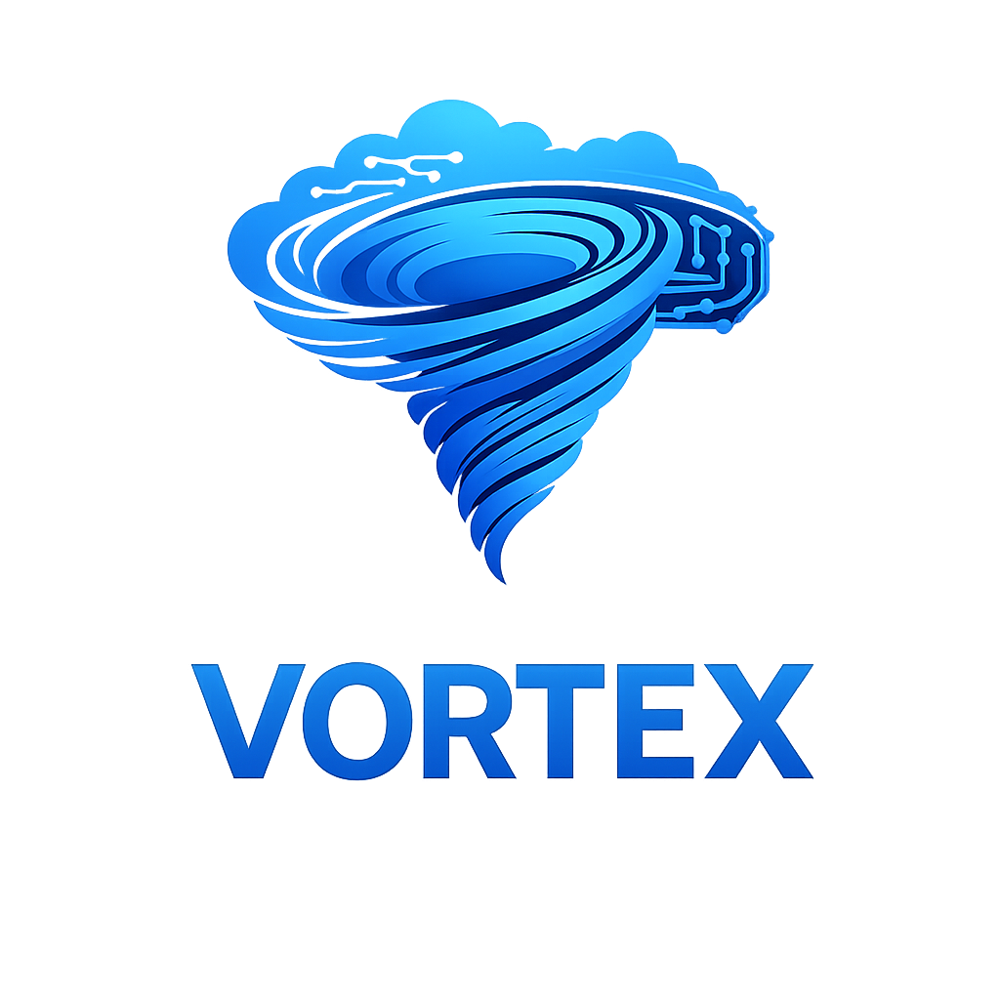

# VORTEX Yapay Zekâ Asistanı

> VORTEX; güvenli kullanıcı deneyimi, yerli yazılım üretimi ve sürdürülebilir teknoloji çözümleri odağıyla geliştirilen bir yapay zekâ asistanı projesidir.

[](docs/TEAM.md)
[](VortexAI.Public.sln)
[](LICENSE)

## Hızlı Navigasyon

| [Tanıtım](#tanıtım) | [Projenin Hikâyesi](#projenin-hikâyesi) | [TEKNOFEST Yolculuğu](#teknofest-yolculuğu) | [Takımımız](#takımımız) | [Katkılarıyla](#katkılarıyla) | [Kurulum](#hızlı-kurulum) |
| --- | --- | --- | --- | --- | --- |

## Tanıtım

VORTEX, gerçek dünya problemlerine güvenli, erişilebilir ve yüksek performanslı yazılım çözümleri üretme hedefiyle geliştirilmektedir. Bu public depo; kaynak sözleşmeleri, public server, web arayüzü, testler ve kullanıcıya dönük dokümantasyon için açık bir başlangıç noktası sunar.

Public kapsam; kullanıcı kaydı ve girişi, profil görüntüleme, cihaz kaydı/listeleme, izinli eylem planlama ve sahiplik kapsamlı device-job yaşam döngüsünü içerir. Gerçek kullanıcı verileri, erişim anahtarları, üretim yapılandırmaları ve private operasyon altyapısı depoda yer almaz.

## Projenin Hikâyesi

VORTEX, öğrencilerin ortak yazılım geliştirme ilgisini sürdürülebilir bir üretim kültürüne dönüştürme hedefiyle ortaya çıktı. Ekip; güvenli, erişilebilir ve kullanıcı odaklı dijital deneyimler tasarlarken gerçek dünya problemlerine yerli yazılım yaklaşımıyla çözüm üretmeyi amaçlıyor.

Proje sürecinde mimari tasarım, backend geliştirme, kullanıcı deneyimi, test yaklaşımı ve dokümantasyon birlikte ele alındı. VORTEX, yalnızca bir ürün fikri değil; ekip çalışması, disiplinli öğrenme ve sürekli iyileştirme anlayışını temsil eden uzun soluklu bir gelişim yolculuğudur.

## TEKNOFEST Yolculuğu

VORTEX, TEKNOFEST 2026 başvuru sürecinde yerli teknoloji üretimi, toplumsal fayda ve gençlerin yazılım alanındaki yetkinliğini güçlendirme hedefleriyle ilerliyor. Bu yolculuk; fikrin olgunlaştırılması, teknik çözümün geliştirilmesi, sunum hazırlığı ve proje yönetimi çalışmalarını kapsıyor.

Takım, her aşamada araştırma, prototipleme, geri bildirim alma ve çözümü iyileştirme döngüsünü benimsiyor. Amaç; teknik niteliği yüksek, anlaşılabilir ve sorumlu bir proje ortaya koyarken Türkiye'nin teknoloji ekosistemine değer katmak.

## Takımımız

VORTEX; farklı sorumlulukları ortak hedefte buluşturan genç bir yazılım takımıdır. Danışmanlık, teknik geliştirme, sistem tasarımı ve proje koordinasyonu görevleri; açık iletişim, karşılıklı öğrenme ve düzenli çalışma ilkeleriyle yürütülür.

Takımın temel değerleri ekip çalışması, azim, disiplin ve asla pes etmemedir. Üyeler; C#, .NET, Python ve Java gibi teknolojilerle çalışırken güvenli kullanıcı deneyimi, estetik tasarım ve yüksek performans hedeflerini birlikte gözetir.

Ayrıntılı ekip hikâyesi, projeler, roller ve TEKNOFEST bağlamı için [TEKNOFEST Takım Belgesi](docs/TEKNOFESTTEAM.md) dosyasını inceleyin.

## Katkılarıyla

VORTEX ekibi; TEKNOFEST başvuru sürecinde sağladıkları başvuru rehberliği, bütçe desteği, çalışma imkânları ve proje geliştirme katkıları için Keçiören Belediyesi ile Teknomer'e içten teşekkür eder.

Bu destek; ekibin proje fikrini olgunlaştırmasına, teknik çalışmalarını planlı yürütmesine ve yenilikçi çözümler geliştirmesine değerli katkı sundu. Gençlerin teknoloji üretimine katılımını güçlendiren bu yaklaşım, VORTEX'in sürdürülebilir ve toplumsal fayda odaklı hedeflerini desteklemektedir.

<p align="center">
  
  &nbsp;&nbsp;&nbsp;&nbsp;
  
</p>

## Arayüz Galerisi

<p align="center">
  <picture>
    
  </picture>
  <picture>
    
  </picture>
</p>

<p align="center"><sub>Arayüz genel görünümü ve kurulum deneyimi. Görseller dar ekranlarda doğal boyutlarına göre alt alta görüntülenir.</sub></p>

Bu görünüm, Vortex'in koyu temalı ve odaklı tasarım dilini; kurulum görünümü ise örnek yapılandırma yaklaşımını temsil eder. Public belgede kullanılan görsellerde parola, token, anahtar veya gerçek kullanıcı verisi bulunmaz.

## Hızlı Kurulum

1. [.NET 8 SDK](https://dotnet.microsoft.com/download/dotnet/8.0) yükleyin.
2. `Vortex.Server.Public/appsettings.example.json` dosyasını referans alın; gerçek `Jwt:SigningKey` değerini yalnız yerel gizli yapılandırmada veya ortam değişkeninde tutun.
3. `Vortex.Web/appsettings.example.json` içindeki `Vortex:ServerBaseUrl` değerini yerel public server adresiniz için yapılandırın.
4. Yayın öncesi restore, build ve test akışını çalıştırın. Ayrıntılar için [kurulum rehberine](docs/SETUP.md) bakın.

Bu kurulum görünümü; örnek yapılandırma, güvenli secret yönetimi ve doğrulama akışını belgelemek için kullanılır. Gerçek `appsettings.json`, `.env`, veritabanı, log veya üretim erişim bilgileri GitHub'a yüklenmez.

## Mimari ve Güvenlik

```text
Tarayıcı → Vortex.Web → Vortex.Server.Public → SQLite
                              ↓
                    sahiplik kapsamlı device-job akışı
```

- **Vortex.Contracts:** İstek, yanıt, rol ve device-job sözleşmeleri.
- **Vortex.Server.Public:** Kimlik doğrulama, owner-scoped cihaz ve iş akışları, SQLite erişimi.
- **Vortex.Web:** Public server API'sini kullanan web arayüzü.
- **Güvenlik ilkesi:** Girdi sınırlandırma, sahiplik kontrolü, izinli eylem planlama, generic hata yanıtları ve anahtarların kaynak kontrolü dışında tutulması.

Ayrıntılar için [Mimari](docs/ARCHITECTURE.md), [Yapılandırma](docs/CONFIGURATION.md), [Public kapsam](docs/PUBLIC_SCOPE.md) ve [Güvenlik](SECURITY.md) belgelerini inceleyin.

## Doğrulama

```powershell
dotnet restore VortexAI.Public.sln
dotnet build VortexAI.Public.sln -c Release --no-restore
dotnet test Vortex.Public.Tests/Vortex.Public.Tests.csproj -c Release --no-build
```

Doğrulama sonucu revision-specific kanıttır. Sürüm notu veya dokümantasyon tek başına build/test başarısı kanıtı değildir. Kontrol listesi için [doğrulama kaydına](docs/VERIFICATION.md) bakın.

## VORTEX Takımı ve Teknofest 2026

VORTEX; yazılım alanında teknik yetkinlik kazanmak, gerçek dünya problemlerine sürdürülebilir çözümler üretmek ve Türkiye'nin dijital dönüşümüne katkı sağlamak amacıyla kurulan genç bir yazılım takımıdır.

- **Takım:** VORTEX
- **Odak:** Yerli yazılım, açık kaynak ekosistemi, güvenli kullanıcı deneyimi ve toplumsal fayda
- **Takım kültürü:** Ekip çalışması, azim, disiplin ve asla pes etmeme
- **Ayrıntılar:** [Takım hikâyesi, projeler ve görev dağılımı](docs/TEAM.md)

## Belgeler

| Belge | İçerik |
| --- | --- |
| [Kurulum Rehberi](docs/SETUP.md) | Yerel yapılandırma, çalıştırma ve doğrulama adımları |
| [Arayüz Rehberi](docs/INTERFACE.md) | Public görsellerin açıklamaları ve kullanım sınırları |
| [Takım ve Teknofest 2026](docs/TEAM.md) | Takım amacı, hikâye, projeler ve roller |
| [Mimari](docs/ARCHITECTURE.md) | Public sistem sınırları ve teknik akış |
| [Yapılandırma](docs/CONFIGURATION.md) | Güvenli örnek ayarlar ve ortam değişkenleri |
| [Katkı Rehberi](CONTRIBUTING.md) | Katkı ve public kapsam kuralları |
| [Güvenlik](SECURITY.md) | Hassas bulgu bildirimi ve gizlilik yaklaşımı |
| [Sürüm Notları](Release/v1.0.1.md) | v1.0.1 public kaynak dışa aktarım özeti |

## Yayın İlkesi

Bu depo source-first bir public sürümdür. Release binary, paket, arşiv, checksum, gerçek kullanıcı verisi, token, erişim anahtarı veya üretim yapılandırması kaynak kontrolünde tutulmaz.
