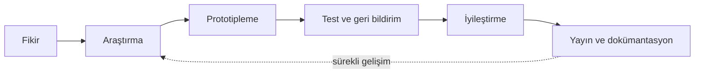
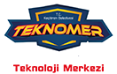
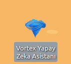
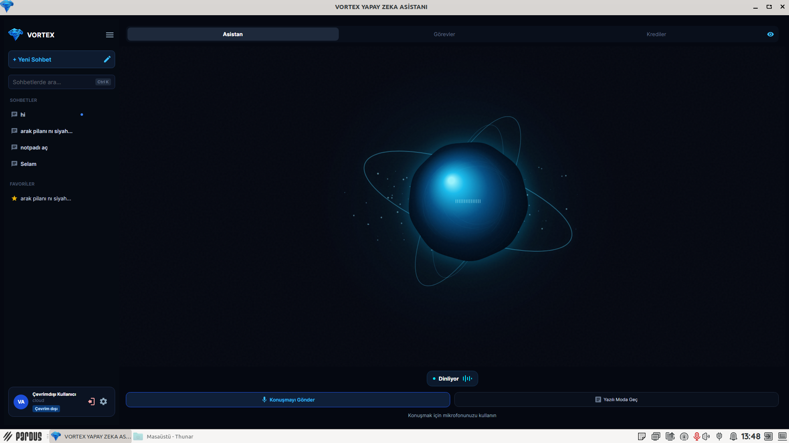
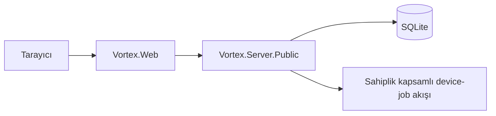

<div align="center">


# VORTEX Yapay Zekâ Asistanı

**Güvenli kullanıcı deneyimi, yerli yazılım üretimi ve sürdürülebilir teknoloji çözümleri odağıyla geliştirilen yapay zekâ asistanı projesi.**

[](TEKNOFESTTEAM.md)
[](VortexAI.Public.sln)
[](#public-depo-sınırı)
[](SECURITY.md)

</div>

---

## Hızlı navigasyon

<div align="center">

[**Tanıtım**](#tanıtım) ·
[**Projenin Hikâyesi**](#projenin-hikâyesi) ·
[**TEKNOFEST Yolculuğu**](#teknofest-yolculuğu) ·
[**Takımımız**](#takımımız) ·
[**Arayüz Galerisi**](#arayüz-galerisi) ·
[**Kurulum**](#hızlı-kurulum) ·
[**Belgeler**](#belgeler)

</div>

> [!NOTE]
> Bu ana `README.md`, projenin sıcak karşılama ve genel tanıtım sayfasıdır. Teknik ayrıntılar tek dosyada yığılmamış; mimari, kurulum, takım, destekçiler ve Hermes Worker işlemleri ayrı belgelere bölünmüştür.

---

## Tanıtım

VORTEX, gerçek dünya problemlerine güvenli, erişilebilir ve yüksek performanslı yazılım çözümleri üretme hedefiyle geliştirilmektedir.

Bu public depo; kaynak sözleşmeleri, public server, web arayüzü, testler ve kullanıcıya dönük dokümantasyon için açık bir başlangıç noktası sunar. Public kapsam aşağıdaki temel yetenekleri içerir:

- Kullanıcı kaydı ve girişi
- Profil bilgisi görüntüleme
- Cihaz kaydı ve listeleme
- İzinli eylem planlama
- Sahiplik kapsamlı device-job yaşam döngüsü
- Güvenli doğrulama ve hata yanıtları
- Public geliştirme ve dokümantasyon altyapısı

Gerçek kullanıcı verileri, erişim anahtarları, üretim yapılandırmaları ve private operasyon altyapısı depoda yer almaz.

<table>
<tr>
<td width="50%" valign="top">

### 🎯 Proje odağı

- Güvenli kullanıcı deneyimi
- Erişilebilir yapay zekâ etkileşimi
- Yerli yazılım geliştirme
- Sürdürülebilir teknik mimari
- Açık kaynak kültürü

</td>
<td width="50%" valign="top">

### 🛡️ Temel yaklaşım

- Owner bazlı yetkilendirme
- Girdi ve işlem sınırlandırma
- Private/public bileşen ayrımı
- Secret-free public repository
- Doğrulanabilir build ve test akışı

</td>
</tr>
</table>

---

## Projenin Hikâyesi

VORTEX, öğrencilerin ortak yazılım geliştirme ilgisini sürdürülebilir bir üretim kültürüne dönüştürme hedefiyle ortaya çıktı. Ekip; güvenli, erişilebilir ve kullanıcı odaklı dijital deneyimler tasarlarken gerçek dünya problemlerine yerli yazılım yaklaşımıyla çözüm üretmeyi amaçlıyor.

Proje sürecinde mimari tasarım, backend geliştirme, kullanıcı deneyimi, test yaklaşımı ve dokümantasyon birlikte ele alındı. VORTEX, yalnızca bir ürün fikri değil; ekip çalışması, disiplinli öğrenme ve sürekli iyileştirme anlayışını temsil eden uzun soluklu bir gelişim yolculuğudur.



---

## TEKNOFEST Yolculuğu

VORTEX, TEKNOFEST 2026 başvuru sürecinde yerli teknoloji üretimi, toplumsal fayda ve gençlerin yazılım alanındaki yetkinliğini güçlendirme hedefleriyle ilerliyor.

Bu yolculuk;

- fikrin olgunlaştırılmasını,
- teknik çözümün geliştirilmesini,
- prototipleme çalışmalarını,
- sunum hazırlığını,
- proje yönetimini,
- geri bildirim ve sürekli iyileştirme döngüsünü

kapsıyor.

Amaç; teknik niteliği yüksek, anlaşılabilir ve sorumlu bir proje ortaya koyarken Türkiye'nin teknoloji ekosistemine değer katmaktır.

<div align="center">

[](TEKNOFESTTEAM.md)

</div>

---

## Takımımız

VORTEX; farklı sorumlulukları ortak hedefte buluşturan genç bir yazılım takımıdır. Danışmanlık, teknik geliştirme, sistem tasarımı ve proje koordinasyonu görevleri; açık iletişim, karşılıklı öğrenme ve düzenli çalışma ilkeleriyle yürütülür.

Takımın temel değerleri:

- **Ekip çalışması**
- **Azim**
- **Disiplin**
- **Sürekli öğrenme**
- **Asla pes etmeme**

Ana README’de yalnızca kısa bir tanıtım bulunur. Üye rolleri, görev dağılımı, takım yönetimi, sorumluluk matrisi ve TEKNOFEST bağlamı ayrı belgede tutulur.

<table>
<tr>
<td align="center" width="33%">

### 👨‍🏫 Danışmanlık

Proje planlama, teknik süreçlerde rehberlik ve ekip gelişiminin desteklenmesi.

</td>
<td align="center" width="33%">

### 🧭 Koordinasyon

Genel proje takibi, görev dağılımı, temel uygulama yapısı ve geliştirme yönetimi.

</td>
<td align="center" width="33%">

### 🧩 Teknik destek

Kod yapısı, sistem tasarımı ve teknik çözüm geliştirme süreçlerinde destek.

</td>
</tr>
</table>

<div align="center">

[](TEKNOFESTTEAM.md)

</div>

---

## Katkılarıyla

VORTEX ekibi; TEKNOFEST başvuru sürecinde sağladıkları başvuru rehberliği, bütçe desteği, çalışma imkânları ve proje geliştirme katkıları için **Keçiören Belediyesi** ile **Teknomer**'e içten teşekkür eder.

Bu destek; ekibin proje fikrini olgunlaştırmasına, teknik çalışmalarını planlı yürütmesine ve yenilikçi çözümler geliştirmesine değerli katkı sundu. Gençlerin teknoloji üretimine katılımını güçlendiren bu yaklaşım, VORTEX'in sürdürülebilir ve toplumsal fayda odaklı hedeflerini desteklemektedir.

<p align="center">
  
  &nbsp;&nbsp;&nbsp;&nbsp;
  
</p>

<div align="center">

[](%F0%9F%A4%9D%20Project%20Supporters.md)

</div>

---

## Arayüz Galerisi

<p align="center">
  <picture>
    
  </picture>
  <picture>
    
  </picture>
</p>

<p align="center"><sub>VORTEX ana arayüzü ve sesli etkileşim sırasında görüntülenen ORB deneyimi.</sub></p>

Bu görünüm, VORTEX'in koyu temalı ve odaklı tasarım dilini temsil eder. Public belgede kullanılan görsellerde parola, token, anahtar veya gerçek kullanıcı verisi bulunmaz.

> [!IMPORTANT]
> Görsellerin GitHub üzerinde görünmesi için `images/partners/` ve `images/interface/` klasörleri repository içinde aynı yollarla korunmalıdır.

---

## Hızlı Kurulum

1. [.NET 8 SDK](https://dotnet.microsoft.com/download/dotnet/8.0) yükleyin.
2. `Vortex.Server.Public/appsettings.example.json` dosyasını referans alın.
3. Gerçek `Jwt:SigningKey` değerini yalnız yerel secret yapılandırmasında veya ortam değişkeninde tutun.
4. `Vortex.Web/appsettings.example.json` içindeki `Vortex:ServerBaseUrl` değerini yerel public server adresiniz için yapılandırın.
5. Restore, build ve test akışını çalıştırın.

```powershell
# Windows PowerShell

dotnet restore VortexAI.Public.sln
dotnet build VortexAI.Public.sln -c Release --no-restore
dotnet test Vortex.Public.Tests/Vortex.Public.Tests.csproj -c Release --no-build
```

Tam kurulum, yapılandırma ve sorun giderme adımları için:

<div align="center">

[](SETUP.md)

</div>

---

## Mimari ve Güvenlik



- **Vortex.Contracts:** İstek, yanıt, rol ve device-job sözleşmeleri.
- **Vortex.Server.Public:** Kimlik doğrulama, owner-scoped cihaz ve iş akışları, SQLite erişimi.
- **Vortex.Web:** Public server API'sini kullanan web arayüzü.
- **Güvenlik ilkesi:** Girdi sınırlandırma, sahiplik kontrolü, izinli eylem planlama, genel hata yanıtları ve anahtarların kaynak kontrolü dışında tutulması.

Teknik mimari, kimlik doğrulama, görev tamamlama politikası, HTTP durumları ve public/private sınırlar için:

<div align="center">

[](ARCHITECTURE.md)

</div>

---

## Hermes Worker belgeleri

Hermes Worker belgeleri iki farklı amaca göre ayrılmıştır.

<table>
<tr>
<td width="50%" valign="top">

### Operasyon rehberi

[`VORTEX_HERMES_WORKER_README.md`](VORTEX_HERMES_WORKER_README.md)

Private WSL Worker için kapsamlı operasyon belgesidir:

- WSL2 ve systemd
- Docker ve .NET preflight
- Worker kurulumu
- Private environment sınırları
- Worker–Server eşleştirmesi
- CLIProxy/model router
- Publish ve versioned release
- Health, diagnostics ve rollback
- Portable backup ve restore

</td>
<td width="50%" valign="top">

### Bileşen geliştirme rehberi

[`Vortex.HermesWorker/README.html`](Vortex.HermesWorker/README.html)

Doğrudan `Vortex.HermesWorker` kaynak klasörüne ait bileşen belgesidir:

- Bileşenin sorumluluğu
- Kaynak dosya yapısı
- Geliştirme akışı
- Build ve local run
- Runtime bağımlılıkları
- Operasyon rehberiyle ayrım

</td>
</tr>
</table>

> [!WARNING]
> Public Server Hermes'i başlatmaz. `Vortex.HermesWorker`, private WSL ortamından Server'a outbound bağlantı kurar. Worker için laptop üzerinde inbound public port açılmaz.

---

## Belgeler

Aşağıdaki belgelerin tamamı ana `README.md` ile aynı kök dizinde bulunur. Yalnızca bileşen geliştirme belgesi `Vortex.HermesWorker/` klasöründedir.

<table>
<tr>
<td width="50%" valign="top">

### 🏗️ [ARCHITECTURE.md](ARCHITECTURE.md)

Public sistem mimarisi, güvenlik sınırları, kimlik doğrulama, device-job yaşam döngüsü ve HTTP davranışları.

</td>
<td width="50%" valign="top">

### 🛠️ [SETUP.md](SETUP.md)

Yerel geliştirme ortamı, server/web yapılandırması, secret yönetimi, build ve test doğrulaması.

</td>
</tr>
<tr>
<td width="50%" valign="top">

### 👥 [TEKNOFESTTEAM.md](TEKNOFESTTEAM.md)

Takım hikâyesi, üye rolleri, görev dağılımı, takım yönetimi ve TEKNOFEST 2026 yolculuğu.

</td>
<td width="50%" valign="top">

### 🤝 [Project Supporters](%F0%9F%A4%9D%20Project%20Supporters.md)

VORTEX'in gelişim sürecine katkı sunan kurumlar ve teşekkür bölümü.

</td>
</tr>
<tr>
<td width="50%" valign="top">

### 🐧 [VORTEX_HERMES_WORKER_README.md](VORTEX_HERMES_WORKER_README.md)

Private WSL Hermes Worker için ayrıntılı operasyon, bakım, tanılama ve kurtarma rehberi.

</td>
<td width="50%" valign="top">

### ⚙️ [Vortex.HermesWorker/HermesWorker.md](Vortex.HermesWorker/HermesWorker.md)

Worker kaynak bileşeninin geliştirme, build ve kod seviyesindeki sorumluluk rehberi.

</td>
</tr>
</table>

Repository içinde mevcutsa aşağıdaki tamamlayıcı belgeler de kullanılmalıdır:

| Belge | İçerik |
| --- | --- |
| [`SECURITY.md`](SECURITY.md) | Hassas güvenlik bulgularını bildirme ve gizlilik yaklaşımı |
| [`CONTRIBUTING.md`](CONTRIBUTING.md) | Katkı süreci ve public kapsam kuralları |
| [`docs/CONFIGURATION.md`](docs/CONFIGURATION.md) | Güvenli örnek ayarlar ve ortam değişkenleri |
| [`docs/PUBLIC_SCOPE.md`](docs/PUBLIC_SCOPE.md) | Public export sınırı |
| [`docs/VERIFICATION.md`](docs/VERIFICATION.md) | Revision-specific build ve test kaydı |
| [`Release/v1.0.1.md`](Release/v1.0.1.md) | Public sürüm notları |

---

## Önerilen repository yerleşimi

```text
VORTEX-YAPAY-ZEKA-ASISTANI/
├─ README.md
├─ ARCHITECTURE.md
├─ SETUP.md
├─ TEKNOFESTTEAM.md
├─ VORTEX_HERMES_WORKER_README.md
├─ 🤝 Project Supporters.md
├─ SECURITY.md
├─ CONTRIBUTING.md
│
├─ Vortex.HermesWorker/
│  ├─ HermesWorker.md
│  ├─ Program.cs
│  ├─ publish-wsl-worker.sh
│  └─ vortex-hermes-worker.service.example
│
├─ images/
│  ├─ partners/
│  └─ interface/
│
├─ Vortex.Contracts/
├─ Vortex.Server.Public/
├─ Vortex.Web/
├─ Vortex.Public.Tests/
└─ VortexAI.Public.sln
```

Bu yerleşimde GitHub repository ana sayfasında yalnız kök `README.md` otomatik gösterilir. Diğer belgeler, ana README’deki bağlantılar üzerinden açılır.

---

## Doğrulama

```powershell
# Windows PowerShell

dotnet restore VortexAI.Public.sln
dotnet build VortexAI.Public.sln -c Release --no-restore
dotnet test Vortex.Public.Tests/Vortex.Public.Tests.csproj -c Release --no-build
```

> [!NOTE]
> Dokümantasyon veya sürüm notu tek başına build/test başarısı kanıtı değildir. Doğrulama sonucu kullanılan revision, tarih ve komut çıktısıyla birlikte kaydedilmelidir.

---

## Public depo sınırı

Bu depo source-first bir public sürümdür. Aşağıdaki öğeler kaynak kontrolünde tutulmaz:

- Gerçek kullanıcı verileri
- Token ve erişim anahtarları
- Private environment dosyaları
- Üretim yapılandırmaları
- Veritabanları ve loglar
- Docker volume/container state
- Private Server payload'ları
- Kullanıcı çalışma alanları
- Provider/model credential bilgileri

Public ve private bileşenler arasındaki sınır, güvenlik ve sürdürülebilir bakım açısından korunmalıdır.

---

<div align="center">

### VORTEX

**Yerli yazılım · Güvenli kullanıcı deneyimi · Sürekli gelişim**

[Başa dön](#vortex-yapay-zekâ-asistanı)

</div>
