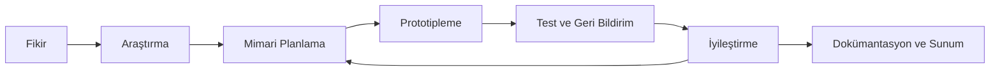
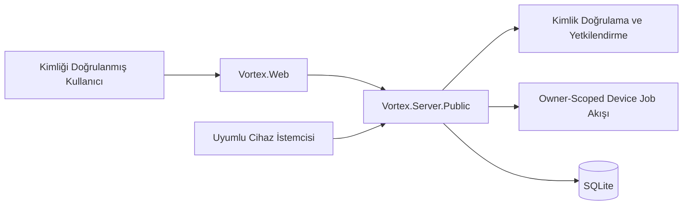
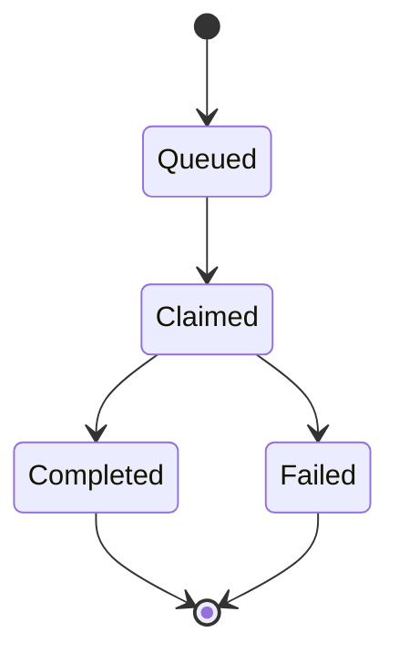
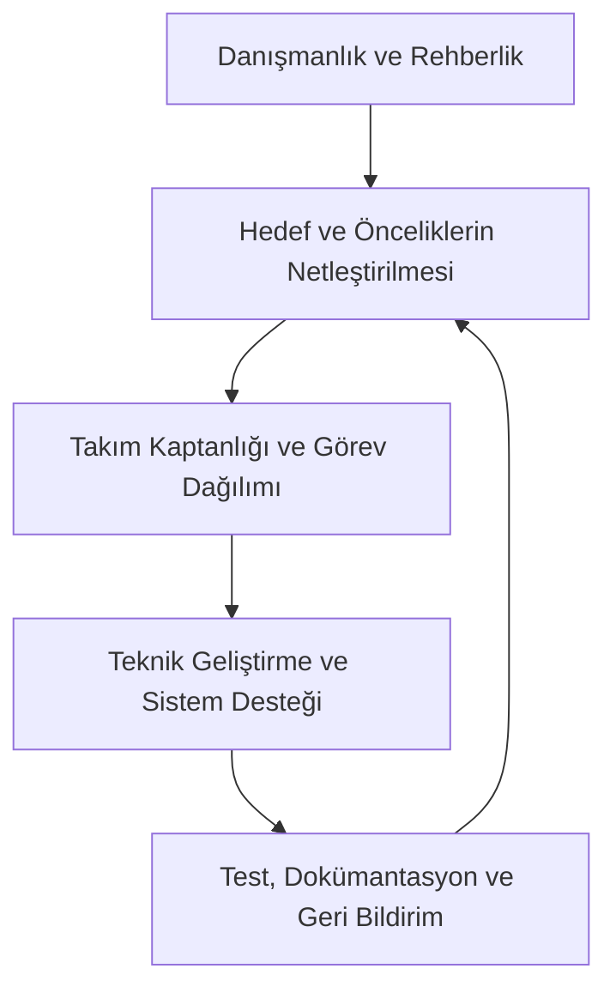
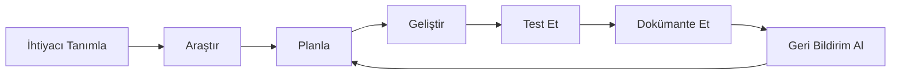
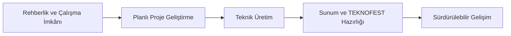

<div align="center">


# VORTEX Yapay Zekâ Asistanı

### Güvenli, erişilebilir ve sürdürülebilir yerli yapay zekâ deneyimi

VORTEX; kullanıcı deneyimi, güvenli yazılım mimarisi, açık kaynak geliştirme kültürü ve toplumsal fayda odağıyla geliştirilen bir yapay zekâ asistanı projesidir.

[](docs/TEAM.md)
[](VortexAI.Public.sln)
[](#-public-kapsam)
[](SECURITY.md)
[](docs/README.md)

[Projeyi Tanı](#-proje-hakkında) ·
[Özellikler](#-öne-çıkan-özellikler) ·
[Arayüz](#-arayüz-galerisi) ·
[Mimari](#-sistem-mimarisi) ·
[Takım](#-takımımız) ·
[Kurulum](#-hızlı-kurulum) ·
[Belgeler](#-dokümantasyon-merkezi)

</div>

---

> [!IMPORTANT]
> Bu depo VORTEX'in **public ve source-first** sürümüdür. Gerçek kullanıcı verileri, erişim anahtarları, üretim yapılandırmaları, private çalışma ortamları ve gizli operasyon altyapısı bu depoda yayımlanmaz.

## İçindekiler

- [Proje hakkında](#-proje-hakkında)
- [Öne çıkan özellikler](#-öne-çıkan-özellikler)
- [Projenin hikâyesi](#-projenin-hikâyesi)
- [TEKNOFEST 2026 yolculuğu](#-teknofest-2026-yolculuğu)
- [Arayüz galerisi](#-arayüz-galerisi)
- [Public kapsam](#-public-kapsam)
- [Sistem mimarisi](#-sistem-mimarisi)
- [Güvenlik yaklaşımı](#-güvenlik-yaklaşımı)
- [Takımımız](#-takımımız)
- [Takım yönetimi ve çalışma modeli](#-takım-yönetimi-ve-çalışma-modeli)
- [Destekçiler](#-destekçiler)
- [Repository yapısı](#-repository-yapısı)
- [Hızlı kurulum](#-hızlı-kurulum)
- [Yapılandırma](#-yapılandırma)
- [Çalıştırma ve doğrulama](#-çalıştırma-ve-doğrulama)
- [Dokümantasyon merkezi](#-dokümantasyon-merkezi)
- [Public yayın ilkesi](#-public-yayın-ilkesi)

---

## 🌌 Proje hakkında

VORTEX, gerçek dünya problemlerine güvenli, erişilebilir ve yüksek performanslı yazılım çözümleri üretme hedefiyle geliştirilmektedir.

Public depo; kaynak sözleşmeleri, public server, web arayüzü, testler ve kullanıcıya dönük dokümantasyon için açık bir başlangıç noktası sunar. Proje yalnızca çalışan bir uygulama üretmeyi değil; mimariyi, güvenlik sınırlarını, doğrulama süreçlerini ve takım çalışma kültürünü anlaşılır biçimde belgelemeyi de amaçlar.

<table>
<tr>
<td width="33%" align="center" valign="top">

### 🛡️ Güvenli

Kimlik doğrulama, sahiplik izolasyonu, izinli eylem modeli ve secret-free repository yaklaşımı.

</td>
<td width="33%" align="center" valign="top">

### 🎯 Kullanıcı Odaklı

Anlaşılır arayüzler, erişilebilir deneyim ve gerçek ihtiyaçlara yönelik çözüm tasarımı.

</td>
<td width="33%" align="center" valign="top">

### ♻️ Sürdürülebilir

Bakımı yapılabilir mimari, test kültürü, dokümantasyon ve sürekli iyileştirme yaklaşımı.

</td>
</tr>
</table>

### VORTEX neyi temsil eder?

- Güvenli ve sorumlu yazılım geliştirme kültürünü,
- yerli teknoloji üretimine katkı sağlama hedefini,
- genç geliştiricilerin ortak üretim yolculuğunu,
- mimari, test ve dokümantasyonun birlikte yürütülmesini,
- kullanıcı deneyimi ile teknik güvenliğin dengelenmesini,
- açık kaynak paylaşımında public/private sınırlarının korunmasını.

---

## ✨ Öne çıkan özellikler

<table>
<tr>
<td width="50%" valign="top">

### 🔐 Kimlik ve Yetkilendirme

- Kullanıcı kaydı ve girişi
- JWT Bearer doğrulaması
- Sahiplik kapsamlı kaynak erişimi
- Cihaz token doğrulaması
- İptal edilmiş cihazların reddedilmesi

</td>
<td width="50%" valign="top">

### 🧩 Cihaz ve Görev Yönetimi

- Cihaz kaydı ve listeleme
- İzinli eylem planlama
- Görev kuyruğu oluşturma
- Claim ve completion yaşam döngüsü
- Tekrarlanan tamamlamada idempotent davranış

</td>
</tr>
<tr>
<td width="50%" valign="top">

### 🗃️ Veri Katmanı

- SQLite tabanlı yerel veri saklama
- Parametreli sorgular
- Owner-scoped kayıt modeli
- Sunucu tarafından korunan kritik alanlar
- Güvenli hata davranışı

</td>
<td width="50%" valign="top">

### 📚 Geliştirici Deneyimi

- .NET 8 çözüm yapısı
- Secret-free örnek yapılandırmalar
- Build ve test komutları
- Mimari ve kurulum rehberleri
- GitHub ana sayfasına uygun dokümantasyon

</td>
</tr>
</table>

---

## 📖 Projenin hikâyesi

VORTEX, öğrencilerin ortak yazılım geliştirme ilgisini sürdürülebilir bir üretim kültürüne dönüştürme hedefiyle ortaya çıktı. TÜBİTAK 4006 Bilim Fuarı deneyimi, bireysel teknik merakın ortak proje üretimine dönüşmesinde önemli başlangıçlardan biri oldu.

Ekip, yalnızca kod yazmaya değil; bir ürünün tamamını oluşturan aşağıdaki alanlara birlikte odaklandı:

- problem ve ihtiyaç analizi,
- sistem mimarisi,
- backend geliştirme,
- kullanıcı deneyimi ve görsel tasarım,
- test ve doğrulama,
- proje planlama,
- dokümantasyon,
- açık kaynak yayın disiplini.

VORTEX Yapay Zekâ Asistanı, bu üretim yaklaşımının güvenli, erişilebilir ve kullanıcı odaklı bir ürün çalışmasına dönüşmüş hâlidir.



---

## 🚀 TEKNOFEST 2026 yolculuğu

VORTEX, TEKNOFEST 2026 başvuru sürecinde yerli teknoloji üretimi, toplumsal fayda ve gençlerin yazılım alanındaki yetkinliğini güçlendirme hedefleriyle ilerlemektedir.

Bu yolculuk:

1. Proje fikrinin olgunlaştırılmasını,
2. kullanıcı ihtiyacının araştırılmasını,
3. teknik çözümün planlanmasını,
4. prototiplerin geliştirilmesini,
5. test ve geri bildirim süreçlerini,
6. sunum ve dokümantasyon çalışmalarını,
7. çözümün sürekli iyileştirilmesini

kapsar.

> [!NOTE]
> TEKNOFEST süreci takım için yalnızca bir yarışma başvurusu değildir. Aynı zamanda görev paylaşımı, teknik engelleri aşma, disiplinli çalışma ve ortaya çıkan ürünü anlaşılır biçimde anlatma deneyimidir.

<table>
<tr>
<td width="25%" align="center">

### 💡 Fikir
İhtiyacı ve hedef kullanıcıyı tanımlama

</td>
<td width="25%" align="center">

### 🧠 Plan
Mimariyi ve görevleri belirleme

</td>
<td width="25%" align="center">

### 🛠️ Üretim
Prototip, kod, test ve tasarım

</td>
<td width="25%" align="center">

### 📣 Sunum
Dokümantasyon ve proje anlatımı

</td>
</tr>
</table>

Ayrıntılı takım hikâyesi için [VORTEX Takımı ve TEKNOFEST Yolculuğu](docs/TEAM.md) belgesini inceleyin.

---

## 🖥️ Arayüz galerisi

<p align="center">
  
  
</p>

<p align="center">
  <sub>VORTEX'in koyu temalı arayüz dili ve sesli komut deneyiminde kullanılan ORB görünümü.</sub>
</p>

<table>
<tr>
<td width="50%" valign="top">

### Ana Arayüz

Odaklı ve koyu temalı tasarım dili, kullanıcıyı gereksiz görsel karmaşadan uzak tutmayı amaçlar.

</td>
<td width="50%" valign="top">

### VORTEX ORB

Sesli komutlar algılandığında kullanıcıya görsel geri bildirim sağlayan dijital arayüz bileşenidir.

</td>
</tr>
</table>

> [!WARNING]
> Public dokümantasyonda kullanılan ekran görüntüleri gerçek kullanıcı verisi, parola, token, API anahtarı, özel endpoint veya üretim adresi göstermemelidir.

---

## 🌐 Public kapsam

Public sürüm, projeyi incelemek ve yerel geliştirme ortamında çalıştırmak isteyen kişiler için güvenli bir başlangıç noktası sunar.

### Public sürümde bulunanlar

- `Vortex.Contracts` içindeki istek, yanıt, rol ve device-job sözleşmeleri,
- `Vortex.Server.Public` kimlik doğrulama ve owner-scoped iş akışları,
- `Vortex.Web` public web arayüzü,
- public test projeleri,
- secret-free örnek yapılandırmalar,
- kullanıcı ve geliştirici belgeleri,
- public kullanıma uygun statik görseller.

### Public sürümde bulunmayanlar

> [!CAUTION]
> Aşağıdaki bileşenler public deponun kapsamı dışındadır.

- Desktop çalışma zamanı,
- LocalAgent,
- Hermes ve HermesWorker private runtime,
- Worker servisleri,
- uzak çalıştırma altyapısı,
- Tailscale ve private ağ yapılandırması,
- Docker runtime state,
- Admin Paneli,
- private Web kaynak kodu,
- üretim servisleri,
- gerçek kullanıcı verileri,
- token, parola, API key veya sertifika,
- veritabanı, log ve build çıktıları.

---

## 🏗️ Sistem mimarisi



Basitleştirilmiş akış:

```text
Tarayıcı → Vortex.Web → Vortex.Server.Public → SQLite
                              ↓
                    owner-scoped device-job akışı
```

### Bileşen sorumlulukları

| Bileşen | Sorumluluk |
| --- | --- |
| `Vortex.Contracts` | İstek, yanıt, kullanıcı rolü ve device-job sözleşmeleri |
| `Vortex.Server.Public` | Kimlik doğrulama, cihaz erişimi, görev yaşam döngüsü ve SQLite veri erişimi |
| `Vortex.Web` | Public Server API üzerinden kullanıcı arayüzü |
| `Vortex.Public.Tests` | Public güvenlik, iş akışı ve repository davranışlarının doğrulanması |

### Device-job yaşam döngüsü



### HTTP davranışı

| Durum | HTTP yanıtı |
| --- | --- |
| Geçersiz veya iptal edilmiş cihaz | `401 Unauthorized` |
| Görev bulunamadı | `404 Not Found` |
| Başka cihaza ait görev | `404 Not Found` |
| Bekleyen görev için geçersiz işlem | `404 Not Found` |
| Başarıyla tamamlandı | `200 OK` |
| Aynı görevin tekrar tamamlanması | `200 OK` |
| Yaşam döngüsü koruma hatası | `409 Conflict` |

Ayrıntılı teknik sınırlar için [Public Sistem Mimarisi](docs/ARCHITECTURE.md) belgesine bakın.

---

## 🔒 Güvenlik yaklaşımı

VORTEX public sürümü aşağıdaki güvenlik ilkelerini temel alır:

1. **Kimlik doğrulama zorunluluğu** — Korunan kaynaklar geçerli token olmadan kullanılamaz.
2. **Owner isolation** — Bir kullanıcı veya cihaz başka bir sahibin kaynağına erişemez.
3. **Kaynak gizleme** — Yetkisiz sahiplik erişimi bilgi sızdırmamak amacıyla `404` döndürebilir.
4. **Sunucu tarafından yönetilen yaşam döngüsü** — `DryRun` gibi kritik alanlar istemci tarafından değiştirilemez.
5. **İzinli eylem modeli** — Public sürüm serbest komut çalıştırmaz.
6. **Girdi sınırlandırma** — Parametre uzunlukları ve riskli işlem koşulları sınırlandırılır.
7. **Secret-free repository** — Gerçek signing key, token, parola, sertifika ve veritabanı commit edilmez.
8. **Generic hata yaklaşımı** — Hata yanıtları gereksiz iç ayrıntı veya hassas değer paylaşmaz.

<table>
<tr>
<td width="50%" valign="top">

### ✅ Depoda olabilir

- Örnek yapılandırmalar
- Placeholder değerler
- Public kaynak kodu
- Secret içermeyen görseller
- Mimari ve kurulum belgeleri
- Public testler

</td>
<td width="50%" valign="top">

### ❌ Depoya eklenmemeli

- Gerçek `appsettings.json`
- `.env` ve private config
- Token, parola ve API key
- SQLite veritabanları
- Kullanıcı verileri ve loglar
- Sertifika ve private endpoint bilgileri

</td>
</tr>
</table>

---

## 👥 Takımımız

VORTEX; danışmanlık, teknik geliştirme, sistem tasarımı ve proje koordinasyonu görevlerini ortak hedefte buluşturan genç bir yazılım takımıdır.

<table>
<tr>
<td width="33%" align="center" valign="top">

### 👨‍🏫 Hüseyin Keçeli

**Danışman Öğretmen**  
**Bilişim Teknolojileri Alan Şefi**


Proje planlama ve teknik süreçlerde rehberlik eder; ekip üyelerinin gelişimini destekler.

</td>
<td width="33%" align="center" valign="top">

### 🧭 Okan Özbay

**Takım Kaptanı**  
**Kod Geliştirici**


Genel koordinasyon, uygulama yapısı, kod geliştirme, görev dağılımı ve proje takibini yürütür.

</td>
<td width="33%" align="center" valign="top">

### 🧩 Enes Tüter

**Takım Üyesi**  
**Yazılım Destek**


Teknik destek, kod yapısı ve sistem tasarımı konularında deneyim paylaşımı sağlar.

</td>
</tr>
</table>

### Takım değerleri

<p align="center">
  
  
  
  
</p>

> [!NOTE]
> Takım görevleri, paylaşılan takım belgesindeki sorumlulukları yansıtır. Görev değişiklikleri olduğunda `docs/TEAM.md` ve bu bölüm birlikte güncellenmelidir.

---

## 🧭 Takım yönetimi ve çalışma modeli

Takım yönetimi; danışmanlık, koordinasyon, teknik üretim ve doğrulama sorumluluklarının birbirini desteklemesi üzerine kuruludur.



### Yönetim sorumlulukları

<table>
<tr>
<td width="33%" valign="top">

#### 🎓 Danışmanlık

- Proje hedeflerinin netleştirilmesi
- Teknik sürecin izlenmesi
- Ekip gelişiminin desteklenmesi
- Planlama ve sunum sürecine rehberlik

</td>
<td width="33%" valign="top">

#### 📋 Koordinasyon

- Görevlerin dağıtılması
- Proje takibinin yürütülmesi
- Teknik kararların paylaşılması
- Kod ve dokümantasyon bütünlüğünün korunması

</td>
<td width="33%" valign="top">

#### 💻 Teknik Destek

- Kod yapısının değerlendirilmesi
- Sistem tasarımına katkı
- Teknik problemlerin incelenmesi
- Ekip içi öğrenmenin desteklenmesi

</td>
</tr>
</table>

### Sorumluluk matrisi

| Çalışma alanı | Danışman | Takım kaptanı | Yazılım destek |
| --- | :---: | :---: | :---: |
| Proje hedeflerinin belirlenmesi | Rehberlik | Koordinasyon | Görüş ve teknik katkı |
| Görev dağılımı | Gözlem ve destek | Ana sorumluluk | Görev katkısı |
| Uygulama geliştirme | Teknik rehberlik | Ana geliştirme | Teknik destek |
| Sistem tasarımı | Değerlendirme | Koordinasyon | Deneyim paylaşımı |
| Test ve doğrulama | Süreç desteği | Takip ve uygulama | Teknik katkı |
| Dokümantasyon | Kalite rehberliği | Bütünlük ve güncelleme | İçerik katkısı |
| Sunum ve TEKNOFEST hazırlığı | Rehberlik | Koordinasyon | Teknik destek |

### Çalışma döngüsü



<details>
<summary><strong>Danışmanlık ve rehberlik görevlerini göster</strong></summary>

- Projenin amacı ile teknik çözüm arasındaki uyumu değerlendirmek,
- ekip üyelerinin gelişimini desteklemek,
- planlama ve sunum çalışmalarına rehberlik etmek,
- proje sürecinin düzenli ilerlemesine katkı sağlamak.

</details>

<details>
<summary><strong>Takım kaptanlığı ve geliştirme görevlerini göster</strong></summary>

- Genel proje koordinasyonunu yürütmek,
- görevleri dağıtmak ve ilerlemeyi takip etmek,
- temel uygulama yapısını geliştirmek,
- teknik kararları ekip içinde paylaşmak,
- kod ve dokümantasyon bütünlüğünü korumak.

</details>

<details>
<summary><strong>Yazılım ve sistem desteği görevlerini göster</strong></summary>

- Kod yapısı hakkında teknik destek sağlamak,
- sistem tasarımı konusunda deneyim paylaşmak,
- geliştirme sırasında karşılaşılan problemleri değerlendirmek,
- ekip içi teknik öğrenmeye katkıda bulunmak.

</details>

### Başarı ölçütü

Takım için başarı yalnızca bir özelliğin çalışması değildir. Başarı;

- neden çalıştığını anlayabilmek,
- güvenli sınırlarını tanımlamak,
- test edebilmek,
- sürdürülebilir biçimde geliştirmek,
- başkalarının anlayabileceği şekilde belgelemek

anlamına gelir.

---

## 🤝 Destekçiler

VORTEX ekibi; TEKNOFEST başvuru sürecinde sağladıkları rehberlik, çalışma ortamı, bütçe desteği, teknik destek ve proje geliştirme katkıları için **Keçiören Belediyesi** ile **Teknomer**'e teşekkür eder.

<p align="center">
  
  &nbsp;&nbsp;&nbsp;&nbsp;&nbsp;
  
</p>

<table>
<tr>
<td width="50%" align="center" valign="top">

### VORTEX

Projenin tasarımı, yazılım geliştirme süreci, sistem mimarisi, dokümantasyonu ve açık kaynak yönetimi VORTEX ekibi tarafından yürütülmektedir.

</td>
<td width="50%" align="center" valign="top">

### Teknomer

TEKNOFEST başvuru sürecinde sağlanan rehberlik, çalışma ortamı, teknik destek ve proje geliştirme katkıları için teşekkür ederiz.

</td>
</tr>
</table>



> 💙 **Keçiören Belediyesi ve Teknomer'e**, genç yazılım geliştiricilere verdikleri değer ve VORTEX projesine sundukları katkılar için teşekkür ederiz.

Ayrıntılı teşekkür sayfası için [Destekçilerimiz](docs/SUPPORTERS.md) belgesini inceleyin.

---

## 📁 Repository yapısı

```text
VORTEX/
├─ README.md                         # GitHub ana sayfasında otomatik gösterilir
├─ VortexAI.Public.sln               # Public solution
├─ Vortex.Contracts/                 # Public sözleşmeler
├─ Vortex.Server.Public/             # Public API ve SQLite veri katmanı
├─ Vortex.Web/                       # Public web arayüzü
├─ Vortex.Public.Tests/              # Public doğrulama testleri
├─ Vortex.Desktop/                   # Yalnız public-safe statik referanslar
├─ images/                           # Dokümantasyon görselleri
├─ docs/
│  ├─ README.md                      # Dokümantasyon merkezi
│  ├─ SETUP.md                       # Kurulum rehberi
│  ├─ ARCHITECTURE.md                # Public sistem mimarisi
│  ├─ TEAM.md                        # Takım ve TEKNOFEST yolculuğu
│  └─ SUPPORTERS.md                  # Destekçiler
├─ SECURITY.md
├─ CONTRIBUTING.md
└─ LICENSE
```

> [!TIP]
> GitHub, repository kökündeki `README.md` dosyasını ana sayfada otomatik gösterir. `docs/README.md` dosyası ise `docs` klasörü açıldığında dokümantasyon ana sayfası olarak görüntülenir.

---

## ⚡ Hızlı kurulum

### Ön koşullar

- [.NET 8 SDK](https://dotnet.microsoft.com/download/dotnet/8.0)
- Git
- Yerel, yazılabilir bir veri dizini
- JWT imzalama anahtarı için güvenli bir yerel secret kaynağı

### 1. Depoyu klonlayın

```powershell
# Windows PowerShell

git clone <REPOSITORY_URL>
cd <REPOSITORY_DIRECTORY>
```

### 2. Örnek yapılandırmaları inceleyin

- `Vortex.Server.Public/appsettings.example.json`
- `Vortex.Web/appsettings.example.json`

Gerçek değerleri repository dışında veya commit edilmeyen yerel yapılandırmada sağlayın.

### 3. Restore, build ve test akışını çalıştırın

```powershell
dotnet restore VortexAI.Public.sln
dotnet build VortexAI.Public.sln -c Release --no-restore
dotnet test Vortex.Public.Tests/Vortex.Public.Tests.csproj -c Release --no-build
```

### 4. Uygulamaları başlatın

```powershell
# Terminal 1 — Public Server

dotnet run --project Vortex.Server.Public/Vortex.Server.Public.csproj
```

```powershell
# Terminal 2 — Web

dotnet run --project Vortex.Web/Vortex.Web.csproj
```

> [!TIP]
> Portları veya URL'leri eski bir örnekten kopyalamayın. Çalışan uygulamaların konsol çıktısını ve etkin yerel yapılandırmasını referans alın.

Ayrıntılı kurulum ve sorun giderme için [Kurulum Rehberi](docs/SETUP.md) belgesine geçin.

---

## ⚙️ Yapılandırma

### Public Server

`Vortex.Server.Public/appsettings.example.json` aşağıdaki ayarlar için referanstır:

| Ayar | Amaç |
| --- | --- |
| `Jwt:Issuer` | Yerel issuer tanımlayıcısı |
| `Jwt:Audience` | Public client audience tanımlayıcısı |
| `Jwt:SigningKey` | En az 32 UTF-8 byte uzunluğunda gizli imzalama anahtarı |
| `Vortex:DataDirectory` | SQLite verisinin tutulacağı yazılabilir yerel dizin |

Ortam değişkenlerinde `:` yerine `__` kullanılır:

```powershell
$env:Jwt__Issuer = "<LOCAL_ISSUER>"
$env:Jwt__Audience = "<LOCAL_AUDIENCE>"
$env:Jwt__SigningKey = "<LOCAL_SECRET_WITH_AT_LEAST_32_UTF8_BYTES>"
$env:Vortex__DataDirectory = "<LOCAL_WRITABLE_DATA_DIRECTORY>"
```

> [!CAUTION]
> Yukarıdaki değerler yalnız placeholder'dır. Gerçek secret değerlerini terminal geçmişine, ekran görüntüsüne veya dokümana yazmayın.

### Web

`Vortex.Web/appsettings.example.json` içindeki `Vortex:ServerBaseUrl`, çalışan yerel public server adresini göstermelidir.

Web arayüzü kullanıcı tarayıcısından API anahtarı istemez. Başarılı girişten sonra server tarafından sağlanan access token HTTP-only oturum çerezinde tutulur; Web uygulaması public server'a bearer header ile istek yapar.

---

## ✅ Çalıştırma ve doğrulama

### Kanonik doğrulama komutları

```powershell
dotnet restore VortexAI.Public.sln
dotnet build VortexAI.Public.sln -c Release --no-restore
dotnet test Vortex.Public.Tests/Vortex.Public.Tests.csproj -c Release --no-build
```

### Doğrulama sınırı

- Dokümantasyonun güncel olması build başarısı anlamına gelmez.
- Sürüm notu testlerin geçtiğini tek başına kanıtlamaz.
- Başarılı sonuç belirli bir commit veya revision için kaydedilmelidir.
- Test atlandıysa açıkça belirtilmelidir.
- Gerçek secret veya kullanıcı verisi doğrulama çıktısına eklenmemelidir.

### Yayın öncesi kontrol listesi

- [ ] Restore başarılı
- [ ] Release build başarılı
- [ ] Public testler başarılı
- [ ] Secret taraması temiz
- [ ] Dokümantasyon bağlantıları çalışıyor
- [ ] Görseller gerçek kullanıcı verisi içermiyor
- [ ] Public/private sınırı korunuyor
- [ ] Sürüm notu güncel

---

## 📚 Dokümantasyon merkezi

<table>
<tr>
<td width="50%" valign="top">

### 🛠️ Kurulum

Yerel geliştirme ortamı, secret-free yapılandırma, Server/Web çalıştırma, doğrulama ve sorun giderme.

**[Kurulum Rehberini Aç →](docs/SETUP.md)**

</td>
<td width="50%" valign="top">

### 🏗️ Mimari

Public sistem sınırları, kimlik doğrulama, owner isolation, device-job yaşam döngüsü ve HTTP davranışları.

**[Mimari Rehberini Aç →](docs/ARCHITECTURE.md)**

</td>
</tr>
<tr>
<td width="50%" valign="top">

### 👥 Takım ve TEKNOFEST

Projenin hikâyesi, takım üyeleri, sorumluluklar, değerler ve TEKNOFEST 2026 yolculuğu.

**[Takım Belgesini Aç →](docs/TEAM.md)**

</td>
<td width="50%" valign="top">

### 🤝 Destekçiler

Keçiören Belediyesi ve Teknomer'in proje yolculuğuna sağladığı katkılar ve teşekkür metni.

**[Destekçiler Sayfasını Aç →](docs/SUPPORTERS.md)**

</td>
</tr>
<tr>
<td width="50%" valign="top">

### 🔐 Güvenlik

Hassas bulguların bildirilmesi, gizlilik yaklaşımı ve public-safe paylaşım sınırları.

**[Güvenlik Belgesini Aç →](SECURITY.md)**

</td>
<td width="50%" valign="top">

### 🤲 Katkı

Public kapsam kuralları, katkı akışı ve repository hijyen beklentileri.

**[Katkı Rehberini Aç →](CONTRIBUTING.md)**

</td>
</tr>
</table>

### Tüm belgeler

| Belge | İçerik |
| --- | --- |
| [Dokümantasyon Merkezi](docs/README.md) | Tüm public belgeler için başlangıç noktası |
| [Kurulum Rehberi](docs/SETUP.md) | Yerel yapılandırma, çalıştırma ve doğrulama |
| [Arayüz Rehberi](docs/INTERFACE.md) | Public görseller ve kullanım sınırları |
| [Takım ve TEKNOFEST](docs/TEAM.md) | Takım hikâyesi, üyeler ve sorumluluklar |
| [Public Sistem Mimarisi](docs/ARCHITECTURE.md) | Teknik akış, güvenlik ve HTTP davranışları |
| [Yapılandırma](docs/CONFIGURATION.md) | Örnek ayarlar ve ortam değişkenleri |
| [Destekçiler](docs/SUPPORTERS.md) | Destek sağlayan kurumlar ve teşekkür |
| [Doğrulama Kaydı](docs/VERIFICATION.md) | Revision-specific build ve test kanıtları |
| [Katkı Rehberi](CONTRIBUTING.md) | Katkı ve public kapsam kuralları |
| [Güvenlik](SECURITY.md) | Hassas bulgu bildirimi ve gizlilik yaklaşımı |
| [Sürüm Notları](Release/v1.0.1.md) | Public sürüm değişiklikleri |

---

## 📦 Public yayın ilkesi

Bu depo source-first bir public sürümdür.

### Kaynak kontrolünde tutulabilir

- public kaynak kodu,
- public testler,
- secret-free örnek yapılandırmalar,
- dokümantasyon,
- public kullanıma uygun görseller,
- public kapsamı açıklayan politika dosyaları.

### Kaynak kontrolünde tutulmaz

- release binary ve kurulum paketleri,
- gerçek kullanıcı verileri,
- token, parola ve API anahtarı,
- üretim yapılandırmaları,
- veritabanları ve loglar,
- private çalışma ortamları,
- Docker container/volume/cache state,
- gerçek endpoint ve erişim bilgileri.

> [!IMPORTANT]
> Checksum veya manifest bir dosyanın public-safe olduğunu tek başına kanıtlamaz. Her artifact ayrıca içerik, dosya yolu ve secret örüntüleri açısından kontrol edilmelidir.

---

<div align="center">

## VORTEX

**Ekip çalışması · Azim · Disiplin · Asla pes etmeme**

Yerli yazılım üretimi, güvenli kullanıcı deneyimi ve sürdürülebilir teknoloji çözümleri için geliştirilmektedir.

[Başa Dön ↑](#vortex-yapay-zekâ-asistanı) · [Dokümantasyon](docs/README.md) · [Takım](docs/TEAM.md) · [Güvenlik](SECURITY.md)

</div>
