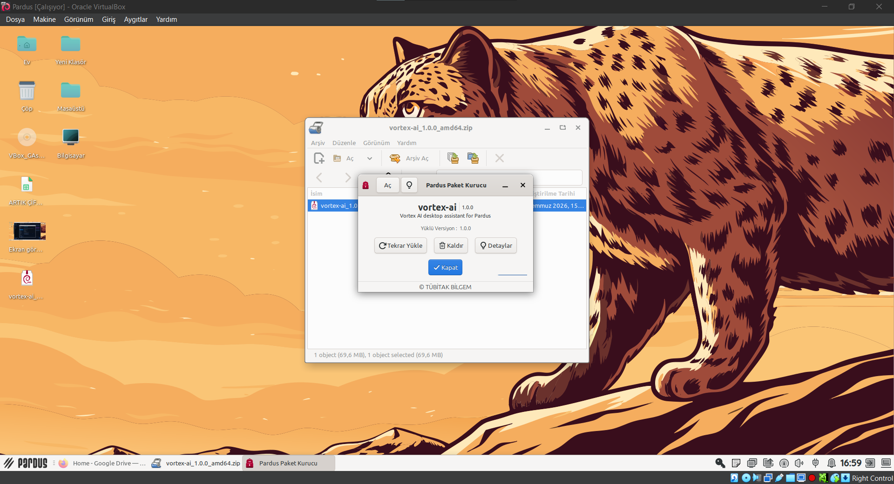

<div align="center">

# VORTEX Kurulum Rehberi

**Public Server ve Web arayüzünü yerel geliştirme ortamında güvenli biçimde çalıştırma**

[](#ön-koşullar)
[](#güvenlik-notları)
[](README.md)

[← Ana README](README.md) · [Mimari](ARCHITECTURE.md) · [Takım](TEKNOFESTTEAM.md) · [Hermes Worker](VORTEX_HERMES_WORKER_README.md)

</div>

---

> [!IMPORTANT]
> Bu belge public `Vortex.Server.Public` ve `Vortex.Web` yerel geliştirme kurulumunu açıklar. Private WSL Worker kurulumu için [`VORTEX_HERMES_WORKER_README.md`](VORTEX_HERMES_WORKER_README.md) kullanılmalıdır.

Bu rehber, public Vortex server ve Web arayüzünü yerel geliştirme ortamında yapılandırmak için temel akışı açıklar. Gerçek anahtarlar, kullanıcı verileri ve üretim yapılandırmaları bu depoya eklenmez.

## Ön koşullar

- .NET 8 SDK
- Yerel, yazılabilir bir veri dizini
- JWT imzalama anahtarı için gizli bir yerel değer

## Server yapılandırması

`Vortex.Server.Public/appsettings.example.json` dosyasını referans alın. Yerel geliştirmede değerleri `appsettings.json` dosyasında veya ortam değişkenleriyle sağlayın; gerçek yapılandırma dosyasını kaynak kontrole eklemeyin.

Gerekli ayarlar:

| Ayar | Açıklama |
| --- | --- |
| `Jwt:Issuer` | Yerel issuer tanımlayıcısı |
| `Jwt:Audience` | Public client audience tanımlayıcısı |
| `Jwt:SigningKey` | En az 32 UTF-8 byte içeren, benzersiz ve gizli imzalama anahtarı |
| `Vortex:DataDirectory` | SQLite verisinin tutulacağı yerel, yazılabilir dizin |

Ortam değişkenlerinde `:` yerine `__` kullanılır; örneğin `Jwt__SigningKey`.

## Web yapılandırması

`Vortex.Web/appsettings.example.json` dosyasındaki `Vortex:ServerBaseUrl` alanını yerel public server adresinizle ayarlayın. Örnek URL yalnızca inert bir yer tutucudur; üretim servis adresi değildir.

Web arayüzü, kullanıcı tarayıcısından API anahtarı istemez. Başarılı girişten sonra server tarafından verilen access token, yalnız HTTP-only oturum çerezinde tutulur ve Web uygulaması public server'a açık bearer header ile istek yapar.

## Kurulum görünümü



Bu ekran görüntüsü, Vortex'in kurulum ve ilk yapılandırma deneyimini belgelemek için ayrılmıştır. Public belgede yer alan görseller, gerçek kullanıcı verileri, parolalar, tokenlar veya üretim adresleri göstermemelidir.

## Çalıştırma ve doğrulama

Public solution için yayın öncesi aşağıdaki komutları çalıştırın:

```powershell
dotnet restore VortexAI.Public.sln
dotnet build VortexAI.Public.sln -c Release --no-restore
dotnet test Vortex.Public.Tests/Vortex.Public.Tests.csproj -c Release --no-build
```

Komutların sonuçları revision-specific olarak [Verification](VERIFICATION.md) belgesine kaydedilmelidir.

## Güvenlik notları

- `appsettings.json`, `.env`, veritabanı, log, sertifika ve build çıktıları yayınlanmamalıdır.
- JWT imzalama anahtarını commit etmeyin veya dokümantasyona yazmayın.
- Örnek yapılandırmalarda yalnız `example.invalid` gibi inert adresler kullanın.
- Public kapsam için [Public Scope](PUBLIC_SCOPE.md) belgesini inceleyin.

---

## Sonraki adımlar

- Sistem sınırlarını öğrenmek için [`ARCHITECTURE.md`](ARCHITECTURE.md) dosyasını inceleyin.
- Takım ve TEKNOFEST bağlamı için [`TEKNOFESTTEAM.md`](TEKNOFESTTEAM.md) dosyasını açın.
- Private Worker kurulumu için [`VORTEX_HERMES_WORKER_README.md`](VORTEX_HERMES_WORKER_README.md) dosyasını kullanın.
- Worker kaynak bileşeni için [`Vortex.HermesWorker/HermesWorker.md`](Vortex.HermesWorker/HermesWorker.md) belgesine bakın.

<div align="center">

[← Ana sayfaya dön](README.md)

</div>
