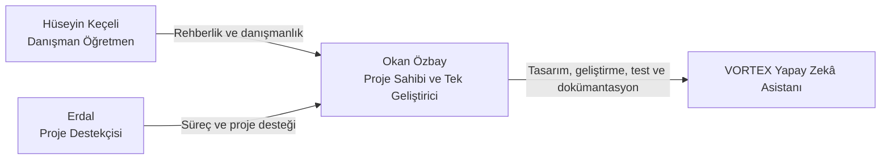
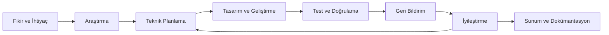

# VORTEX Takımı ve TEKNOFEST Yolculuğu

**Teknolojiyi yalnızca tüketmeyen; araştıran, geliştiren, öğrenen ve topluma değer katmayı hedefleyen bir proje yolculuğu.**

[← Ana README](README.md) · [Mimari](ARCHITECTURE.md) · [Kurulum](SETUP.md) · [Destekçiler](./%F0%9F%A4%9D%20Project%20Supporters.md)

---

> [!IMPORTANT]
> **VORTEX Yapay Zekâ Asistanı'nın yazılım geliştirme süreci Okan Özbay tarafından tek başına yürütülmüştür.**
> Hüseyin Keçeli projede danışman öğretmen ve rehber olarak; Erdal ise proje destekçisi olarak yer almıştır.
> Danışmanlık ve destek rolleri, uygulamanın kod geliştirme katkısı olarak gösterilmemelidir.

> [!NOTE]
> Bu belgeyi tamamlamak için üç kişiye ait gerçek fotoğraflar gereklidir. Aşağıdaki yer tutucu görselleri aynı dosya adlarını koruyarak gerçek fotoğraflarla değiştirin:
>
> - `images/team/okan-ozbay.jpg`
> - `images/team/huseyin-keceli.jpg`
> - `images/team/erdal.jpg`
>
> Erdal'ın soyadı ve resmî görev tanımı paylaşılmadığı için belgede yalnızca **Erdal** adı ve genel **proje destekçisi** rolü kullanılmıştır.

## İçindekiler

- [VORTEX nedir?](#vortex-nedir)
- [Projenin hikâyesi](#projenin-hikâyesi)
- [Geliştirme sahipliği](#geliştirme-sahipliği)
- [TEKNOFEST 2026 yolculuğu](#teknofest-2026-yolculuğu)
- [Proje ekibi ve destek rolleri](#proje-ekibi-ve-destek-rolleri)
- [Görev ve sorumluluk modeli](#görev-ve-sorumluluk-modeli)
- [Çalışma yaklaşımı](#çalışma-yaklaşımı)
- [Proje değerleri](#proje-değerleri)
- [Teknik çalışma alanları](#teknik-çalışma-alanları)
- [Hedefler](#hedefler)
- [Katkılarıyla](#katkılarıyla)
- [İlgili belgeler](#ilgili-belgeler)

---

## VORTEX nedir?

VORTEX; yerli yazılım üretimi, güvenli kullanıcı deneyimi ve sürdürülebilir teknoloji çözümleri odağında geliştirilen bir yapay zekâ asistanı projesidir.

Proje; yalnızca çalışan bir uygulama ortaya koymayı değil, aynı zamanda aşağıdaki alanlarda ölçülebilir ve belgelenebilir bir geliştirme süreci oluşturmayı hedefler:

- gerçek bir problemi tanımlamak,
- ihtiyaca uygun sistem mimarisi tasarlamak,
- güvenli yazılım geliştirme ilkelerini uygulamak,
- kullanıcıya anlaşılır ve erişilebilir bir deneyim sunmak,
- geliştirilen çözümü test etmek,
- kurulum ve kullanım süreçlerini belgelemek,
- public ve private sistem sınırlarını açık biçimde ayırmak,
- öğrenilen teknik bilgileri sürdürülebilir bir projeye dönüştürmek.

VORTEX Yapay Zekâ Asistanı bu yaklaşımın güvenli, kullanıcı odaklı ve geliştirilebilir bir ürün çalışmasına dönüşmüş hâlidir.

---

## Projenin hikâyesi

VORTEX'in temelleri, yazılım ve uygulama geliştirmeye duyulan ilginin gerçek bir ürün ortaya çıkarma hedefiyle birleşmesiyle atıldı.

TÜBİTAK 4006 Bilim Fuarı gibi önceki proje deneyimleri; araştırma yapma, fikir geliştirme, teknik engelleri aşma ve ortaya çıkan çalışmayı sunma konusunda önemli bir başlangıç oluşturdu. Bu deneyim zamanla daha kapsamlı bir yazılım projesine dönüştü.

VORTEX sürecinde yalnızca kod yazmaya değil, bir yazılım ürününün tamamını oluşturan şu alanlara da odaklanıldı:

- problem ve ihtiyaç analizi,
- teknik araştırma,
- sistem ve servis mimarisi,
- backend geliştirme,
- kullanıcı arayüzü,
- kullanıcı deneyimi,
- performans ve hata yönetimi,
- test ve doğrulama,
- güvenlik sınırları,
- proje planlama,
- sürüm yönetimi,
- teknik dokümantasyon,
- GitHub ve açık kaynak yayın disiplini.

VORTEX, tek seferlik bir uygulama denemesi olarak değil; öğrenme, üretme ve sürekli iyileştirme yolculuğu olarak ele alınmaktadır.

---

## Geliştirme sahipliği

VORTEX Yapay Zekâ Asistanı'nın teknik geliştirme sorumluluğu **Okan Özbay** tarafından tek başına üstlenilmiştir.

Aşağıdaki çalışmalar Okan Özbay tarafından yürütülmüştür:

- proje fikrinin teknik ürüne dönüştürülmesi,
- uygulama mimarisinin oluşturulması,
- temel kod yapısının geliştirilmesi,
- public ve private bileşenlerin ayrıştırılması,
- masaüstü uygulama geliştirmesi,
- Server ve Web yapılarının geliştirilmesi,
- Worker ve Hermes entegrasyon çalışmalarının yürütülmesi,
- kullanıcı arayüzü ve deneyim tasarımı,
- hata ayıklama ve sorun giderme,
- test ve doğrulama süreçleri,
- güvenlik ve public export kontrolleri,
- kurulum ve operasyon rehberlerinin hazırlanması,
- GitHub repository ve sürüm dokümantasyonunun yönetilmesi.

> [!CAUTION]
> Projenin danışmanları ve destekçileri değerlidir; ancak **uygulamanın kod geliştirme sahipliği yalnızca Okan Özbay'a aittir**.
> Belge, sunum ve tanıtım metinlerinde bu ayrım korunmalıdır.

---

## TEKNOFEST 2026 yolculuğu

VORTEX, TEKNOFEST 2026 başvuru sürecinde aşağıdaki hedeflerle ilerlemektedir:

- yerli teknoloji üretimine katkı sağlamak,
- gerçek dünya problemlerine uygulanabilir çözümler geliştirmek,
- gençlerin teknik yetkinliğini güçlendirmek,
- toplumsal faydayı teknoloji tasarımının merkezinde tutmak,
- güvenli ve sorumlu yazılım geliştirme yaklaşımını göstermek,
- geliştirilen projenin teknik sınırlarını açık ve dürüst biçimde belgelemek.

TEKNOFEST yolculuğu yalnızca bir yarışma başvurusundan ibaret değildir. Bu süreç; fikri olgunlaştırma, teknik karar alma, danışman görüşlerinden yararlanma, destek mekanizmalarını doğru kullanma ve ortaya çıkan ürünü anlaşılır şekilde sunma deneyimidir.

---

## Proje ekibi ve destek rolleri

<table>
<tr>
<td align="center" width="33%">
   
  <h3>Okan Özbay</h3>
  <strong>Proje Sahibi</strong> 
  <strong>Takım Kaptanı</strong> 
  <strong>Tek Geliştirici</strong>  
  Uygulamanın mimarisi, kod geliştirme süreci, arayüzü, testleri, güvenlik çalışmaları ve dokümantasyonu.
</td>
<td align="center" width="33%">
   
  <h3>Hüseyin Keçeli</h3>
  <strong>Danışman Öğretmen</strong> 
  <strong>Bilişim Teknolojileri Alan Şefi</strong>  
  Proje hedeflerinin değerlendirilmesi, eğitimsel rehberlik, planlama ve süreç danışmanlığı.
</td>
<td align="center" width="33%">
   
  <h3>Erdal</h3>
  <strong>Proje Destekçisi</strong> 
  <strong>Süreç Desteği</strong>  
  Proje sürecine destek, motivasyon ve ihtiyaç duyulan aşamalarda katkı.
</td>
</tr>
</table>

### Rol özeti

| Kişi | Resmî rol | Kod geliştirme katkısı | Temel katkı alanı |
| --- | --- | ---: | --- |
| **Okan Özbay** | Proje sahibi, takım kaptanı ve tek geliştirici | **Evet — uygulamanın tamamı** | Mimari, yazılım, arayüz, test, güvenlik, dokümantasyon ve proje yönetimi |
| **Hüseyin Keçeli** | Danışman öğretmen | Hayır | Eğitimsel rehberlik, planlama ve danışmanlık |
| **Erdal** | Proje destekçisi | Hayır | Süreç, motivasyon ve proje desteği |

> [!TIP]
> Erdal'ın soyadı, görev unvanı ve katkı açıklaması kesinleştiğinde yalnızca bu kart ve rol tablosu güncellenmelidir.

---

## Görev ve sorumluluk modeli

### Proje sahipliği ve tek geliştirici sorumluluğu

Okan Özbay'ın sorumlulukları:

- ürün vizyonunu ve teknik hedefleri belirlemek,
- mimari kararları almak,
- kaynak kodu geliştirmek ve bakımını yapmak,
- Server, Web, Desktop ve Worker bileşenlerini geliştirmek,
- UI/UX tasarımını yürütmek,
- test ve doğrulama süreçlerini uygulamak,
- güvenlik sınırlarını tanımlamak,
- public export içeriğini kontrol etmek,
- hata ve sorunları incelemek,
- sürüm ve repository düzenini yönetmek,
- teknik belgeleri hazırlamak,
- TEKNOFEST için teknik sunum içeriğini oluşturmak.

### Danışmanlık ve rehberlik

Hüseyin Keçeli'nin katkıları:

- proje hedeflerinin eğitimsel açıdan değerlendirilmesi,
- planlama sürecine rehberlik,
- proje sunumu ve çalışma düzeni konusunda danışmanlık,
- öğrencinin teknik ve kişisel gelişiminin desteklenmesi,
- okul ve proje süreçleri arasında koordinasyona yardımcı olunması.

### Proje desteği

Erdal'ın katkıları:

- proje sürecine destek sağlanması,
- ihtiyaç duyulan aşamalarda yönlendirme ve motivasyon,
- proje çalışmasının sürdürülebilirliğine katkı,
- ilgili imkân ve bağlantılar konusunda destek.

---

## Çalışma yaklaşımı

VORTEX'in geliştirme modeli aşağıdaki adımları esas alır:

1. **İhtiyacı tanımlama** — Çözülecek problem, hedef kullanıcı ve beklenen sonuç belirlenir.
2. **Araştırma** — Benzer çözümler, kullanılan teknolojiler, güvenlik riskleri ve operasyon gereksinimleri incelenir.
3. **Teknik planlama** — Mimari, bileşen sınırları, veri akışları ve doğrulama hedefleri oluşturulur.
4. **Geliştirme** — Uygulama küçük, izlenebilir ve test edilebilir adımlarla geliştirilir.
5. **Doğrulama** — Build, test, güvenlik, kullanıcı deneyimi ve operasyon kontrolleri yapılır.
6. **Dokümantasyon** — Kurulum, mimari, geliştirme kararları, sınırlar ve kullanım yöntemleri açıklanır.
7. **Danışman değerlendirmesi** — Projenin hedefleri, sunumu ve çalışma düzeni danışman görüşleriyle değerlendirilir.
8. **İyileştirme** — Bulgular ve geri bildirimler sonraki geliştirme döngüsüne aktarılır.

---

## Proje değerleri

| İlke | Projedeki karşılığı |
| --- | --- |
| **Azim** | Teknik engeller karşısında araştırmaya ve çözüm üretmeye devam etmek |
| **Disiplin** | Planlı geliştirme, test, sürüm ve dokümantasyon sorumluluğu |
| **Dürüstlük** | Geliştirme sahipliğiyle danışmanlık ve destek rollerini doğru ayırmak |
| **Asla pes etmeme** | Hataları öğrenme fırsatı olarak değerlendirip projeyi geliştirmek |

---

## Teknik çalışma alanları

- C# ve .NET,
- Python,
- Java,
- yapay zekâ ve model entegrasyonları,
- sistem mimarisi,
- backend geliştirme,
- masaüstü uygulama geliştirme,
- web uygulamaları,
- Linux ve Pardus sistem yönetimi,
- WSL ve Docker,
- servis ve Worker mimarileri,
- UI/UX tasarımı,
- uygulama optimizasyonu,
- güvenli kullanıcı deneyimi,
- test ve doğrulama,
- GitHub ve sürüm yönetimi,
- teknik dokümantasyon.

---

## Hedefler

### Teknik hedefler

- anlaşılır ve sürdürülebilir bir mimari geliştirmek,
- public ve private sistem sınırlarını korumak,
- güvenli kimlik doğrulama ve sahiplik izolasyonu uygulamak,
- kullanıcıya erişilebilir bir arayüz sunmak,
- kritik işlemlerde doğrulama ve onay mekanizmaları kullanmak,
- release öncesi test ve doğrulama kültürü oluşturmak,
- kurulum ve operasyon süreçlerini yeniden uygulanabilir biçimde belgelemek.

### Eğitimsel hedefler

- yazılım geliştirme yetkinliğini artırmak,
- teknik kararları gerekçelendirebilmek,
- bağımsız araştırma ve problem çözme becerisini geliştirmek,
- düzenli çalışma ve proje takibi alışkanlığı kazanmak,
- danışman geri bildirimlerini geliştirme sürecine aktarmak,
- teknik çalışmayı anlaşılır biçimde sunabilmek.

### Toplumsal hedefler

- gençlerin teknoloji üretimine katılımını desteklemek,
- yerli yazılım ekosistemine değer katmak,
- güvenli ve sorumlu dijital çözümler geliştirmek,
- erişilebilir araçlarla teknik engelleri azaltmak,
- üretim sürecini açık ve anlaşılır dokümantasyonla paylaşmak.

---

## Katkılarıyla

VORTEX projesi, TEKNOFEST başvuru ve geliştirme sürecinde sağlanan katkılar için **Hüseyin Keçeli**, **Erdal**, **Keçiören Belediyesi** ve **Teknomer**'e teşekkür eder.

### Bireysel katkılar

- **Hüseyin Keçeli:** Danışman öğretmen olarak proje planlama, eğitimsel rehberlik ve sunum sürecine katkı sağlamıştır.
- **Erdal:** Proje destekçisi olarak sürecin ilerlemesine ve ihtiyaç duyulan aşamalardaki çalışmalara destek olmuştur.

### Kurumsal katkılar

Keçiören Belediyesi ve Teknomer tarafından sağlanan başvuru rehberliği, bütçe desteği, çalışma imkânları, teknik destek ve proje geliştirme katkıları; projenin daha planlı biçimde ilerlemesine yardımcı olmuştur.

  
  &nbsp;&nbsp;&nbsp;&nbsp;
  

Ayrıntılı teşekkür sayfası için [🤝 Project Supporters](./%F0%9F%A4%9D%20Project%20Supporters.md) belgesini inceleyin.

---

## İlgili belgeler

| Belge | Açıklama |
| --- | --- |
| [Ana README](README.md) | Proje tanıtımı, hikâye, görseller ve hızlı navigasyon |
| [Public Sistem Mimarisi](ARCHITECTURE.md) | Teknik sınırlar, bileşenler ve güvenlik modeli |
| [Kurulum Rehberi](SETUP.md) | Yerel çalışma, yapılandırma ve doğrulama |
| [Hermes Worker Operasyon Rehberi](VORTEX_HERMES_WORKER_README.md) | WSL, Docker, systemd, tanılama, rollback ve yedekleme |
| [Hermes Worker Geliştirme Rehberi](Vortex.HermesWorker/HermesWorker.md) | Worker bileşeni, kaynak kod ve geliştirme sınırları |
| [🤝 Project Supporters](./%F0%9F%A4%9D%20Project%20Supporters.md) | Bireysel ve kurumsal destekçiler |

---

**Tek geliştirici · Güçlü danışmanlık · Değerli destek · Sürekli gelişim**

[← Ana sayfaya dön](README.md)

