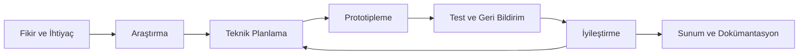

# VORTEX Takımı ve TEKNOFEST Yolculuğu

**Teknolojiyi yalnızca tüketmeyen; proje geliştiren, öğrenen ve topluma değer katmayı hedefleyen genç bir yazılım takımı.**

[← Ana README](README.md) · [Dokümantasyon Merkezi](README.md) · [Destekçiler](SUPPORTERS.md)

---

## İçindekiler

- [VORTEX kimdir?](#vortex-kimdir)
- [Projenin hikâyesi](#projenin-hikâyesi)
- [TEKNOFEST 2026 yolculuğu](#teknofest-2026-yolculuğu)
- [Takım üyeleri](#takım-üyeleri)
- [Görev ve sorumluluk modeli](#görev-ve-sorumluluk-modeli)
- [Takım kültürü](#takım-kültürü)
- [Çalışma yaklaşımı](#çalışma-yaklaşımı)
- [Teknik ilgi alanları](#teknik-ilgi-alanları)
- [Hedefler](#hedefler)
- [Katkılarıyla](#katkılarıyla)
- [İlgili belgeler](#ilgili-belgeler)

## VORTEX kimdir?

VORTEX; yerli yazılım üretimi, güvenli kullanıcı deneyimi ve sürdürülebilir teknoloji çözümleri odağında çalışan genç bir yazılım takımıdır.

Takım, teknolojiyi yalnızca kullanan değil; araştıran, tasarlayan, geliştiren, test eden ve öğrendiklerini yeni projelere aktaran bir üretim kültürü oluşturmayı hedefler.

VORTEX Yapay Zekâ Asistanı bu yaklaşımın:

- güvenli,
- erişilebilir,
- kullanıcı odaklı,
- teknik olarak geliştirilebilir,
- dokümante edilebilir

bir ürün çalışmasına dönüşmüş hâlidir.

## Projenin hikâyesi

VORTEX'in temelleri, ekip üyelerinin yazılım ve uygulama geliştirmeye duyduğu ortak ilgiyle atıldı. TÜBİTAK 4006 Bilim Fuarı deneyimi, bireysel teknik merakı ortak üretim kültürüne dönüştüren önemli başlangıçlardan biri oldu.

Bu süreçte ekip yalnızca kod yazmaya değil, bir projenin tamamını oluşturan şu alanlara da odaklandı:

- problem ve ihtiyaç analizi,
- sistem mimarisi,
- backend geliştirme,
- kullanıcı deneyimi,
- görsel tasarım,
- test ve doğrulama,
- proje planlama,
- dokümantasyon,
- açık kaynak yayın disiplini.

VORTEX, tek seferlik bir ürün denemesi yerine öğrenme ve sürekli iyileştirme yolculuğu olarak ele alınmaktadır.

## TEKNOFEST 2026 yolculuğu

VORTEX, TEKNOFEST 2026 başvuru sürecinde aşağıdaki hedeflerle ilerlemektedir:

- yerli teknoloji üretimine katkı sağlamak,
- gerçek dünya problemlerine uygulanabilir çözümler geliştirmek,
- gençlerin teknik yetkinliğini güçlendirmek,
- toplumsal faydayı teknoloji tasarımının merkezinde tutmak,
- güvenli ve sorumlu yazılım geliştirme yaklaşımını göstermek.

Süreç aşağıdaki çalışma döngüsünü kapsar:

TEKNOFEST yolculuğu yalnız yarışma başvurusundan ibaret değildir. Takım için bu süreç; fikir geliştirme, sorumluluk paylaşma, teknik engelleri aşma ve ortaya çıkan ürünü anlaşılır biçimde anlatma deneyimidir.

## Takım üyeleri

| Üye | Görev | Katkı alanı |
| --- | --- | --- |
| **Hüseyin Keçeli** | Danışman Öğretmen, Bilişim Teknolojileri Alan Şefi | Proje planlama ve teknik süreçlerde rehberlik; ekip üyelerinin gelişimini destekleme |
| **Okan Özbay** | Takım Kaptanı, Kod Geliştirici | Genel koordinasyon, temel uygulama yapısı, kod geliştirme, görev dağılımı ve proje takibi |
| **Enes Tüter** | Takım Üyesi, Yazılım Destek | Teknik destek, kod yapısı ve sistem tasarımı konusunda deneyim paylaşımı |

> [!NOTE]
> Bu tablo paylaşılan takım belgesindeki görevleri yansıtır. Güncel görev değişiklikleri bu dosyada açıkça güncellenmelidir.

## Görev ve sorumluluk modeli

### Danışmanlık ve rehberlik

- proje hedeflerinin netleştirilmesi,
- teknik sürecin izlenmesi,
- ekip üyelerinin gelişiminin desteklenmesi,
- planlama ve sunum sürecine rehberlik.

### Takım kaptanlığı ve geliştirme

- genel proje koordinasyonu,
- görevlerin dağıtılması ve takibi,
- temel uygulama yapısının geliştirilmesi,
- kod ve dokümantasyon bütünlüğünün korunması,
- teknik kararların ekip içinde paylaşılması.

### Yazılım ve sistem desteği

- kod yapısı hakkında teknik destek,
- sistem tasarımı konusunda deneyim paylaşımı,
- geliştirme sırasında karşılaşılan problemlerin değerlendirilmesi,
- ekip içi teknik öğrenmeye katkı.

## Takım kültürü

VORTEX takım kültürü dört ana ilke üzerinde şekillenir:

| İlke | Takımdaki karşılığı |
| --- | --- |
| **Ekip çalışması** | Bilgi paylaşımı, ortak karar ve karşılıklı destek |
| **Azim** | Teknik engeller karşısında çözüm aramaya devam etmek |
| **Disiplin** | Plan, görev takibi, test ve dokümantasyon sorumluluğu |
| **Asla pes etmeme** | Hataları öğrenme fırsatı olarak değerlendirip projeyi geliştirmek |

Takım için başarı yalnızca bir özelliğin çalışması değildir. Başarı; neden çalıştığını anlayabilmek, güvenli sınırlarını tanımlamak, test edebilmek ve başkalarının da anlayabileceği şekilde belgeleyebilmektir.

## Çalışma yaklaşımı

Takımın çalışma modeli aşağıdaki adımları esas alır:

1. **İhtiyacı tanımlama** — Çözülecek problem ve hedef kullanıcı netleştirilir.
2. **Araştırma** — Benzer çözümler, teknik seçenekler ve riskler incelenir.
3. **Planlama** — Mimari, görev dağılımı ve doğrulama hedefleri belirlenir.
4. **Geliştirme** — Küçük ve test edilebilir adımlarla uygulama geliştirilir.
5. **Doğrulama** — Build, test, güvenlik ve kullanıcı deneyimi kontrolleri yapılır.
6. **Dokümantasyon** — Kurulum, mimari, karar ve sınırlar açıklanır.
7. **Geri bildirim** — Sonuçlar değerlendirilir ve sonraki geliştirme döngüsüne aktarılır.

## Teknik ilgi alanları

Takımın çalışma ve deneyim alanları kaynak belgede aşağıdaki şekilde tanımlanmıştır:

- C# ve .NET,
- Python,
- Java,
- sistem mimarisi,
- backend geliştirme,
- oyun ve simülasyon projeleri,
- mobil/web standartlarında UI/UX tasarımı,
- uygulama optimizasyonu,
- güvenli kullanıcı deneyimi,
- test ve dokümantasyon.

Bu alanlar VORTEX projesinde tek bir teknoloji listesi olarak değil; problemin ihtiyacına göre birlikte kullanılan araçlar olarak ele alınır.

## Hedefler

### Teknik hedefler

- anlaşılır ve sürdürülebilir mimari geliştirmek,
- public ve private sistem sınırlarını korumak,
- güvenli kimlik doğrulama ve sahiplik izolasyonu uygulamak,
- kullanıcıya erişilebilir bir arayüz sunmak,
- release öncesi doğrulama kültürü oluşturmak.

### Eğitim ve takım hedefleri

- yazılım geliştirme yetkinliğini artırmak,
- teknik kararları gerekçelendirebilmek,
- ekip içinde bilgi paylaşımını güçlendirmek,
- düzenli çalışma ve görev takibi alışkanlığı kazanmak,
- teknik çalışmayı etkili biçimde sunabilmek.

### Toplumsal hedefler

- gençlerin teknoloji üretimine katılımını desteklemek,
- yerli yazılım ekosistemine değer katmak,
- güvenli ve sorumlu dijital çözümler geliştirmek,
- üretim sürecini açık ve anlaşılır dokümantasyonla paylaşmak.

## Katkılarıyla

VORTEX ekibi, TEKNOFEST başvuru sürecinde sağladıkları değerli katkılar için **Keçiören Belediyesi** ve **Teknomer**'e teşekkür eder.

Sağlanan rehberlik, bütçe desteği, çalışma imkânları, teknik destek ve proje geliştirme katkıları; ekibin fikrini daha planlı biçimde olgunlaştırmasına ve çalışmalarını sürdürülebilir bir zeminde yürütmesine yardımcı olmuştur.

  
  &nbsp;&nbsp;&nbsp;&nbsp;
  

Ayrıntılı teşekkür sayfası için [Destekçilerimiz](SUPPORTERS.md) belgesini inceleyin.

## İlgili belgeler

| Belge | Açıklama |
| --- | --- |
| [Ana README](../README.md) | Proje tanıtımı ve hızlı navigasyon |
| [Dokümantasyon Merkezi](README.md) | Tüm public belgeler |
| [Public Sistem Mimarisi](ARCHITECTURE.md) | Teknik sınırlar ve güvenlik modeli |
| [Kurulum Rehberi](SETUP.md) | Yerel çalışma ve doğrulama |
| [Destekçiler](SUPPORTERS.md) | Projeye katkı sağlayan kurumlar |

---

**Ekip çalışması · Azim · Disiplin · Asla pes etmeme**

[← Ana sayfaya dön](../README.md)

