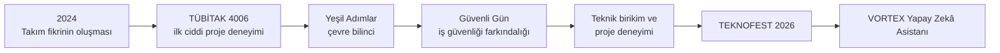
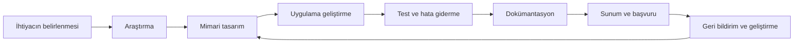

# VORTEX Takımı ve TEKNOFEST Yolculuğu

**Bir okul projesiyle başlayan, her yeni çalışmada büyüyen ve VORTEX Yapay Zekâ Asistanı'na uzanan üretim yolculuğu.**

[← Ana README](README.md) · [Mimari](ARCHITECTURE.md) · [Kurulum](SETUP.md) · [Destekçiler](./%F0%9F%A4%9D%20Project%20Supporters.md)

---

> [!IMPORTANT]
> VORTEX'in hikâyesi tek bir uygulamayla başlamadı.  
> 2024 yılında okul ortamında oluşan takım fikri; TÜBİTAK 4006 deneyimi, **Yeşil Adımlar** ve **Güvenli Gün** projeleriyle gelişti. Her çalışma; araştırma, tasarım, sunum, problem çözme ve toplumsal fayda konusunda yeni bir deneyim kazandırdı.  
> **VORTEX Yapay Zekâ Asistanı**, bu yolculukta edinilen birikimin daha kapsamlı bir yazılım projesine dönüşmüş hâlidir.

## İçindekiler

- [VORTEX'in doğuşu](#vortexin-doğuşu)
- [Takım hikâyesi](#takım-hikâyesi)
- [Proje yolculuğu](#proje-yolculuğu)
- [Yeşil Adımlar](#yeşil-adımlar)
- [Güvenli Gün](#güvenli-gün)
- [VORTEX Yapay Zekâ Asistanı'na geçiş](#vortex-yapay-zekâ-asistanına-geçiş)
- [TEKNOFEST 2026 yolculuğu](#teknofest-2026-yolculuğu)
- [Projedeki isimler](#projedeki-isimler)
- [Gelecek perspektifi](#gelecek-perspektifi)
- [Katkılarıyla](#katkılarıyla)
- [İlgili belgeler](#ilgili-belgeler)

---

## VORTEX'in doğuşu

VORTEX, 2024 yılında **Yenimahalle Şehit Mehmet Şengül Mesleki ve Teknik Anadolu Lisesi** bünyesinde, yazılım geliştirmeye ilgi duyan öğrencilerin ortak üretim isteğiyle ortaya çıktı.

Kuruluş amacı yalnızca yarışmalara proje hazırlamak değildi. Asıl hedef;

- yazılım alanında teknik yetkinlik kazanmak,
- gerçek dünya problemlerine çözüm üretmek,
- yeni teknolojileri araştırmak,
- açık kaynak ve yerli platformlarda projeler geliştirmek,
- edinilen bilgiyi sürdürülebilir çalışmalara dönüştürmekti.

VORTEX adı, zaman içinde yalnızca bir takım adını değil; araştırma, üretme ve her projeden yeni bir şey öğrenme anlayışını temsil etmeye başladı.

---

## Takım hikâyesi

Takımın temelleri, lise döneminde yazılım ve uygulama geliştirmeye duyulan ortak ilginin arkadaşlık ve takım çalışmasıyla birleşmesiyle atıldı.

Okulda düzenlenen **TÜBİTAK 4006 Bilim Fuarı**, bu ilginin gerçek bir projeye dönüşmesinde önemli bir dönüm noktası oldu. Fikir üretmek, projeyi eğitim kategorisine uygun hâle getirmek, uygulamayı tamamlamak ve ortaya çıkan ürünü sunmak; yazılım geliştirme yolculuğunun ilk ciddi deneyimlerini oluşturdu.

İlk projelerde karşılaşılan zorluklar yalnızca teknik değildi. Bir fikrin;

- hedef kitlesini belirlemek,
- anlaşılır bir senaryoya dönüştürmek,
- çalışır bir uygulama hâline getirmek,
- raporlamak,
- sunmak,
- geri bildirimlere göre yeniden düzenlemek

gerekiyordu.

Bu süreç, VORTEX'in sonraki projelerinde kullanacağı çalışma alışkanlığının temelini oluşturdu.

---

## Proje yolculuğu

Bu akış yalnızca tamamlanan projeleri göstermiyor. Her aşama bir sonraki çalışmanın temelini oluşturdu:

- TÜBİTAK 4006, proje fikrini uygulanabilir bir çalışmaya dönüştürmeyi öğretti.
- Yeşil Adımlar, çocuklara uygun içerik ve toplumsal fayda yaklaşımını güçlendirdi.
- Güvenli Gün, senaryo tabanlı öğretim ve farkındalık tasarımına deneyim kazandırdı.
- Bu birikim, daha kapsamlı sistem mimarisi ve yapay zekâ entegrasyonu gerektiren VORTEX Yapay Zekâ Asistanı'na zemin hazırladı.

---

## Yeşil Adımlar

**Yeşil Adımlar**, anaokulu ve ilkokul düzeyindeki çocuklara çevre bilinci kazandırmayı amaçlayan eğitici bir oyun ve sanallaştırma projesidir.

Projenin temel amacı, erken yaşta sürdürülebilirlik farkındalığı oluşturmaktı. Bu amaçla;

- etkileşimli senaryolar,
- öğretici içerikler,
- çocukların anlayabileceği görsel anlatım,
- çevreye karşı doğru davranışları destekleyen görevler

tasarlandı.

Projenin hazırlanma sürecindeki en önemli zorluklardan biri, uygulamayı TÜBİTAK 4006 eğitim kategorisine uygun ve anlaşılır bir yapıya dönüştürmekti.

Bu çalışma; hedef kullanıcıya göre tasarım yapmanın, ortak karar almanın ve bir fikri tamamlanmış ürüne dönüştürmenin önemini gösteren ilk büyük deneyimlerden biri oldu.

---

## Güvenli Gün

**Güvenli Gün**, iş kazalarının önlenmesine yönelik farkındalık oluşturmayı amaçlayan senaryo tabanlı bir oyun ve sanallaştırma projesidir.

Kullanıcıya riskli durumları güvenli bir simülasyon içinde göstererek doğru davranış biçimlerini öğretmeyi hedefledi.

Projede;

- gerçek hayattan alınan risk senaryoları,
- doğru ve yanlış davranışların karşılaştırılması,
- kullanıcı kararlarına göre ilerleyen etkileşimler,
- iş güvenliği farkındalığını artıran öğretici içerikler

üzerinde çalışıldı.

Güvenli Gün, teknolojinin yalnız eğlence için değil; bilinçlendirme ve toplumsal fayda için de kullanılabileceğini gösteren önemli çalışmalardan biri oldu.

---

## VORTEX Yapay Zekâ Asistanı'na geçiş

Önceki projelerde edinilen deneyimler, daha kapsamlı ve teknik bir ürün geliştirme hedefini ortaya çıkardı.

VORTEX Yapay Zekâ Asistanı;

- doğal dil ile sistem ve servis yönetimi,
- güvenli işlem planlama,
- kullanıcı onayı,
- public ve private bileşen ayrımı,
- masaüstü, Server ve Worker mimarisi,
- yapay zekâ ve model entegrasyonları,
- kurulum, test ve operasyon dokümantasyonu

gibi daha ileri düzey çalışma alanlarını bir araya getirdi.

Bu uygulamanın teknik tasarım, kod geliştirme, test, arayüz ve dokümantasyon süreci **Okan Özbay** tarafından yürütüldü.

Bu bilgi, takımın önceki ortak proje geçmişini küçültmek için değil; VORTEX Yapay Zekâ Asistanı özelindeki geliştirme sorumluluğunu doğru ifade etmek için belirtilmektedir.

---

## TEKNOFEST 2026 yolculuğu

TEKNOFEST 2026 süreci, VORTEX'in önceki proje deneyimlerini daha kapsamlı bir hedef altında birleştirdi.

Bu yolculukta;

- proje fikrinin teknik bir çözüme dönüştürülmesi,
- yarışma gereksinimlerinin incelenmesi,
- Pardus ve yerli yazılım odağının güçlendirilmesi,
- kurulum ve kullanım senaryolarının hazırlanması,
- güvenlik sınırlarının belgelenmesi,
- arayüz ve tanıtım görsellerinin oluşturulması,
- teknik rapor ve sunum çalışmalarının yürütülmesi

üzerinde çalışıldı.

TEKNOFEST, yalnızca son ürünün değerlendirildiği bir yarışma değil; projenin neden geliştirildiğini, nasıl çalıştığını ve hangi probleme çözüm sunduğunu açık biçimde anlatmayı gerektiren bir süreç oldu.

---

## Projedeki isimler

<table>
<tr>
<td align="center" width="33%">
   
  <h3>Okan Özbay</h3>
  <strong>Takım Kaptanı</strong> 
  <strong>VORTEX Yapay Zekâ Asistanı Geliştiricisi</strong>  
  Uygulamanın teknik tasarımını, geliştirmesini, testlerini ve dokümantasyonunu yürüttü.
</td>
<td align="center" width="33%">
   
  <h3>Hüseyin Keçeli</h3>
  <strong>Danışman Öğretmen</strong> 
  <strong>Bilişim Teknolojileri Alan Şefi</strong>  
  Proje sürecine danışman öğretmen olarak rehberlik etti.
</td>
<td align="center" width="33%">
   
  <h3>Erdal</h3>
  <strong>Proje Destekçisi</strong>  
  Projede destekçi olarak yer aldı. Proje sürecinde ekibin yanında bulunarak çalışmalara destek verdi.
</td>
</tr>
</table>

---

## Gelecek perspektifi

VORTEX için tamamlanan her proje, bir sonraki hedefe giden yolda edinilmiş bir deneyimdir.

Gelecek dönemde özellikle;

- Pardus ve Linux tabanlı çözümler,
- açık kaynak ve yerli platformlar,
- güvenli yapay zekâ entegrasyonları,
- sistem ve servis yönetimi,
- kullanıcı dostu masaüstü uygulamaları,
- eğitim ve farkındalık odaklı projeler

üzerinde daha kapsamlı çalışmalar yapılması hedeflenmektedir.

Amaç yalnızca daha büyük uygulamalar geliştirmek değildir. Her yeni projede;

- teknik kaliteyi artırmak,
- güvenliği güçlendirmek,
- kullanıcı deneyimini geliştirmek,
- dokümantasyon kalitesini yükseltmek,
- üretilen çözümün gerçek bir ihtiyaca karşılık vermesini sağlamak

temel hedef olmaya devam edecektir.

---

## Katkılarıyla

VORTEX projesi, TEKNOFEST başvuru ve geliştirme sürecinde sağlanan katkılar için **Hüseyin Keçeli**, **Erdal**, **Keçiören Belediyesi** ve **Teknomer**'e teşekkür eder.

- **Hüseyin Keçeli**, danışman öğretmen olarak proje sürecine rehberlik etmiştir.
- **Erdal**, projede destekçi olarak yer almıştır.
- **Keçiören Belediyesi** ve **Teknomer**, başvuru süreci, çalışma imkânları ve proje geliştirme sürecinde destek sağlamıştır.

  
  &nbsp;&nbsp;&nbsp;&nbsp;
  

Ayrıntılı teşekkür sayfası için [🤝 Project Supporters](./%F0%9F%A4%9D%20Project%20Supporters.md) belgesini inceleyin.

---

## İlgili belgeler

| Belge | Açıklama |
| --- | --- |
| [Ana README](README.md) | Proje tanıtımı, hikâye, görseller ve hızlı navigasyon |
| [Public Sistem Mimarisi](ARCHITECTURE.md) | Teknik sınırlar, bileşenler ve güvenlik modeli |
| [Kurulum Rehberi](SETUP.md) | Yerel çalışma, yapılandırma ve doğrulama |
| [Hermes Worker Operasyon Rehberi](VORTEX_HERMES_WORKER_README.md) | WSL, Docker, systemd, tanılama, rollback ve yedekleme |
| [Hermes Worker Geliştirme Rehberi](Vortex.HermesWorker/HermesWorker.md) | Worker bileşeni ve geliştirme sınırları |
| [🤝 Project Supporters](./%F0%9F%A4%9D%20Project%20Supporters.md) | Bireysel ve kurumsal destekçiler |

---

**Her proje yeni bir deneyim, her deneyim bir sonraki hedefe atılan adımdır.**

[← Ana sayfaya dön](README.md)

