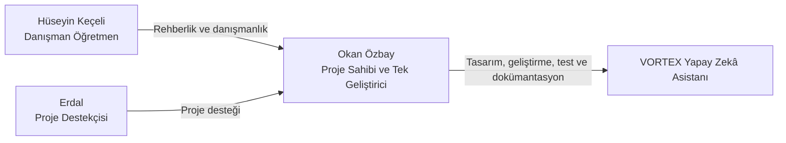
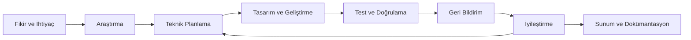

# VORTEX Takımı ve TEKNOFEST Yolculuğu

**Teknolojiyi yalnızca tüketmeyen; araştıran, geliştiren, öğrenen ve topluma değer katmayı hedefleyen bir proje yolculuğu.**

[← Ana README](README.md) · [Mimari](ARCHITECTURE.md) · [Kurulum](SETUP.md) · [Destekçiler](./%F0%9F%A4%9D%20Project%20Supporters.md)

---

> [!IMPORTANT]
> Bu belge iki farklı kapsamı birlikte anlatır: **VORTEX takımının 2024 yılında başlayan kuruluş ve proje yolculuğu** ile **VORTEX Yapay Zekâ Asistanı'nın teknik geliştirme sahipliği**.  
> Takım geçmişi ortak öğrenme ve proje deneyimlerini ifade eder; VORTEX Yapay Zekâ Asistanı'nın uygulama geliştirme süreci ise Okan Özbay tarafından tek başına yürütülmüştür.

## İçindekiler

- [VORTEX nedir?](#vortex-nedir)
- [Projenin hikâyesi](#projenin-hikâyesi)
- [Geliştirme sahipliği](#geliştirme-sahipliği)
- [TEKNOFEST 2026 yolculuğu](#teknofest-2026-yolculuğu)
- [Proje ekibi ve destek rolleri](#proje-ekibi-ve-destek-rolleri)
- [Bu projedeki roller](#bu-projedeki-roller)
- [Çalışma yaklaşımı](#çalışma-yaklaşımı)
- [Teknik çalışma alanları](#teknik-çalışma-alanları)
- [Gelecek perspektifi](#gelecek-perspektifi)
- [Hedefler](#hedefler)
- [Katkılarıyla](#katkılarıyla)
- [İlgili belgeler](#ilgili-belgeler)

---

## VORTEX nedir?

VORTEX, 2024 yılında **Yenimahalle Şehit Mehmet Şengül Mesleki ve Teknik Anadolu Lisesi** öğrencilerinin yazılım geliştirme ilgisini ortak bir üretim kültürüne dönüştürme amacıyla ortaya çıkan bir proje takımıdır.

Kuruluş yaklaşımı yalnızca bir yarışmaya proje hazırlamak değildir. VORTEX;

- yazılım alanında teknik yetkinlik kazanmayı,
- gerçek dünya problemlerine sürdürülebilir çözümler üretmeyi,
- yerli ve açık kaynak yazılım ekosistemine katkı sağlamayı,
- disiplinli çalışma ve dokümantasyon kültürü oluşturmayı,
- teknolojiyi yalnızca tüketen değil, üreten bir gençlik anlayışını temsil etmeyi

hedefler.

Takımın teknik ilgi alanları arasında C# ve .NET, Python, Java, Pardus, Linux ve Windows tabanlı uygulamalar; sistem mimarisi, backend geliştirme, oyun ve sanallaştırma projeleri ile UI/UX tasarımı bulunmaktadır.

VORTEX Yapay Zekâ Asistanı, bu uzun vadeli üretim yaklaşımının güvenli, kullanıcı odaklı ve geliştirilebilir bir yazılım ürününe dönüşmüş hâlidir.

---

## Projenin hikâyesi

VORTEX'in temelleri 2024 yılında, lise döneminde yazılım ve uygulama geliştirmeye duyulan ortak ilginin bir takım fikrine dönüşmesiyle atıldı. Okul bünyesindeki **TÜBİTAK 4006 Bilim Fuarı** deneyimi; araştırma yapma, proje fikrini olgunlaştırma, teknik sorunları çözme ve ortaya çıkan çalışmayı sunma konusunda önemli bir başlangıç oldu.

Bu yolculuğun ilk önemli çalışmalarından biri **Yeşil Adımlar** projesiydi. Anaokulu ve ilkokul düzeyindeki çocuklara çevre bilinci kazandırmayı amaçlayan bu eğitici oyun/sanallaştırma projesi; etkileşimli senaryolar aracılığıyla erken yaşta sürdürülebilirlik farkındalığı oluşturmayı hedefledi.

Bir diğer çalışma olan **Güvenli Gün**, iş kazalarının önlenmesine yönelik farkındalık oluşturmak amacıyla tasarlanan senaryo tabanlı bir oyun/sanallaştırma projesiydi. Kullanıcıya riskli durumları simüle ederek doğru davranış biçimlerini öğretmeyi amaçladı.

Bu projeler;

- problem analizi,
- proje planlama,
- uygulama geliştirme,
- kullanıcıya uygun içerik tasarımı,
- toplumsal fayda odaklı düşünme,
- sunum ve dokümantasyon

alanlarında önemli deneyimler kazandırdı.

VORTEX'in proje kültürü **“Ekip Çalışması · Azim · Disiplin · Asla Pes Etmeme”** anlayışı üzerine kurulmuştur. Her çalışma, daha büyük ve etkili projelere giden yolda bir öğrenme basamağı olarak görülmektedir.

---

## Geliştirme sahipliği

Takımın geçmişinde ortak proje ve öğrenme deneyimleri bulunmakla birlikte, **VORTEX Yapay Zekâ Asistanı'nın teknik geliştirme süreci Okan Özbay tarafından tek başına yürütülmüştür.**

Aşağıdaki çalışmalar Okan Özbay tarafından yürütülmüştür:

- proje fikrinin teknik ürüne dönüştürülmesi,
- uygulama mimarisinin oluşturulması,
- temel kod yapısının geliştirilmesi,
- public ve private bileşenlerin ayrıştırılması,
- masaüstü uygulama geliştirmesi,
- Server ve Web yapılarının geliştirilmesi,
- Worker ve Hermes entegrasyon çalışmalarının yürütülmesi,
- kullanıcı arayüzü ve deneyim tasarımı,
- hata ayıklama ve sorun giderme,
- test ve doğrulama süreçleri,
- güvenlik ve public export kontrolleri,
- kurulum ve operasyon rehberlerinin hazırlanması,
- GitHub repository ve sürüm dokümantasyonunun yönetilmesi.

> [!NOTE]
> Takım geçmişi, danışmanlık ve destek katkıları proje yolculuğunun parçalarıdır. VORTEX Yapay Zekâ Asistanı'nın teknik geliştirme süreci Okan Özbay tarafından yürütülmüştür.

---

## TEKNOFEST 2026 yolculuğu

VORTEX, TEKNOFEST 2026 başvuru sürecinde aşağıdaki hedeflerle ilerlemektedir:

- yerli teknoloji üretimine katkı sağlamak,
- gerçek dünya problemlerine uygulanabilir çözümler geliştirmek,
- gençlerin teknik yetkinliğini güçlendirmek,
- toplumsal faydayı teknoloji tasarımının merkezinde tutmak,
- güvenli ve sorumlu yazılım geliştirme yaklaşımını göstermek,
- geliştirilen projenin teknik sınırlarını açık ve dürüst biçimde belgelemek.

TEKNOFEST yolculuğu yalnızca bir yarışma başvurusundan ibaret değildir. Bu süreç; fikri olgunlaştırma, teknik karar alma, danışman görüşlerinden yararlanma, destek mekanizmalarını doğru kullanma ve ortaya çıkan ürünü anlaşılır şekilde sunma deneyimidir.

---

## Proje ekibi ve destek rolleri

<table>
<tr>
<td align="center" width="33%">
   
  <h3>Okan Özbay</h3>
  <strong>Proje Sahibi</strong> 
  <strong>Takım Kaptanı</strong> 
  <strong>Tek Geliştirici</strong>  
  Uygulamanın tasarımını, geliştirmesini, testlerini ve dokümantasyonunu yürüttü.
</td>
<td align="center" width="33%">
   
  <h3>Hüseyin Keçeli</h3>
  <strong>Danışman Öğretmen</strong> 
  <strong>Bilişim Teknolojileri Alan Şefi</strong>  
  Danışman öğretmen olarak proje sürecine rehberlik etti.
</td>
<td align="center" width="33%">
   
  <h3>Erdal</h3>
  <strong>Proje Destekçisi</strong> 
  <strong>Süreç Desteği</strong>  
  Projede destekçi olarak yer aldı.
</td>
</tr>
</table>

---

## Bu projedeki roller

### Okan Özbay — proje sahibi ve geliştirici

VORTEX Yapay Zekâ Asistanı'nın fikirden çalışan ürüne dönüşen teknik süreci Okan Özbay tarafından yürütülmüştür. Bu süreçte:

- ürün vizyonunu ve teknik hedefleri belirlemek,
- mimari kararları almak,
- kaynak kodu geliştirmek ve bakımını yapmak,
- Server, Web, Desktop ve Worker bileşenlerini geliştirmek,
- UI/UX tasarımını yürütmek,
- test ve doğrulama süreçlerini uygulamak,
- güvenlik sınırlarını tanımlamak,
- public export içeriğini kontrol etmek,
- hata ve sorunları incelemek,
- sürüm ve repository düzenini yönetmek,
- teknik belgeleri hazırlamak,
- TEKNOFEST için teknik sunum içeriğini oluşturmak.

### Hüseyin Keçeli — danışman öğretmen

Hüseyin Keçeli, danışman öğretmen olarak projenin eğitimsel ve planlama tarafında rehberlik sağlamıştır:

- proje hedeflerinin eğitimsel açıdan değerlendirilmesi,
- planlama sürecine rehberlik,
- proje sunumu ve çalışma düzeni konusunda danışmanlık,
- öğrencinin teknik ve kişisel gelişiminin desteklenmesi,
- okul ve proje süreçleri arasında koordinasyona yardımcı olunması.

### Erdal — proje destekçisi

Erdal, projede **proje destekçisi** olarak yer almıştır.

---

## Çalışma yaklaşımı

VORTEX'in geliştirme modeli aşağıdaki adımları esas alır:

1. **İhtiyacı tanımlama** — Çözülecek problem, hedef kullanıcı ve beklenen sonuç belirlenir.
2. **Araştırma** — Benzer çözümler, kullanılan teknolojiler, güvenlik riskleri ve operasyon gereksinimleri incelenir.
3. **Teknik planlama** — Mimari, bileşen sınırları, veri akışları ve doğrulama hedefleri oluşturulur.
4. **Geliştirme** — Uygulama küçük, izlenebilir ve test edilebilir adımlarla geliştirilir.
5. **Doğrulama** — Build, test, güvenlik, kullanıcı deneyimi ve operasyon kontrolleri yapılır.
6. **Dokümantasyon** — Kurulum, mimari, geliştirme kararları, sınırlar ve kullanım yöntemleri açıklanır.
7. **Danışman değerlendirmesi** — Projenin hedefleri, sunumu ve çalışma düzeni danışman görüşleriyle değerlendirilir.
8. **İyileştirme** — Bulgular ve geri bildirimler sonraki geliştirme döngüsüne aktarılır.

---

---

## Teknik çalışma alanları

- C# ve .NET,
- Python,
- Java,
- yapay zekâ ve model entegrasyonları,
- sistem mimarisi,
- backend geliştirme,
- masaüstü uygulama geliştirme,
- web uygulamaları,
- Linux ve Pardus sistem yönetimi,
- WSL ve Docker,
- servis ve Worker mimarileri,
- UI/UX tasarımı,
- uygulama optimizasyonu,
- güvenli kullanıcı deneyimi,
- test ve doğrulama,
- GitHub ve sürüm yönetimi,
- teknik dokümantasyon.

---

## Gelecek perspektifi

VORTEX, her projeyi daha kapsamlı çözümlere giden bir öğrenme basamağı olarak görmektedir. Gelecek dönemde özellikle:

- Pardus ve Linux tabanlı çözümler,
- açık kaynak ve yerli platformlar,
- güvenli yapay zekâ entegrasyonları,
- sistem ve servis yönetimi,
- kullanıcı dostu masaüstü uygulamaları,
- toplumsal fayda odaklı eğitim ve farkındalık projeleri

üzerinde çalışılması hedeflenmektedir.

Amaç yalnızca daha büyük projeler geliştirmek değil; teknik niteliği, güvenliği, kullanıcı deneyimini ve dokümantasyon kalitesini birlikte yükselten sürdürülebilir bir üretim yaklaşımı oluşturmaktır.

---

## Hedefler

### Teknik hedefler

- anlaşılır ve sürdürülebilir bir mimari geliştirmek,
- public ve private sistem sınırlarını korumak,
- güvenli kimlik doğrulama ve sahiplik izolasyonu uygulamak,
- kullanıcıya erişilebilir bir arayüz sunmak,
- kritik işlemlerde doğrulama ve onay mekanizmaları kullanmak,
- release öncesi test ve doğrulama kültürü oluşturmak,
- kurulum ve operasyon süreçlerini yeniden uygulanabilir biçimde belgelemek.

### Eğitimsel hedefler

- yazılım geliştirme yetkinliğini artırmak,
- teknik kararları gerekçelendirebilmek,
- bağımsız araştırma ve problem çözme becerisini geliştirmek,
- düzenli çalışma ve proje takibi alışkanlığı kazanmak,
- danışman geri bildirimlerini geliştirme sürecine aktarmak,
- teknik çalışmayı anlaşılır biçimde sunabilmek.

### Toplumsal hedefler

- gençlerin teknoloji üretimine katılımını desteklemek,
- yerli yazılım ekosistemine değer katmak,
- güvenli ve sorumlu dijital çözümler geliştirmek,
- erişilebilir araçlarla teknik engelleri azaltmak,
- üretim sürecini açık ve anlaşılır dokümantasyonla paylaşmak.

---

## Katkılarıyla

VORTEX projesi, TEKNOFEST başvuru ve geliştirme sürecinde sağlanan katkılar için **Hüseyin Keçeli**, **Erdal**, **Keçiören Belediyesi** ve **Teknomer**'e teşekkür eder.

### Bireysel katkılar

- **Hüseyin Keçeli:** Danışman öğretmen olarak proje planlama, eğitimsel rehberlik ve sunum sürecine katkı sağlamıştır.
- **Erdal:** Projede proje destekçisi olarak yer almıştır.

### Kurumsal katkılar

Keçiören Belediyesi ve Teknomer tarafından sağlanan başvuru rehberliği, bütçe desteği, çalışma imkânları, teknik destek ve proje geliştirme katkıları; projenin daha planlı biçimde ilerlemesine yardımcı olmuştur.

  
  &nbsp;&nbsp;&nbsp;&nbsp;
  

Ayrıntılı teşekkür sayfası için [🤝 Project Supporters](./%F0%9F%A4%9D%20Project%20Supporters.md) belgesini inceleyin.

---

## İlgili belgeler

| Belge | Açıklama |
| --- | --- |
| [Ana README](README.md) | Proje tanıtımı, hikâye, görseller ve hızlı navigasyon |
| [Public Sistem Mimarisi](ARCHITECTURE.md) | Teknik sınırlar, bileşenler ve güvenlik modeli |
| [Kurulum Rehberi](SETUP.md) | Yerel çalışma, yapılandırma ve doğrulama |
| [Hermes Worker Operasyon Rehberi](VORTEX_HERMES_WORKER_README.md) | WSL, Docker, systemd, tanılama, rollback ve yedekleme |
| [Hermes Worker Geliştirme Rehberi](Vortex.HermesWorker/HermesWorker.md) | Worker bileşeni, kaynak kod ve geliştirme sınırları |
| [🤝 Project Supporters](./%F0%9F%A4%9D%20Project%20Supporters.md) | Bireysel ve kurumsal destekçiler |

---

**Tek geliştirici · Güçlü danışmanlık · Değerli destek · Sürekli gelişim**

[← Ana sayfaya dön](README.md)

