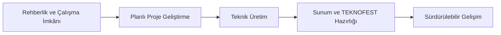

# Destekçilerimiz

**VORTEX Yapay Zekâ Asistanı'nın geliştirme yolculuğunda yanımızda olan ve projeye değer katan kurumlara teşekkür ederiz.**

[← Ana README](../README.md) · [Takım](TEAM.md) · [Dokümantasyon Merkezi](README.md)

---

  
  &nbsp;&nbsp;&nbsp;&nbsp;
  

## Teşekkür

VORTEX ekibi; TEKNOFEST başvuru sürecinde sağladıkları rehberlik, çalışma ortamı, bütçe desteği, teknik destek ve proje geliştirme katkıları için **Keçiören Belediyesi** ile **Teknomer**'e içten teşekkür eder.

Bu destek, ekibin:

- proje fikrini daha planlı biçimde olgunlaştırmasına,
- teknik çalışmalarını sürdürülebilir bir zeminde yürütmesine,
- ekip içi koordinasyonu güçlendirmesine,
- yenilikçi çözümler geliştirmesine,
- TEKNOFEST hazırlık sürecini daha verimli yönetmesine

önemli katkı sağlamıştır.

> [!NOTE]
> Bu belge, proje kaynaklarındaki teşekkür metnini daha düzenli bir GitHub sayfası hâline getirir. Destek kapsamı, paylaşılan belgelerde belirtilen katkılarla sınırlıdır.

## Katkı çerçevesi

<table>
<tr>
<td width="50%" valign="top" align="center">

### VORTEX

Projenin tasarımı, yazılım geliştirme süreci, sistem mimarisi, dokümantasyonu ve açık kaynak yönetimi VORTEX ekibi tarafından yürütülmektedir.

</td>
<td width="50%" valign="top" align="center">

### Teknomer

TEKNOFEST başvuru süreci boyunca sağlanan rehberlik, çalışma ortamı, teknik destek ve proje geliştirme sürecine sunulan katkılar için teşekkür ederiz.

</td>
</tr>
</table>

## Keçiören Belediyesi ve Teknomer

Keçiören Belediyesi ile Teknomer'in gençlerin teknoloji üretimine katılımını destekleyen yaklaşımı, VORTEX'in sürdürülebilir ve toplumsal fayda odaklı hedeflerini güçlendirmektedir.

Proje sürecine sağlanan imkânlar:

- başvuru sürecine ilişkin rehberlik,
- çalışma ortamı,
- bütçe desteği,
- teknik destek,
- proje geliştirme sürecine katkı,
- genç geliştiricilerin üretim motivasyonunu destekleme

başlıklarında ifade edilmektedir.

## Desteğin proje yolculuğundaki yeri

VORTEX ekibi için destek yalnızca kısa süreli bir katkı değildir. Gençlerin teknik üretime katılımını güçlendiren, proje disiplinini destekleyen ve yeni çözümler geliştirmeye alan açan önemli bir motivasyon kaynağıdır.

## Şeffaflık ve kullanım notu

- Logo ve kurum isimleri saygılı ve bağlama uygun biçimde kullanılmalıdır.
- Destek kapsamı belgelenen ifadelerin ötesinde genişletilmemelidir.
- Sponsorluk, resmî ortaklık veya ürün onayı gibi ek iddialar yalnız doğrulanmışsa eklenmelidir.
- Public görseller gerçek kullanıcı verisi, erişim bilgisi veya secret içermemelidir.
- Logo dosya yolları repository yapısıyla eşleşmelidir.

## İlgili belgeler

| Belge | Açıklama |
| --- | --- |
| [Ana README](../README.md) | Proje tanıtımı ve destekçiler özeti |
| [Takım ve TEKNOFEST](TEAM.md) | Takım hikâyesi, üyeler ve hedefler |
| [Dokümantasyon Merkezi](README.md) | Tüm public belgeler |
| [Public Sistem Mimarisi](ARCHITECTURE.md) | Teknik kapsam ve güvenlik sınırları |

---

💙 **Keçiören Belediyesi ve Teknomer'e, genç yazılım geliştiricilere verdikleri değer ve VORTEX projesine sundukları katkılar için teşekkür ederiz.**

[← Ana sayfaya dön](../README.md)

